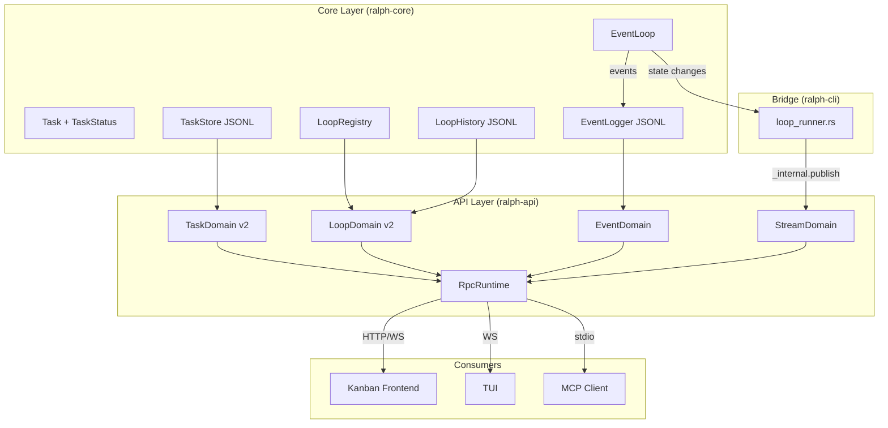

# Detailed Design: Kanban Tracking UX API Surface

## Overview

This design extends Ralph Orchestrator's API surface so that any frontend can build a Kanban-style board to track workstreams (loops) and their tasks. The primary unit of work is a task (card), grouped by loop (workstream), with columns mapped to task statuses. Hat information appears as card metadata, not as structural columns.

The scope is API-only — no frontend implementation.

## Detailed Requirements

Consolidated from idea-honing.md:

1. **Cards = tasks, grouped by loop** — flat task list with `loop_id` filtering
2. **Columns = 6 task statuses** — Open, Blocked, InProgress, InReview, Closed, Failed
3. **Hat info as card metadata** — badge/tag on each card showing which hat is working on it
4. **API surface only** — no UI implementation in this scope
5. **Loose status transitions** — no state machine enforcement, agents decide
6. **Inline loop context** on task responses — iteration count, cost, runtime, active hat, termination reason
7. **Status transition history** per task — `{from_status, to_status, timestamp, hat}` entries
8. **Enriched loop responses** — hat collection, active hat, task counts per status
9. **Real-time streaming** via existing `stream.subscribe` WebSocket
10. **Filters on task.list** — must-have: status, loop_id, active_hat; nice-to-have: priority, tags
11. **No backlog/specs** in this scope
12. **Build on core task system** — API task domain (`tasks-v1.json`) is deprecated; use core `TaskStore` (`tasks.jsonl`)
13. **Ralph events exposed** — orchestration events (pub/sub between hats) available via API for activity timelines, loop progress visualization, and diagnostics

## Architecture Overview



## Components and Interfaces

### 1. Core Task Model Changes (ralph-core)

#### New TaskStatus Variants

```rust
pub enum TaskStatus {
    Open,        // Not started
    Blocked,     // Has unmet blocked_by dependencies (NEW)
    InProgress,  // Being worked on
    InReview,    // Under review by a reviewer/critic hat (NEW)
    Closed,      // Complete
    Failed,      // Failed/abandoned
}
```

Serialization: `snake_case` — `"open"`, `"blocked"`, `"in_progress"`, `"in_review"`, `"closed"`, `"failed"`.

`is_terminal()` returns true for Closed and Failed (unchanged).

#### New Fields on Task

```rust
pub struct Task {
    // ... existing fields ...

    /// Hat that last transitioned this task's status.
    #[serde(skip_serializing_if = "Option::is_none")]
    pub last_hat: Option<String>,

    /// Status transition history.
    #[serde(default, skip_serializing_if = "Vec::is_empty")]
    pub transitions: Vec<StatusTransition>,

    /// User-defined tags for filtering/grouping.
    #[serde(default, skip_serializing_if = "Vec::is_empty")]
    pub tags: Vec<String>,
}
```

#### StatusTransition

```rust
#[derive(Debug, Clone, Serialize, Deserialize)]
pub struct StatusTransition {
    pub from: String,
    pub to: String,
    pub timestamp: String,  // ISO 8601
    #[serde(skip_serializing_if = "Option::is_none")]
    pub hat: Option<String>,
}
```

#### TaskStore Changes

Add a `transition()` method that records the status change:

```rust
impl TaskStore {
    pub fn transition(&mut self, id: &str, new_status: TaskStatus, hat: Option<&str>) -> Option<&Task> {
        if let Some(task) = self.get_mut(id) {
            let transition = StatusTransition {
                from: task.status.as_str().to_string(),
                to: new_status.as_str().to_string(),
                timestamp: chrono::Utc::now().to_rfc3339(),
                hat: hat.map(|h| h.to_string()),
            };
            task.transitions.push(transition);
            task.status = new_status;
            task.last_hat = hat.map(|h| h.to_string());
            // Update timestamps
            match new_status {
                TaskStatus::InProgress => task.started = Some(chrono::Utc::now().to_rfc3339()),
                TaskStatus::Closed | TaskStatus::Failed => task.closed = Some(chrono::Utc::now().to_rfc3339()),
                _ => {}
            }
            return self.get(id);
        }
        None
    }
}
```

Existing `start()`, `close()`, `fail()`, `reopen()` methods should be updated to call `transition()` internally so all status changes are recorded.

Add filtering methods:

```rust
impl TaskStore {
    pub fn filter_by_status(&self, status: TaskStatus) -> Vec<&Task> { ... }
    pub fn filter_by_loop_id(&self, loop_id: &str) -> Vec<&Task> { ... }
    pub fn filter_by_hat(&self, hat: &str) -> Vec<&Task> { ... }
    pub fn counts_by_status(&self) -> HashMap<TaskStatus, usize> { ... }
    pub fn counts_by_status_for_loop(&self, loop_id: &str) -> HashMap<TaskStatus, usize> { ... }
}
```

### 2. Loop Registry Changes (ralph-core)

#### Enriched LoopEntry

```rust
pub struct LoopEntry {
    // ... existing fields ...

    /// Hat collection configured for this loop.
    #[serde(default, skip_serializing_if = "Vec::is_empty")]
    pub hat_collection: Vec<HatSummary>,

    /// Currently active hat (updated each iteration).
    #[serde(skip_serializing_if = "Option::is_none")]
    pub active_hat: Option<String>,

    /// Current iteration number.
    #[serde(default)]
    pub iteration: u32,

    /// Total cost in USD.
    #[serde(default)]
    pub total_cost_usd: f64,

    /// Maximum iterations configured.
    #[serde(skip_serializing_if = "Option::is_none")]
    pub max_iterations: Option<u32>,

    /// Termination reason (if loop has ended).
    #[serde(skip_serializing_if = "Option::is_none")]
    pub termination_reason: Option<String>,
}

#[derive(Debug, Clone, Serialize, Deserialize)]
pub struct HatSummary {
    pub id: String,
    pub name: String,
    pub description: String,
}
```

#### LoopRegistry Updates

The loop runner should update the registry entry each iteration with:
- `active_hat`
- `iteration`
- `total_cost_usd`

And on completion:
- `termination_reason`

This makes loop state persistent and queryable by the API without needing a live connection to the loop process.

### 3. Loop History Changes (ralph-core)

Enrich `IterationStarted` to include hat info:

```rust
pub enum HistoryEventType {
    IterationStarted {
        iteration: u32,
        hat: String,           // NEW
        hat_display: String,   // NEW
    },
    IterationCompleted {
        iteration: u32,
        success: bool,
        cost_usd: Option<f64>, // NEW
    },
    // ... rest unchanged
}
```

### 4. API TaskDomain v2 (ralph-api)

Replace the current `TaskDomain` (which uses its own `tasks-v1.json` store) with a wrapper around the core `TaskStore`.

#### New TaskDomain

```rust
pub struct TaskDomain {
    workspace_root: PathBuf,
}

impl TaskDomain {
    pub fn new(workspace_root: impl AsRef<Path>) -> Self { ... }

    fn store_path(&self) -> PathBuf {
        self.workspace_root.join(".ralph/agent/tasks.jsonl")
    }

    fn load_store(&self) -> Result<TaskStore, ApiError> {
        TaskStore::load(&self.store_path())
            .map_err(|e| ApiError::internal(format!("failed loading task store: {e}")))
    }
}
```

#### Updated task.list

```rust
#[derive(Debug, Clone, Deserialize)]
#[serde(rename_all = "camelCase")]
pub struct TaskListParams {
    pub status: Option<String>,
    pub loop_id: Option<String>,
    pub hat: Option<String>,
    pub priority: Option<u8>,
    pub tag: Option<String>,
}
```

Response includes `loop_context` inline:

```rust
#[derive(Debug, Clone, Serialize)]
#[serde(rename_all = "camelCase")]
pub struct TaskResponse {
    pub id: String,
    pub title: String,
    #[serde(skip_serializing_if = "Option::is_none")]
    pub description: Option<String>,
    #[serde(skip_serializing_if = "Option::is_none")]
    pub key: Option<String>,
    pub status: String,
    pub priority: u8,
    #[serde(skip_serializing_if = "Vec::is_empty")]
    pub blocked_by: Vec<String>,
    #[serde(skip_serializing_if = "Option::is_none")]
    pub loop_id: Option<String>,
    #[serde(skip_serializing_if = "Option::is_none")]
    pub last_hat: Option<String>,
    #[serde(default, skip_serializing_if = "Vec::is_empty")]
    pub tags: Vec<String>,
    #[serde(default, skip_serializing_if = "Vec::is_empty")]
    pub transitions: Vec<StatusTransitionResponse>,
    #[serde(skip_serializing_if = "Option::is_none")]
    pub loop_context: Option<LoopContextResponse>,
    pub created: String,
    #[serde(skip_serializing_if = "Option::is_none")]
    pub started: Option<String>,
    #[serde(skip_serializing_if = "Option::is_none")]
    pub closed: Option<String>,
}

#[derive(Debug, Clone, Serialize)]
#[serde(rename_all = "camelCase")]
pub struct LoopContextResponse {
    pub loop_id: String,
    pub iteration: u32,
    pub total_cost_usd: f64,
    #[serde(skip_serializing_if = "Option::is_none")]
    pub active_hat: Option<String>,
    #[serde(skip_serializing_if = "Option::is_none")]
    pub max_iterations: Option<u32>,
    #[serde(skip_serializing_if = "Option::is_none")]
    pub termination_reason: Option<String>,
    pub started: String,
}

#[derive(Debug, Clone, Serialize)]
#[serde(rename_all = "camelCase")]
pub struct StatusTransitionResponse {
    pub from: String,
    pub to: String,
    pub timestamp: String,
    #[serde(skip_serializing_if = "Option::is_none")]
    pub hat: Option<String>,
}
```

The `loop_context` is populated by joining the task's `loop_id` with the `LoopRegistry` and `LoopHistory` data.

#### Queue/Execution Features

The current API `TaskDomain` has `run`, `run_all`, `cancel`, `retry`, `status` methods for task execution. These are API-layer concerns (spawning ralph processes) and should remain in the API layer, not move to core `TaskStore`. They'll operate by:
1. Reading/writing the core task store for status
2. Managing process lifecycle separately

### 5. API LoopDomain v2 (ralph-api)

#### Updated LoopRecord

```rust
#[derive(Debug, Clone, Serialize)]
#[serde(rename_all = "camelCase")]
pub struct LoopRecord {
    pub id: String,
    pub status: String,
    pub location: String,
    #[serde(skip_serializing_if = "Option::is_none")]
    pub prompt: Option<String>,
    #[serde(skip_serializing_if = "Option::is_none")]
    pub merge_commit: Option<String>,
    // NEW fields:
    #[serde(default, skip_serializing_if = "Vec::is_empty")]
    pub hat_collection: Vec<HatSummaryResponse>,
    #[serde(skip_serializing_if = "Option::is_none")]
    pub active_hat: Option<String>,
    pub iteration: u32,
    pub total_cost_usd: f64,
    #[serde(skip_serializing_if = "Option::is_none")]
    pub max_iterations: Option<u32>,
    #[serde(skip_serializing_if = "Option::is_none")]
    pub termination_reason: Option<String>,
    pub task_counts: TaskCountsResponse,
}

#[derive(Debug, Clone, Serialize)]
#[serde(rename_all = "camelCase")]
pub struct HatSummaryResponse {
    pub id: String,
    pub name: String,
    pub description: String,
}

#[derive(Debug, Clone, Serialize, Default)]
#[serde(rename_all = "camelCase")]
pub struct TaskCountsResponse {
    pub open: usize,
    pub blocked: usize,
    pub in_progress: usize,
    pub in_review: usize,
    pub closed: usize,
    pub failed: usize,
}
```

Task counts are computed by loading the core `TaskStore` and filtering by `loop_id`.

### 6. Stream Event Enrichment (ralph-api)

#### Enriched task.status.changed

```json
{
  "topic": "task.status.changed",
  "resource": { "type": "task", "id": "task-1234-abcd" },
  "payload": {
    "from": "in_progress",
    "to": "in_review",
    "hat": "critic",
    "loopId": "loop-5678-efgh",
    "taskTitle": "Implement auth middleware"
  }
}
```

Changes to `rpc_side_effects.rs`:
- Capture the task's previous status before mutation
- Include `hat`, `loopId`, and `taskTitle` in the payload

#### New task.created / task.deleted Events

Add to `STREAM_TOPICS`:
- `task.created` — published on `task.create`
- `task.deleted` — published on `task.delete` / `task.clear`

#### Enriched loop.status.changed

Published by the loop runner via `_internal.publish`:

```json
{
  "topic": "loop.status.changed",
  "resource": { "type": "loop", "id": "loop-5678-efgh" },
  "payload": {
    "status": "iteration_started",
    "iteration": 5,
    "activeHat": "builder",
    "activeHatDisplay": "⚙️ Builder",
    "totalCostUsd": 1.23
  }
}
```

#### New loop.started / loop.completed Events

Add to `STREAM_TOPICS`:
- `loop.started` — `{ loopId, prompt, hatCollection }`
- `loop.completed` — `{ loopId, terminationReason, totalCostUsd, iterations }`

### 7. Loop Runner Bridge (ralph-cli)

The loop runner (`loop_runner.rs`) needs to publish state changes to the API's stream domain. Two approaches:

**Option A: HTTP calls to `_internal.publish`**
- Loop runner makes HTTP POST to the API server on each iteration start/end
- Requires the API server to be running
- Simple but adds HTTP overhead per iteration

**Option B: Shared file watcher**
- Loop runner writes state to `.ralph/loop-state.json`
- API watches the file and publishes stream events
- No HTTP dependency but adds file I/O complexity

**Recommended: Option A** — the API server is already running when the web dashboard is in use (which is the primary Kanban consumer). The `_internal.publish` endpoint already exists. The loop runner just needs to make a few HTTP calls per iteration.

For cases where the API isn't running (CLI-only usage), the loop runner should update the `LoopRegistry` entry directly (which it already partially does). The stream events are only needed when a real-time consumer is connected.

```rust
// In loop_runner.rs, after each iteration:
if let Some(api_url) = api_url {
    let _ = reqwest::Client::new()
        .post(format!("{api_url}/rpc"))
        .json(&json!({
            "method": "_internal.publish",
            "params": {
                "topic": "loop.status.changed",
                "resourceType": "loop",
                "resourceId": loop_id,
                "payload": {
                    "status": "iteration_started",
                    "iteration": iteration,
                    "activeHat": hat_id,
                    "totalCostUsd": total_cost
                }
            }
        }))
        .send()
        .await;
}
```

### 8. CLI Task Commands Update (ralph-cli)

Update `ralph tools task` commands to support new statuses and record transitions:

- `ralph tools task start <id>` — transitions to InProgress, records hat from active loop context
- `ralph tools task review <id>` — NEW: transitions to InReview
- `ralph tools task block <id>` — NEW: transitions to Blocked
- `ralph tools task close <id>` — transitions to Closed
- `ralph tools task fail <id>` — transitions to Failed
- `ralph tools task reopen <id>` — transitions to Open

All transition commands should accept an optional `--hat <hat_id>` flag. When running inside a loop, the hat is auto-detected from the loop context.

### 9. Orchestration Events API (ralph-api + ralph-core)

Ralph's pub/sub events (e.g., `subtask.ready`, `review.rejected`, `LOOP_COMPLETE`) are the coordination heartbeat between hats. Exposing them enables activity timelines on task/loop cards, progress visualization, and "why is this stuck?" diagnostics.

#### Event Storage

Events are already recorded in `.ralph/events.jsonl` (per session) and `.ralph/history.jsonl` (across sessions). The `EventLogger` in ralph-core records events with topic, payload, source hat, and timestamp.

#### New API Methods

**`event.list`** — List orchestration events for a loop, with optional filtering.

```rust
#[derive(Debug, Clone, Deserialize)]
#[serde(rename_all = "camelCase")]
pub struct EventListParams {
    /// Filter by loop ID. If omitted, returns events for the current/primary loop.
    pub loop_id: Option<String>,
    /// Filter by topic pattern (e.g., "review.*", "subtask.done").
    pub topic: Option<String>,
    /// Maximum number of events to return (default: 100, max: 500).
    pub limit: Option<u16>,
    /// Cursor for pagination (ISO 8601 timestamp).
    pub after: Option<String>,
}
```

Response:

```rust
#[derive(Debug, Clone, Serialize)]
#[serde(rename_all = "camelCase")]
pub struct EventRecord {
    /// Event topic (e.g., "subtask.ready", "review.rejected").
    pub topic: String,
    /// Event payload (the summary/reason text).
    pub payload: String,
    /// Hat that published this event.
    #[serde(skip_serializing_if = "Option::is_none")]
    pub source_hat: Option<String>,
    /// Iteration number when the event was published.
    pub iteration: u32,
    /// ISO 8601 timestamp.
    pub timestamp: String,
}
```

Implementation: Read from `.ralph/events.jsonl` for the current session, or from `.ralph/history.jsonl` for historical data. The `EventLogger` already stores `EventRecord` entries — the API just needs to expose them with filtering.

#### New Stream Topic

**`event.published`** — Real-time stream of orchestration events as they fire.

Add to `STREAM_TOPICS`:

```rust
"event.published",
```

Published by the loop runner (via `_internal.publish`) whenever the EventBus routes an event:

```json
{
  "topic": "event.published",
  "resource": { "type": "event", "id": "evt-1234" },
  "payload": {
    "eventTopic": "review.rejected",
    "eventPayload": "Missing edge case test for empty input",
    "sourceHat": "critic",
    "iteration": 5,
    "loopId": "loop-5678-efgh"
  }
}
```

This enables a live event feed in any connected frontend — events appear as they fire during the loop.

#### Linking Events to Tasks

Events don't currently reference task IDs directly. However, the event payload often contains task context (e.g., `tasks.ready` includes `task_id` and `task_key` in the code-assist preset). To support task-level activity timelines:

- When the event payload contains a `task_id` field, include it in the `EventRecord` response
- The frontend can filter `event.list` results by matching `task_id` in payloads
- A dedicated `task_id` filter on `event.list` would parse payloads server-side for convenience:

```rust
pub struct EventListParams {
    // ... existing fields ...
    /// Filter events whose payload references this task ID.
    pub task_id: Option<String>,
}
```

## Data Models

See the type definitions in the Components section above. Key models:

- `Task` (extended with `last_hat`, `transitions`, `tags`)
- `TaskStatus` (extended with `Blocked`, `InReview`)
- `StatusTransition` (new)
- `LoopEntry` (extended with `hat_collection`, `active_hat`, `iteration`, `total_cost_usd`, `max_iterations`, `termination_reason`)
- `HatSummary` (new)
- `TaskResponse` / `LoopRecord` (API response types)
- `LoopContextResponse` / `TaskCountsResponse` (new API response types)

## Error Handling

- **Task store I/O failures**: Return `ApiError::internal` with descriptive message. The JSONL store uses file locking; lock contention returns a retryable error.
- **Missing loop context**: If a task's `loop_id` references a loop not in the registry, `loop_context` is `None` in the response (not an error).
- **Stream publish failures**: Fire-and-forget for `_internal.publish` calls from the loop runner. Stream events are best-effort; the API can always serve snapshots from files.
- **Backward compatibility**: New fields on `Task` use `#[serde(default)]` so existing JSONL files deserialize without error. Missing fields get default values.

## Testing Strategy

### Unit Tests (ralph-core)
- `TaskStatus` serialization/deserialization for new variants
- `StatusTransition` recording on all transition methods
- `TaskStore` filtering methods (by status, loop_id, hat)
- `TaskStore` counts methods
- `LoopEntry` serialization with new fields
- Backward compatibility: loading old JSONL files without new fields

### Unit Tests (ralph-api)
- `TaskDomain` v2 reading from core JSONL store
- `task.list` with all filter combinations
- `task.get` with inline `loop_context`
- `LoopDomain` v2 with enriched `LoopRecord`
- Stream event payloads for enriched `task.status.changed`
- New `task.created` / `task.deleted` stream events
- `event.list` with topic, loop_id, task_id, and pagination filters
- `event.published` stream topic payload structure

### Integration Tests
- End-to-end: create task via CLI → verify via API → check stream event
- Multi-loop: tasks from different loops filtered correctly
- Status transitions: full lifecycle Open → InProgress → InReview → Closed with history
- Loop context enrichment: task response includes correct iteration/cost/hat from loop

### Smoke Tests
- Record a session with the new task statuses and replay
- Verify backward compatibility with existing fixtures

## Appendices

### Technology Choices

No new dependencies required. All changes use existing crates:
- `serde` for serialization of new fields
- `chrono` for timestamps
- `reqwest` (already a dependency) for `_internal.publish` HTTP calls

### Alternative Approaches Considered

1. **Unified task store from scratch** — Build a new SQLite-based store replacing both JSONL and JSON stores. Rejected: too much scope for this feature; JSONL works well for the core use case and has multi-loop file locking.

2. **GraphQL API** — Expose a GraphQL endpoint for flexible querying. Rejected: adds a new protocol; the existing JSON-RPC pattern is sufficient and consistent.

3. **Hat-based columns** — Dynamic columns based on hat collection. Rejected per requirements: hat collections vary per loop, making columns unstable. Hat info as card metadata is simpler and more flexible.

4. **Backlog with specs** — Expose specs as API objects for a backlog column. Deferred per requirements: unnecessary complexity for v1.

5. **Polling instead of streaming** — Simpler but less responsive. Rejected: existing stream infrastructure makes real-time updates low-cost.

### Key Constraints and Limitations

- **Ephemeral loop state**: Iteration/hat/cost data is only available while the loop is running. After termination, only what was persisted to `LoopRegistry` and `LoopHistory` is available.
- **File-based storage**: JSONL scales well for typical workloads (dozens to hundreds of tasks) but would need rethinking for thousands of tasks.
- **API server dependency for streaming**: Real-time stream events require the API server to be running. CLI-only usage gets snapshot data from files.
- **No state machine enforcement**: Status transitions are not validated. This is intentional per requirements but means the API won't prevent nonsensical transitions.
