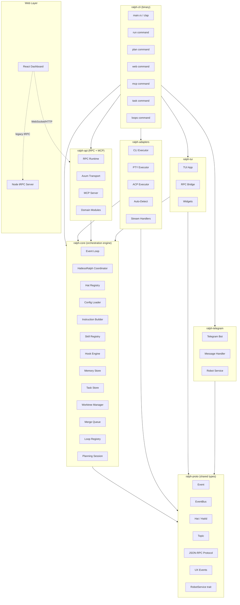
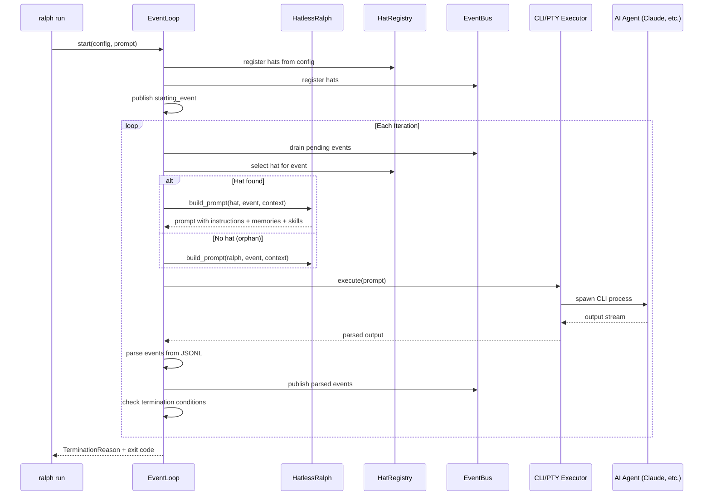
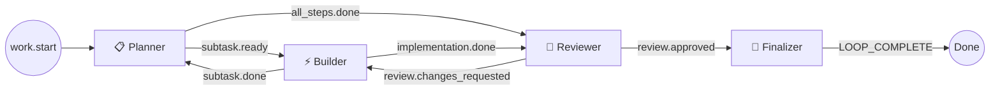
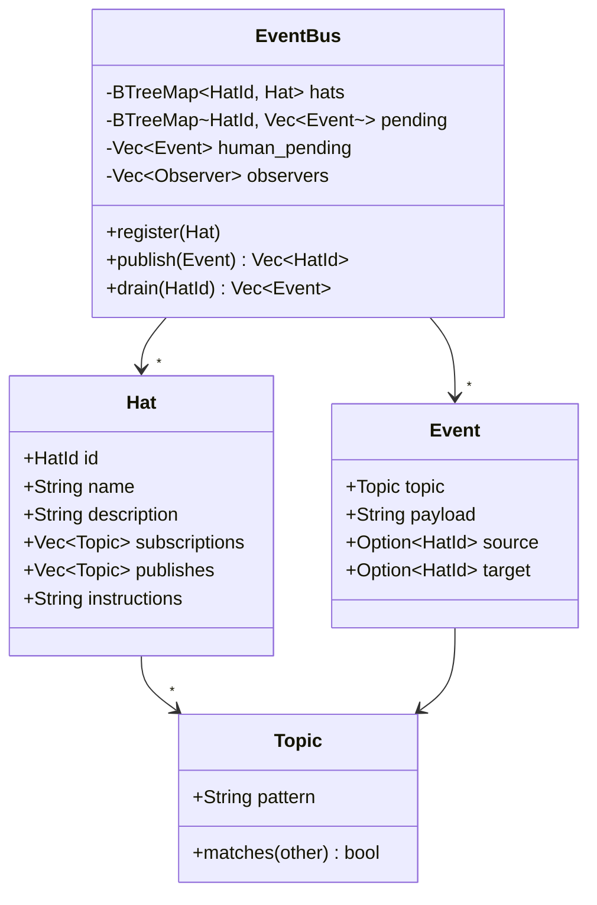
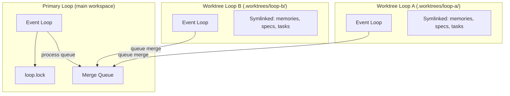
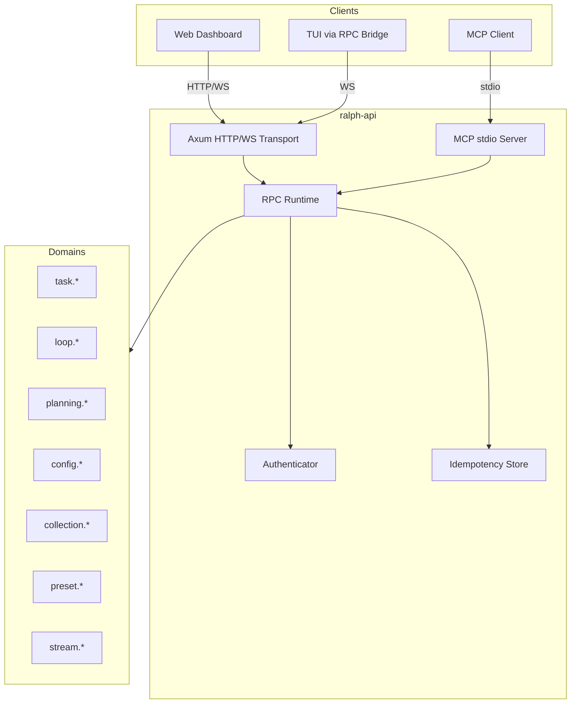

# Architecture

## System Overview

Ralph Orchestrator is a hat-based orchestration framework that runs AI agents in iterative loops until task completion. The architecture follows a layered design with clear separation between protocol definitions, core orchestration logic, backend adapters, and presentation layers.

## Core Orchestration Flow

The event loop is the heart of Ralph. Each iteration: select a hat → build prompt → execute agent → parse events → route via EventBus → repeat.

## Hat System

Hats are specialized personas that coordinate through pub/sub events. Each hat subscribes to specific topics and publishes others, creating a directed workflow.

## Event System

Events flow through the `EventBus` which routes by topic pattern matching. Each event has a topic, payload, optional source hat, and optional target hat.

## Execution Modes

Ralph supports multiple execution strategies for agent backends:

| Mode | Module | Description |
|------|--------|-------------|
| CLI | `cli_executor.rs` | Spawns agent CLI as subprocess, captures stdout |
| PTY | `pty_executor.rs` | Pseudo-terminal for rich TUI output (colors, spinners) |
| ACP | `acp_executor.rs` | Agent Communication Protocol for structured I/O |
| Stream | `stream_handler.rs` | Handles streaming output (Claude, Pi parsers) |

## Parallel Loops Architecture

Multiple loops run concurrently via git worktrees. The primary loop holds `.ralph/loop.lock` and processes the merge queue.

## Hook Lifecycle

Hooks execute at defined phase-events during the orchestration lifecycle (e.g., `iteration.before`, `iteration.after`, `loop.start`, `loop.end`). The `HookEngine` resolves hooks per phase-event, builds JSON payloads, and the `HookExecutor` runs them.

## API Architecture

The `ralph-api` crate provides a Rust-native RPC API and MCP server:

