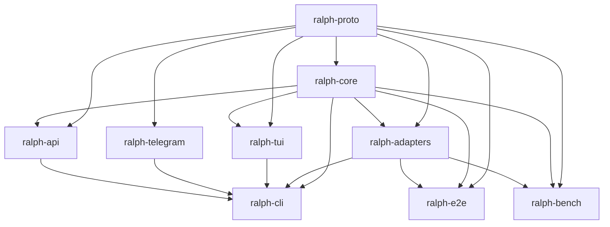

# Dependencies

## Rust Dependencies (Workspace-Level)

### Async Runtime
| Crate | Version | Usage |
|-------|---------|-------|
| `tokio` | 1 (full features) | Async runtime for all crates |
| `async-trait` | 0.1 | Async trait support |
| `futures` | 0.3 | Stream utilities |
| `tokio-util` | 0.7 | Compat layer |

### Serialization
| Crate | Version | Usage |
|-------|---------|-------|
| `serde` | 1 (derive) | Serialization framework |
| `serde_json` | 1 | JSON parsing/generation |
| `serde_yaml` | 0.9 | YAML config parsing |

### CLI
| Crate | Version | Usage |
|-------|---------|-------|
| `clap` | 4 (derive) | Argument parsing |
| `clap_complete` | 4 | Shell completions |

### Terminal UI
| Crate | Version | Usage |
|-------|---------|-------|
| `ratatui` | 0.30 | TUI framework |
| `crossterm` | 0.28 | Terminal manipulation |
| `termimad` | 0.31 | Markdown rendering in terminal |
| `colored` | 3 | Terminal colors |
| `indicatif` | 0.17 | Progress indicators |
| `ansi-to-tui` | 8 | ANSI → ratatui conversion (ralph-adapters) |

### HTTP / WebSocket
| Crate | Version | Usage |
|-------|---------|-------|
| `reqwest` | 0.12 (rustls-tls) | HTTP client for remote presets |
| `tokio-tungstenite` | 0.24 | WebSocket client (TUI) |
| `tungstenite` | 0.24 | WebSocket types |
| `axum` | 0.8 | HTTP/WS server (ralph-api) |

### Error Handling
| Crate | Version | Usage |
|-------|---------|-------|
| `thiserror` | 2 | Typed errors |
| `anyhow` | 1 | Ad-hoc errors |

### PTY / Process
| Crate | Version | Usage |
|-------|---------|-------|
| `portable-pty` | 0.9 | PTY support for agent execution |
| `nix` | 0.29 | Unix signal/terminal handling |
| `vt100` | 0.15 | VT100 terminal emulation |
| `strip-ansi-escapes` | 0.2 | ANSI escape removal |
| `scopeguard` | 1 | Cleanup guards |

### Other
| Crate | Version | Usage |
|-------|---------|-------|
| `regex` | 1 | Text processing |
| `chrono` | 0.4 | Date/time with serde |
| `keyring` | 3 | OS keychain for credentials |
| `tempfile` | 3 | Temporary files (testing) |
| `open` | 5 | Open URLs in browser |
| `tracing` / `tracing-subscriber` | 0.1 / 0.3 | Structured logging |
| `base64` | 0.22 | Base64 encoding (ralph-proto) |
| `uuid` | 1 | UUID generation (ralph-api) |
| `jsonschema` | 0.18 | JSON Schema validation (ralph-api) |
| `rmcp` | 1.1.0 | MCP protocol (ralph-api) |
| `teloxide` | 0.13 | Telegram bot framework (ralph-telegram) |
| `unicode-width` | 0.2 | Unicode width calculation (ralph-tui) |

## Node.js Dependencies

### Frontend (`frontend/ralph-web/`)
| Package | Usage |
|---------|-------|
| React | UI framework |
| Vite | Build tool / dev server |
| TailwindCSS | Utility-first CSS |
| shadcn/ui | UI component library (badge, button, card, input, label, textarea) |
| ReactFlow | Visual hat collection builder |
| Zustand | State management |

### Legacy Backend (`backend/ralph-web-server/`)
| Package | Usage |
|---------|-------|
| Fastify | HTTP server |
| tRPC | Type-safe API layer |
| better-sqlite3 | SQLite database |
| zod | Schema validation |

## Build & Dev Tools

| Tool | Purpose |
|------|---------|
| `just` | Task runner (Justfile) |
| `mise` | Toolchain management (Node.js 22) |
| `cargo-dist` | Binary distribution (npm + shell installers) |
| GitHub Actions | CI/CD (ci.yml, lint.yml, release.yml, docs.yml) |
| MkDocs | Documentation site generation |
| `nix` / `devenv` | Reproducible dev environment (flake.nix, devenv.nix) |

## Internal Crate Dependencies

Key dependency rule: `ralph-proto` is the leaf crate with no internal dependencies. All other crates depend on it. `ralph-cli` is the root crate that depends on everything.
