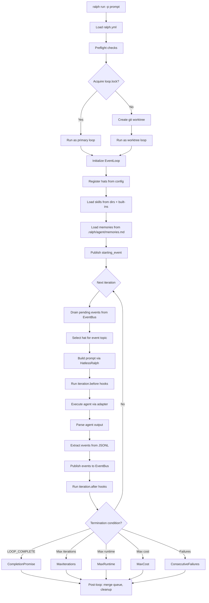
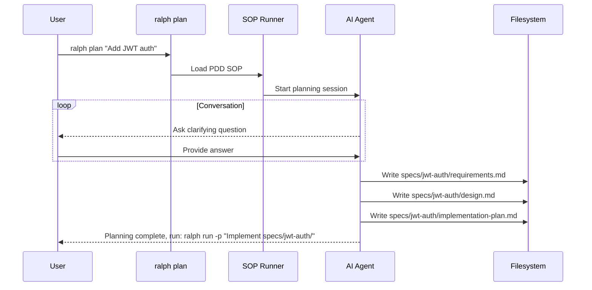
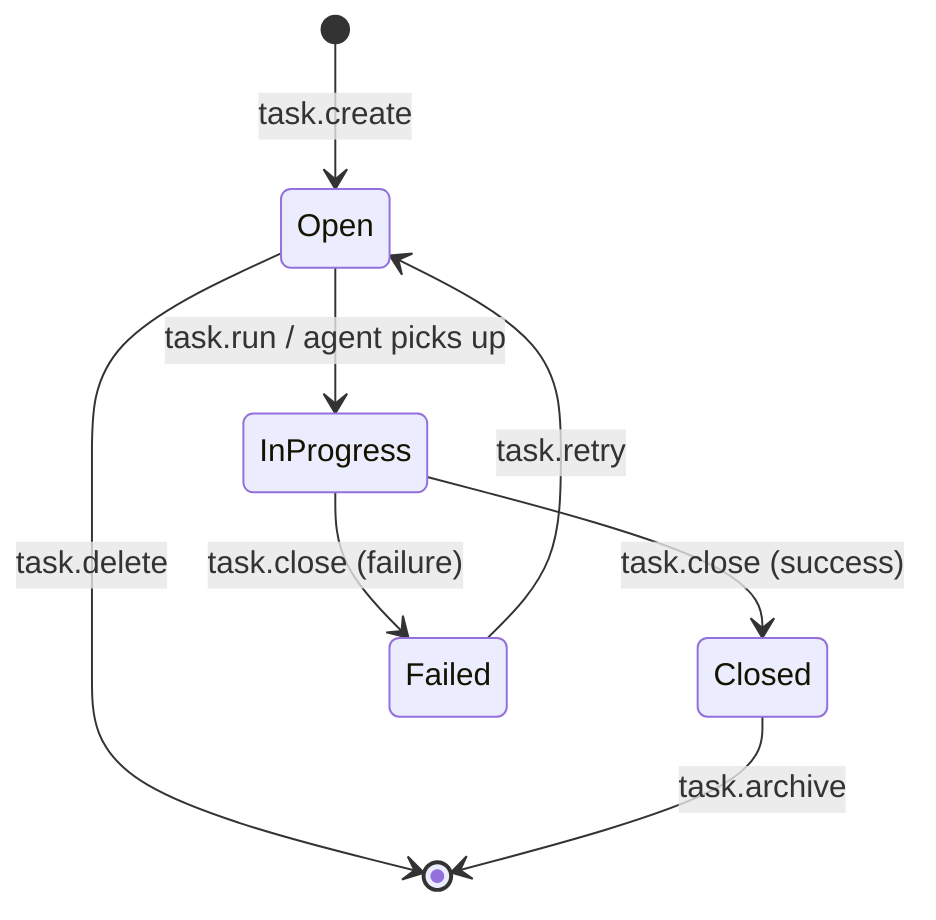
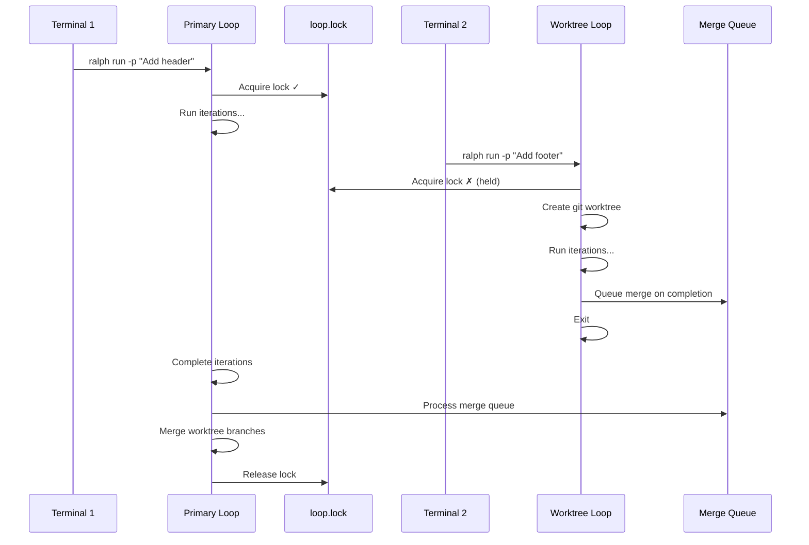
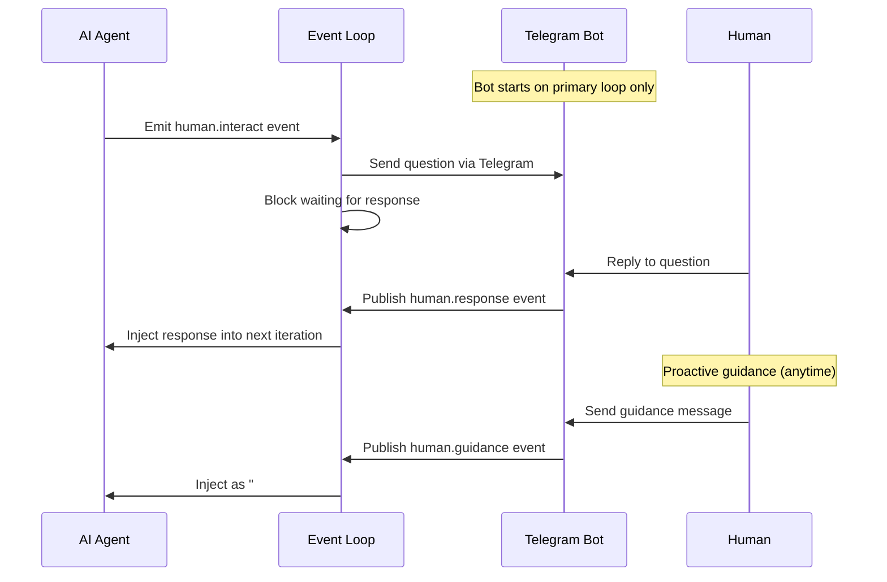
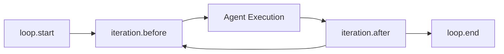
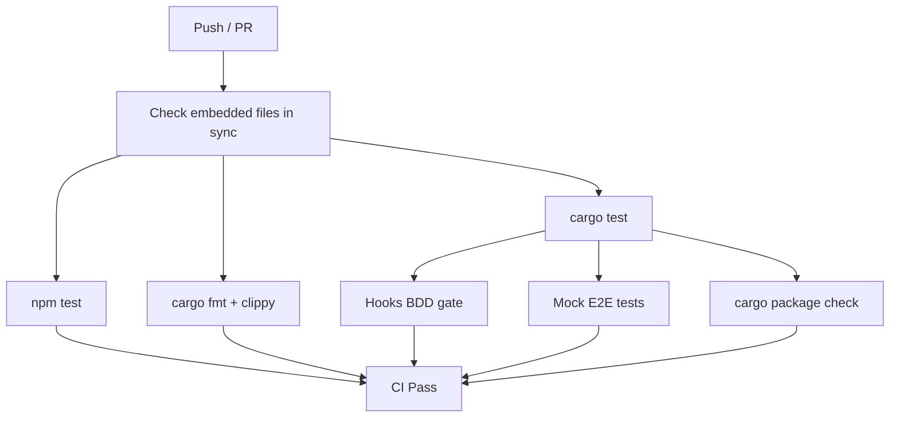
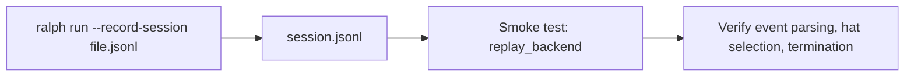

# Workflows

## Primary Orchestration Loop

The main `ralph run` workflow:



## Planning Workflow (PDD)

Interactive planning via `ralph plan`:



## Task Lifecycle



## Parallel Loop Workflow



## Human-in-the-Loop (RObot)



## Hook Lifecycle



Each hook phase:
1. `HookEngine` resolves hooks for the phase-event
2. Builds JSON payload with iteration context, loop metadata, active hat info
3. `HookExecutor` runs each hook command, pipes payload to stdin
4. Handles errors per `on_error` config (fail, warn, ignore)
5. Supports suspend/resume for long-running hooks

## Web Dashboard Workflow

```mermaid
sequenceDiagram
    participant User
    participant CLI as ralph web
    participant API as ralph-api (Rust)
    participant FE as React Frontend
    participant Loop as Orchestration Loop

    User->>CLI: ralph web
    CLI->>API: Start Axum server (port 3000)
    CLI->>FE: Start Vite dev server (port 5173)
    CLI->>User: Open browser

    FE->>API: WebSocket connect
    API->>FE: Stream events (iterations, tasks, logs)

    User->>FE: Create task / start loop
    FE->>API: RPC call (task.create / task.run)
    API->>Loop: Spawn ralph run process
    Loop->>API: Stream output via RPC events
    API->>FE: Forward events via WebSocket
```

## Build & CI Workflow



## Session Recording & Replay

For smoke tests and debugging:



Fixtures stored in `crates/ralph-core/tests/fixtures/`.
