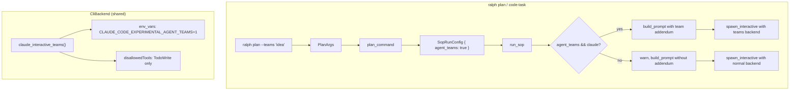

# Design: Agent Teams in Ralph

## Overview

Add `--teams` flag to `ralph plan` and `ralph code-task` that enables Claude Code's experimental Agent Teams feature. This enables parallel research and adversarial design review during interactive PDD sessions. The flag is intentionally not available on `ralph run` — Agent Teams requires an interactive session, which the non-interactive orchestration loop does not provide.

The implementation is a thin integration layer: a CLI flag, environment variable injection via `CliBackend`, tool allow-listing, and (for plan/code-task) a prompt addendum — no architectural changes.

## Detailed Requirements

### Functional Requirements

1. **New `--teams` CLI flag** on `ralph plan` and `ralph code-task` commands
2. **Environment variable injection**: Set `CLAUDE_CODE_EXPERIMENTAL_AGENT_TEAMS=1` on the spawned Claude process when `--teams` is passed. Carried by `CliBackend.env_vars` so both CLI and PTY executors apply it uniformly.
3. **Tool re-allowlisting**: When teams are enabled, `TaskCreate`, `TaskUpdate`, `TaskList`, `TaskGet` must not be in `--disallowedTools` (Agent Teams uses them internally). `TodoWrite` remains disallowed.
4. **Conditional prompt addendum** (plan/code-task only): Append team-specific instructions to the prompt when `--teams` is active. Instructions are suggestive (describe goals, not prescriptive team structures).
5. **Non-Claude graceful degradation**: When `--teams` is passed with a non-Claude backend, print a warning and proceed without teams.
6. **No SOP duplication**: Single `pdd.md` with a separate addendum file appended conditionally.

### Non-Functional Requirements

- Minimal code changes (~60-80 lines across 5-6 files)
- No changes to non-teams codepaths
- No new dependencies

## Architecture Overview



## Components and Interfaces

### 1. CLI Layer (`main.rs`)

**`PlanArgs` changes:**

```rust
struct PlanArgs {
    idea: Option<String>,
    backend: Option<String>,
    #[arg(long)]
    teams: bool,               // NEW
    custom_args: Vec<String>,
}
```

**`CodeTaskArgs` changes:** Same — add `teams: bool`.

**`plan_command()` / `code_task_command()` changes:** Thread `args.teams` into `SopRunConfig`.

### 2. Backend (`cli_backend.rs`)

**`CliBackend` struct changes:**

```rust
pub struct CliBackend {
    pub command: String,
    pub args: Vec<String>,
    pub prompt_mode: PromptMode,
    pub prompt_flag: Option<String>,
    pub output_format: OutputFormat,
    pub env_vars: Vec<(String, String)>,   // NEW
}
```

All existing constructors set `env_vars: vec![]`.

**New method:**

```rust
/// Interactive Claude with Agent Teams support.
/// Used by `ralph plan --teams` and `ralph code-task --teams`.
pub fn claude_interactive_teams() -> Self {
    Self {
        command: "claude".to_string(),
        args: vec![
            "--dangerously-skip-permissions".to_string(),
            "--disallowedTools=TodoWrite".to_string(),
        ],
        prompt_mode: PromptMode::Arg,
        prompt_flag: None,
        output_format: OutputFormat::Text,
        env_vars: vec![
            ("CLAUDE_CODE_EXPERIMENTAL_AGENT_TEAMS".to_string(), "1".to_string()),
        ],
    }
}
```

Disallows only `TodoWrite` and carries the Agent Teams env var.

**Executor changes:**

Both `cli_executor.rs` and `pty_executor.rs` apply `backend.env_vars` when spawning:

```rust
// cli_executor.rs — after command.current_dir()
for (key, value) in &self.backend.env_vars {
    command.env(key, value);
}

// pty_executor.rs — after cmd_builder.cwd()
for (key, value) in &self.backend.env_vars {
    cmd_builder.env(key, value);
}
```

### 3. SOP Runner (`sop_runner.rs`)

**`SopRunConfig` changes:**

```rust
pub struct SopRunConfig {
    pub sop: Sop,
    pub user_input: Option<String>,
    pub backend_override: Option<String>,
    pub config_path: Option<PathBuf>,
    pub custom_args: Option<Vec<String>>,
    pub agent_teams: bool,     // NEW
}
```

**`sops` module changes:**

```rust
pub mod sops {
    pub const PDD: &str = include_str!("../sops/pdd.md");
    pub const PDD_TEAM_ADDENDUM: &str = include_str!("../sops/pdd-team-addendum.md");  // NEW
    pub const CODE_TASK_GENERATOR: &str = include_str!("../sops/code-task-generator.md");
}
```

**`build_prompt()` changes:**

- New signature: `fn build_prompt(sop: Sop, user_input: Option<&str>, addendums: &[(&str, &str)])`
- `addendums` is a slice of `(xml_tag_name, content)` pairs
- Each addendum is appended after `</sop>` as `<{tag}>\n{content}\n</{tag}>`
- This is extensible: future features add new addendums without changing the signature

**`run_sop()` changes:**

- Build a `Vec<(&str, &str)>` of addendums based on active features
- When `agent_teams` is true and backend is Claude, push `("team-instructions", sops::PDD_TEAM_ADDENDUM)`
- If non-Claude backend with `agent_teams`, print warning and skip the addendum
- Select `claude_interactive_teams()` vs `claude_interactive()` based on flag
- Pass addendums vec to `build_prompt()`

**`spawn_interactive()` changes:**

- No `agent_teams` parameter needed — the backend's `env_vars` carries the env var
- Apply `backend.env_vars` when constructing the `Command` (same pattern as executors)

### 4. Team Addendum (`sops/pdd-team-addendum.md`)

A separate markdown file with suggestive team instructions. Content covers:

- **Research phase**: Use Agent Teams to parallelize research. Spawn teammates for different research angles. Synthesize findings before presenting to user.
- **Design phase**: Consider spawning a critic teammate for adversarial design review. The critic should challenge assumptions, identify gaps, and propose alternatives.
- **Iteration checkpoint**: Ensure all teammate findings are consolidated before asking user to proceed.
- **General guidance**: User gates remain enforced. The lead (main session) maintains the conversation with the user. Teammates work in the background.

## Data Models

- `CliBackend` gains `env_vars: Vec<(String, String)>`
- `SopRunConfig` gains `agent_teams: bool`
- `PlanArgs` and `CodeTaskArgs` gain `teams: bool`

## Error Handling

| Scenario | Handling |
|----------|----------|
| `--teams` with non-Claude backend (plan/code-task) | `warn!()` + proceed without teams |
| `--teams` with Claude but Agent Teams not installed/available | Claude handles this — the env var enables the feature but Claude itself manages availability. No Ralph-side error handling needed. |

No new error variants needed.

## Acceptance Criteria

### AC1: Teams flag is accepted on interactive commands

- **Given** a user runs `ralph plan --teams "idea"` or `ralph code-task --teams "desc"`
- **When** the CLI parses arguments
- **Then** `teams` is `true` and the command proceeds

### AC2: Environment variable is set via CliBackend

- **Given** `--teams` is passed and the backend is Claude
- **When** the child process is spawned (via any executor)
- **Then** `CLAUDE_CODE_EXPERIMENTAL_AGENT_TEAMS=1` is set in the process environment via `backend.env_vars`

### AC3: Task tools are re-allowed for teams

- **Given** `--teams` is passed and the backend is Claude
- **When** the `CliBackend` is constructed
- **Then** `--disallowedTools` only contains `TodoWrite` (not `TaskCreate`, `TaskUpdate`, `TaskList`, `TaskGet`)

### AC4: Team addendum is appended to prompt (plan/code-task only)

- **Given** `--teams` is passed for `ralph plan`
- **When** `build_prompt()` constructs the prompt
- **Then** the prompt contains the team addendum content wrapped in `<team-instructions>` tags after the `</sop>` tag

### AC5: Non-Claude backends degrade gracefully

- **Given** `--teams` is passed with `--backend gemini`
- **When** the backend is resolved
- **Then** a warning is printed and the session proceeds without teams

### AC6: No teams by default

- **Given** a user runs any command without `--teams`
- **When** the session spawns
- **Then** behavior is identical to current (no env var, full disallowed tools, no addendum)

### AC7: Extensible addendum pattern

- **Given** `build_prompt()` accepts `addendums: &[(&str, &str)]`
- **When** called with multiple addendums
- **Then** all are appended in order, each in its own XML tags

## Testing Strategy

### Unit Tests

1. **`cli_backend::tests`**:
   - `test_claude_interactive_teams_backend` — verify `claude_interactive_teams()` args and env_vars
   - `test_env_vars_default_empty` — verify existing constructors have empty env_vars

2. **`sop_runner::tests`**:
   - `test_build_prompt_with_addendums` — verify addendum is wrapped in correct XML tags
   - `test_build_prompt_with_multiple_addendums` — verify ordering
   - `test_build_prompt_no_addendums_unchanged` — regression

3. **`cli_executor` / `pty_executor`**: Existing spawn tests remain valid; env_vars application is trivial (2 lines each)

### Manual Testing

- `ralph plan --teams "Build a rate limiter"` — Claude starts with teams enabled
- `ralph plan --teams --backend gemini "idea"` — warning printed, proceeds without teams
- `ralph plan "idea"` / `ralph run -p "prompt"` — no regression

## Appendices

### A. Technology Choices

- **`env_vars` on `CliBackend`**: Chosen over per-call env var injection because both `cli_executor` and `pty_executor` need the env var. Putting it on the backend struct means a single point of configuration, applied uniformly by all executors.
- **Conditional assembly over SOP duplication**: Avoids drift between two SOP files.
- **Extensible addendum slice**: `&[(&str, &str)]` is zero-cost when empty, supports future addendums without signature changes.

### B. Research Findings

- Agent Teams requires `CLAUDE_CODE_EXPERIMENTAL_AGENT_TEAMS=1` env var
- Uses `TaskCreate`, `TaskUpdate`, `TaskList`, `TaskGet` tools internally
- Claude-only feature — other backends have no equivalent
- Teammates inherit lead's permissions (`--dangerously-skip-permissions`)
- Higher token usage (each teammate is a separate Claude instance)
- Known limitations: no session resumption, task status lag, slow shutdown
- Interactive sessions spawn via `sop_runner` (std::process Command) — supports `.env()`

### C. Alternative Approaches

1. **SOP duplication** (`pdd.md` + `pdd-teams.md`): Rejected — drift risk for no benefit.
2. **Parameterized `claude_interactive()`**: Rejected — separate method matches codebase pattern.
3. **Per-call env var injection**: Rejected — would require `agent_teams` params on `spawn_interactive()`, `cli_executor.execute()`, and `pty_executor.spawn_command()`. `env_vars` on `CliBackend` is cleaner.
4. **Hat-level integration**: Out of scope — much larger architectural change.
5. **Worktree-based parallelism**: Not suitable — no inter-agent communication.
