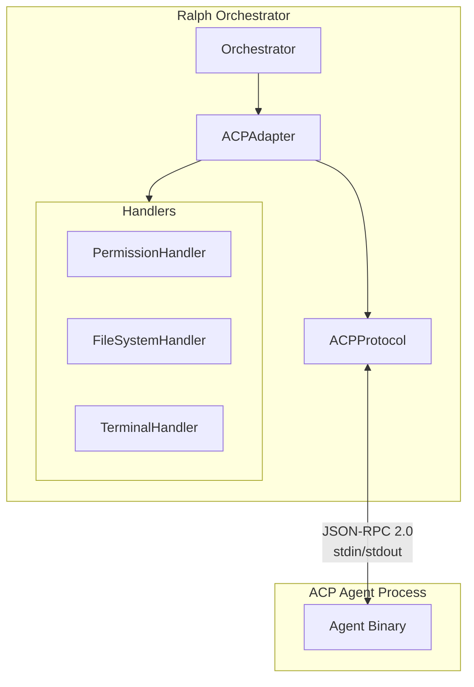
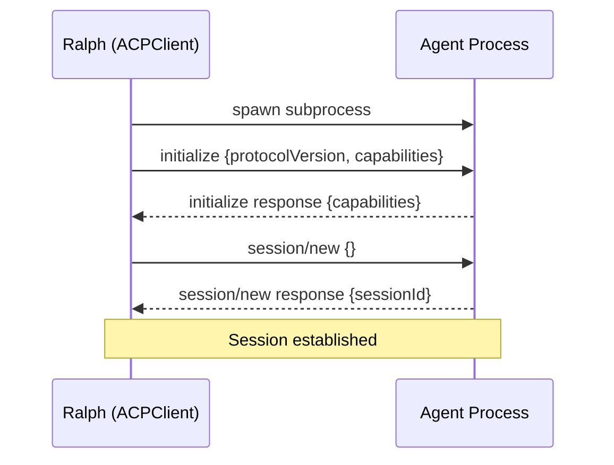
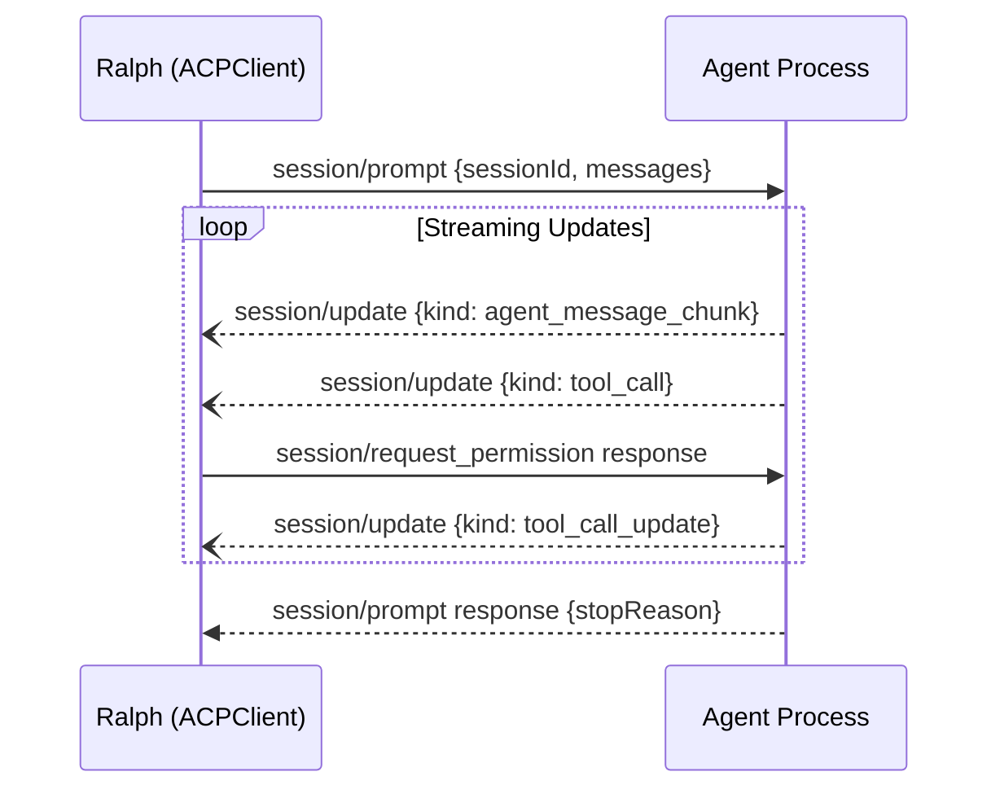
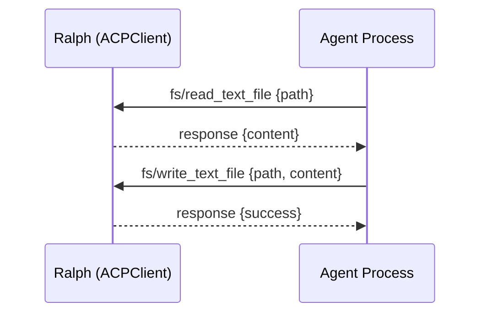

# ACP Adapter Detailed Design

## Overview

This document describes the design for adding Agent Client Protocol (ACP) support to Ralph Orchestrator. The implementation introduces a new `ACPAdapter` class that enables Ralph to communicate with ACP-compatible AI agents (Gemini CLI, Claude Code, Goose, etc.) via the JSON-RPC 2.0 protocol over subprocess stdin/stdout.

ACP is analogous to LSP (Language Server Protocol) but for AI coding agents - it standardizes how editors/orchestrators communicate with AI assistants.

---

## Detailed Requirements

### Functional Requirements

1. **ACP Client Role**
   - Ralph acts as ACP client, spawning agent binaries as subprocesses
   - Communication via JSON-RPC 2.0 over stdin/stdout
   - Support full ACP protocol lifecycle (initialize → session → prompt → updates)

2. **Adapter Architecture**
   - New `ACPAdapter` class alongside existing adapters (Claude, QChat, Gemini)
   - Configurable agent binary path (e.g., `gemini`, `claude`, `goose`)
   - Follows existing `ToolAdapter` interface

3. **Client Capabilities**
   - `session/request_permission` - Handle agent permission requests
   - `fs/read_text_file` - Serve file read requests
   - `fs/write_text_file` - Serve file write requests
   - `terminal/*` - Terminal operations (create, output, wait, kill)

4. **Permission Handling**
   - Configurable modes: `auto_approve`, `allowlist`, `interactive`, `deny_all`
   - Default: `auto_approve` for autonomous operation

5. **Update Processing**
   - Capture all `session/update` notification types
   - `agent_message_chunk` → Main output accumulation
   - `agent_thought_chunk` → Verbose logging
   - `tool_call` / `tool_call_update` → Tool execution tracking
   - `plan` → Debugging/logging

6. **Test Targets**
   - Primary: Gemini CLI (reference implementation)
   - Secondary: Claude Code (via ACP support)

### Non-Functional Requirements

1. **Compatibility**: Must work with existing Ralph orchestration loop
2. **Performance**: Async-first design for non-blocking I/O
3. **Reliability**: Graceful error handling and subprocess cleanup
4. **Observability**: Integration with Ralph's logging and metrics

---

## Architecture Overview

```
┌─────────────────────────────────────────────────────────────┐
│                    Ralph Orchestrator                        │
│  ┌─────────────┐  ┌─────────────┐  ┌─────────────────────┐ │
│  │ClaudeAdapter│  │GeminiAdapter│  │     ACPAdapter      │ │
│  │   (SDK)     │  │   (CLI)     │  │   (JSON-RPC 2.0)    │ │
│  └─────────────┘  └─────────────┘  └──────────┬──────────┘ │
└───────────────────────────────────────────────┼─────────────┘
                                                │
                              stdin/stdout (JSON-RPC 2.0)
                                                │
                                                ▼
                              ┌─────────────────────────────┐
                              │    ACP-Compatible Agent     │
                              │  (Gemini CLI, Claude, etc.) │
                              └─────────────────────────────┘
```

### Component Diagram



---

## Components and Interfaces

### 1. ACPAdapter Class

**Location**: `src/ralph_orchestrator/adapters/acp.py`

```python
class ACPAdapter(ToolAdapter):
    """ACP client adapter for communicating with ACP-compatible agents."""

    def __init__(
        self,
        agent_command: str = "gemini",
        agent_args: list[str] | None = None,
        permission_mode: str = "auto_approve",
        permission_allowlist: list[str] | None = None,
        verbose: bool = False,
        config: Any = None,
    ):
        """
        Initialize ACP adapter.

        Args:
            agent_command: Path/name of ACP agent binary
            agent_args: Additional arguments for agent
            permission_mode: How to handle permissions
            permission_allowlist: Patterns for allowlist mode
            verbose: Enable verbose output
            config: Optional adapter config
        """

    def check_availability(self) -> bool:
        """Check if agent binary is available."""

    def execute(self, prompt: str, **kwargs) -> ToolResponse:
        """Execute prompt synchronously."""

    async def aexecute(self, prompt: str, **kwargs) -> ToolResponse:
        """Execute prompt asynchronously."""

    def configure(
        self,
        agent_command: str | None = None,
        permission_mode: str | None = None,
        **kwargs
    ) -> None:
        """Update adapter configuration."""
```

### 2. ACPProtocol Class

**Location**: `src/ralph_orchestrator/adapters/acp_protocol.py`

Handles JSON-RPC 2.0 message serialization and protocol state.

```python
class ACPProtocol:
    """JSON-RPC 2.0 protocol handler for ACP."""

    def __init__(self):
        self._request_id: int = 0
        self._pending_requests: dict[int, asyncio.Future] = {}

    def create_request(self, method: str, params: dict) -> tuple[int, str]:
        """Create JSON-RPC request, return (id, json_string)."""

    def create_notification(self, method: str, params: dict) -> str:
        """Create JSON-RPC notification (no id)."""

    def parse_message(self, data: str) -> ACPMessage:
        """Parse incoming JSON-RPC message."""

    def create_response(self, request_id: int, result: Any) -> str:
        """Create JSON-RPC response for agent request."""

    def create_error_response(
        self, request_id: int, code: int, message: str
    ) -> str:
        """Create JSON-RPC error response."""
```

### 3. ACPClient Class

**Location**: `src/ralph_orchestrator/adapters/acp_client.py`

Manages subprocess lifecycle and message routing.

```python
class ACPClient:
    """ACP client managing agent subprocess and communication."""

    def __init__(
        self,
        command: str,
        args: list[str],
        protocol: ACPProtocol,
        handlers: ACPHandlers,
    ):
        self.process: asyncio.subprocess.Process | None = None
        self.protocol = protocol
        self.handlers = handlers

    async def start(self) -> None:
        """Spawn agent subprocess."""

    async def stop(self) -> None:
        """Terminate agent subprocess gracefully."""

    async def send_request(
        self, method: str, params: dict
    ) -> dict:
        """Send request and await response."""

    async def send_notification(self, method: str, params: dict) -> None:
        """Send notification (no response expected)."""

    async def _read_loop(self) -> None:
        """Read and route incoming messages."""

    async def _handle_message(self, message: ACPMessage) -> None:
        """Route message to appropriate handler."""
```

### 4. ACPHandlers Class

**Location**: `src/ralph_orchestrator/adapters/acp_handlers.py`

Implements client-side request handlers.

```python
class ACPHandlers:
    """Handlers for ACP client-side requests."""

    def __init__(
        self,
        permission_mode: str = "auto_approve",
        permission_allowlist: list[str] | None = None,
        working_dir: Path | None = None,
    ):
        self.permission_mode = permission_mode
        self.permission_allowlist = permission_allowlist or []
        self.working_dir = working_dir or Path.cwd()
        self._terminals: dict[str, Terminal] = {}

    async def handle_request_permission(
        self, params: dict
    ) -> dict:
        """Handle session/request_permission."""

    async def handle_read_file(self, params: dict) -> dict:
        """Handle fs/read_text_file."""

    async def handle_write_file(self, params: dict) -> dict:
        """Handle fs/write_text_file."""

    async def handle_terminal_create(self, params: dict) -> dict:
        """Handle terminal/create."""

    async def handle_terminal_output(self, params: dict) -> dict:
        """Handle terminal/output."""

    async def handle_terminal_kill(self, params: dict) -> dict:
        """Handle terminal/kill."""
```

### 5. ACPSession Class

**Location**: `src/ralph_orchestrator/adapters/acp_session.py`

Manages session state and update accumulation.

```python
@dataclass
class ACPSession:
    """ACP session state."""

    session_id: str
    output_chunks: list[str] = field(default_factory=list)
    thought_chunks: list[str] = field(default_factory=list)
    tool_calls: list[ToolCall] = field(default_factory=list)
    plans: list[Plan] = field(default_factory=list)

    def accumulate_update(self, update: dict) -> None:
        """Process session/update notification."""

    def get_output(self) -> str:
        """Get accumulated message output."""

    def get_full_log(self) -> str:
        """Get full verbose log including thoughts."""
```

---

## Data Models

### JSON-RPC 2.0 Messages

```python
@dataclass
class ACPMessage:
    """Base ACP message."""
    jsonrpc: str = "2.0"

@dataclass
class ACPRequest(ACPMessage):
    """JSON-RPC request (has id, expects response)."""
    id: int
    method: str
    params: dict

@dataclass
class ACPNotification(ACPMessage):
    """JSON-RPC notification (no id, no response)."""
    method: str
    params: dict

@dataclass
class ACPResponse(ACPMessage):
    """JSON-RPC response."""
    id: int
    result: dict | None = None
    error: dict | None = None
```

### Session Update Types

```python
@dataclass
class SessionUpdate:
    """session/update notification payload."""
    session_id: str
    update: UpdatePayload

@dataclass
class UpdatePayload:
    """Update content."""
    kind: str  # agent_message_chunk, tool_call, etc.
    content: Any

@dataclass
class ToolCall:
    """Tool call from agent."""
    id: str
    name: str
    arguments: dict
    status: str = "pending"  # pending, running, completed, failed
    result: Any = None
```

### Configuration Model

```python
@dataclass
class ACPAdapterConfig:
    """ACP adapter configuration."""
    enabled: bool = True
    agent_command: str = "gemini"
    agent_args: list[str] = field(default_factory=list)
    timeout: int = 300
    permission_mode: str = "auto_approve"
    permission_allowlist: list[str] = field(default_factory=list)
    verbose: bool = False
```

---

## Protocol Flow

### Initialization Sequence



### Prompt Execution Sequence



### File Operation Sequence



---

## Error Handling

### Error Categories

1. **Subprocess Errors**
   - Agent binary not found → `ToolResponse(success=False, error="Agent not found")`
   - Process crash → Capture stderr, return error response
   - Timeout → Terminate process, return timeout error

2. **Protocol Errors**
   - Invalid JSON → Log and skip message
   - Unknown method → Return JSON-RPC error response
   - Missing required fields → Return JSON-RPC error response

3. **Permission Errors**
   - Denied permission → Return denial response to agent
   - Invalid path → Return error with details

### JSON-RPC Error Codes

```python
class ACPErrorCodes:
    PARSE_ERROR = -32700
    INVALID_REQUEST = -32600
    METHOD_NOT_FOUND = -32601
    INVALID_PARAMS = -32602
    INTERNAL_ERROR = -32603

    # ACP-specific
    PERMISSION_DENIED = -32001
    FILE_NOT_FOUND = -32002
    FILE_ACCESS_ERROR = -32003
    TERMINAL_ERROR = -32004
```

### Graceful Shutdown

```python
async def stop(self) -> None:
    """Graceful shutdown sequence."""
    if self.process:
        # Send cancel notification if session active
        if self._session_id:
            await self.send_notification(
                "session/cancel",
                {"sessionId": self._session_id}
            )

        # Terminate gracefully
        self.process.terminate()
        try:
            await asyncio.wait_for(self.process.wait(), timeout=5.0)
        except asyncio.TimeoutError:
            self.process.kill()
            await self.process.wait()
```

---

## Testing Strategy

### Unit Tests

1. **ACPProtocol Tests**
   - JSON-RPC message creation
   - Message parsing
   - Request ID generation
   - Error response creation

2. **ACPHandlers Tests**
   - Permission handling for each mode
   - File read/write operations
   - Terminal operations
   - Edge cases (invalid paths, permissions)

3. **ACPSession Tests**
   - Update accumulation
   - Output aggregation
   - Tool call tracking

### Integration Tests

1. **ACPClient Tests**
   - Subprocess spawn/terminate
   - Message routing
   - Timeout handling
   - Signal handling

2. **ACPAdapter Tests**
   - Full execute() flow with mock agent
   - Integration with orchestrator
   - Cost/token tracking
   - Error recovery

### End-to-End Tests

1. **Gemini CLI Integration**
   - Real Gemini CLI execution (requires API key)
   - Full prompt → response cycle

2. **Mock Agent Tests**
   - Create mock ACP agent for CI testing
   - Test all protocol methods

### Test Structure

```
tests/
├── test_acp_adapter.py      # ACPAdapter unit tests
├── test_acp_protocol.py     # Protocol handling tests
├── test_acp_handlers.py     # Request handler tests
├── test_acp_client.py       # Client integration tests
├── test_acp_integration.py  # Full integration tests
└── fixtures/
    └── mock_acp_agent.py    # Mock agent for testing
```

---

## Appendices

### A. Technology Choices

| Component | Choice | Rationale |
|-----------|--------|-----------|
| Async I/O | `asyncio` | Matches existing Ralph architecture |
| JSON parsing | `json` (stdlib) | No external deps needed |
| Subprocess | `asyncio.subprocess` | Non-blocking I/O |
| Type hints | Python 3.10+ | Match existing codebase |

### B. Research Findings Summary

1. **Agent Client Protocol** is the active standard (Zed/xenodium)
2. JSON-RPC 2.0 over stdin/stdout
3. Supports streaming via notifications
4. Well-documented at agentclientprotocol.com
5. Reference implementations: Gemini CLI, acp.el

### C. Alternative Approaches Considered

1. **REST-based ACP (IBM)** - Rejected: Deprecated, merged into A2A
2. **Direct SDK integration** - Exists already (ClaudeAdapter)
3. **Plugin architecture** - Overkill for single protocol

### D. Configuration Schema

```yaml
# ralph.yml
adapters:
  acp:
    enabled: true
    agent_command: gemini
    agent_args: []
    timeout: 300
    permission_mode: auto_approve  # auto_approve, allowlist, interactive, deny_all
    permission_allowlist:
      - "fs/read_text_file:*"
      - "fs/write_text_file:*.py"
    verbose: false
```

### E. CLI Integration

```bash
# Use ACP adapter with Gemini
ralph run -a acp --acp-agent gemini

# Use ACP adapter with Claude
ralph run -a acp --acp-agent claude

# With specific permission mode
ralph run -a acp --acp-permission-mode allowlist
```
