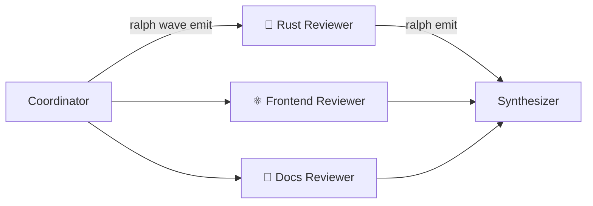

# エージェント波

エージェント波は、Ralph のオーケストレーションにループ内並列性を加えます。作業項目を一度に
1 つずつ処理する代わりに、ハットは並列のバックエンドインスタンスとして実行される項目の
**波**をディスパッチできます。すべて単一のイテレーション内で行われます。

## いつ波を使うか

波は、単一のイテレーションが複数の独立した項目に作業をファンアウトする必要があるときに
役立ちます。

- 専門レビュアーを並列に実行する（Rust、フロントエンド、ドキュメント）
- N 個の質問を同時に調査する
- N 個の独立した分析を並行実行する

波がなければ、ハットは項目をイテレーションをまたいで順次処理します。波はそれを 1 回の並列の
バーストに畳み込みます。

## 仕組み



波のライフサイクルには 3 つのフェーズがあります。

1. **ディスパッチ** — ハットが `ralph wave emit` を使って N 個のイベントを波として発行する
2. **実行** — ループランナーが並列のバックエンドインスタンスを spawn する（ハットの
   `concurrency` 上限まで）
3. **集約** — 結果がメインのイベントストリームにマージされ、次のハットが消費する

各波ワーカーは、独自のイベントファイルと環境変数を伴って分離して実行されます。ワーカーは
`ralph emit` で結果を公開し、ループランナーがすべてをメインのイベントファイルにマージし
戻します。

## 設定

2 つの新しいハット設定フィールドが波の実行を有効にします。

### `concurrency`

このハットの並列バックエンドインスタンスの最大数を設定します。

```yaml
hats:
  reviewer:
    name: "🔍 Reviewer"
    triggers: ["review.perspective"]
    publishes: ["review.done"]
    concurrency: 3  # Rust, frontend, and docs reviewers run simultaneously
    instructions: |
      Review code from your assigned specialist perspective.
```

`concurrency` が 1（既定）のとき、ハットは通常どおり順次実行されます。

### `aggregate`

下流のハットが波の結果をどう集めるかを設定します。

```yaml
hats:
  synthesizer:
    name: "📊 Synthesizer"
    triggers: ["review.done"]
    publishes: ["review.complete"]
    aggregate:
      mode: wait_for_all  # Wait for every worker to finish
      timeout: 300        # Give up after 5 minutes
    instructions: |
      Combine all review findings into a unified report.
```

| フィールド | 説明 |
|-------|-------------|
| `mode` | `wait_for_all` — 起動する前にすべてのワーカーの完了を待つ |
| `timeout` | 波をタイムアウトさせるまでの待機秒数 |

**タイムアウトの解決順:** ワーカーごとのタイムアウトを決めるとき、Ralph はまず
`hat.timeout` を、次に `aggregate.timeout` を確認し、300 秒にフォールバックします。

## 波のディスパッチ

ハットは `ralph wave emit` CLI コマンドを使って波をディスパッチします。

```bash
ralph wave emit <topic> --payloads "item1" "item2" "item3"
```

各ペイロードは、共有の `wave_id` でタグ付けされた別個のイベントになります。ループランナーは
これらのタグ付きイベントを検出し、並列ワーカーを spawn します。

### 例: 専門レビュアーのディスパッチ

````yaml
hats:
  coordinator:
    name: "📋 Coordinator"
    triggers: ["review.start"]
    publishes: ["review.perspective"]
    instructions: |
      Dispatch specialized reviewers as a wave. Each payload
      describes the reviewer's role and focus area:

      ```bash
      ralph wave emit review.perspective --payloads \
        "ROLE: Rust Reviewer. Focus on ownership, error handling, unsafe, performance." \
        "ROLE: Frontend Reviewer. Focus on React patterns, a11y, state management." \
        "ROLE: Docs Reviewer. Focus on README accuracy, doc comments, examples."
      ```
````

### コンテキストの注入

ハットの `publishes` が波対応ハット（`concurrency > 1` のもの）を対象とするとき、Ralph は
自動的にハットのプロンプトに **Wave Dispatch** セクションを注入します。このセクションは、
利用可能なトピック、ターゲットハット、使用構文を示します。これにより、ディスパッチする
ハットは指示をハードコードせずに波の発行方法を知ります。

## ワーカーの分離

各波ワーカーは次を伴って実行されます。

| 環境変数 | 用途 |
|---------------------|---------|
| `RALPH_WAVE_WORKER=1` | このプロセスを波ワーカーとしてマークする |
| `RALPH_WAVE_ID` | 共有の波の相関 ID |
| `RALPH_WAVE_INDEX` | このワーカーの 0 始まりのインデックス |
| `RALPH_EVENTS_FILE` | ワーカーごとのイベントファイルのパス |

ワーカーは標準の `ralph emit` で結果を公開します。

```bash
ralph emit review.done "## Rust Review\n\n### Critical\n- Unbounded clone in hot loop at src/handler.rs:42"
```

ループランナーは各ワーカーのイベントファイルから結果を集め、メインのイベントファイルに
マージします。

### ネストした波の防止

波ワーカーは自分の波をディスパッチできません。これは 2 つのレベルで強制されます。

- **ハードガード** — `ralph wave emit` は `RALPH_WAVE_WORKER` 環境変数を確認し、実行を
  拒否する
- **ソフトガード** — ワーカーのプロンプトは明示的に `ralph wave emit` を禁止する

## 並行性の制御

ワーカーの並列性は、ターゲットハットの `concurrency` 設定で制限されます。波に 10 項目
あっても `concurrency: 4` なら、一度に 4 ワーカーだけが実行されます。セマフォが、スロットが
空くまで追加のワーカーをゲートします。

```
Wave: 10 items, concurrency: 4

  Time →
  [Worker 0] [Worker 1] [Worker 2] [Worker 3]
             [Worker 4] ─────────── [Worker 5]
                        [Worker 6] [Worker 7]
                                   [Worker 8] [Worker 9]
```

## 3 ハットのパターン

ほとんどの波ワークフローは 3 ハットのパターンに従います。**コーディネーター → ワーカー →
シンセサイザー**。

```yaml
event_loop:
  starting_event: "review.start"
  completion_promise: "LOOP_COMPLETE"

hats:
  coordinator:
    name: "📋 Coordinator"
    triggers: ["review.start"]
    publishes: ["review.perspective"]
    instructions: |
      Dispatch specialized reviewers as a wave.
      Each payload describes a reviewer role and focus area.

  reviewer:
    name: "🔍 Reviewer"
    triggers: ["review.perspective"]
    publishes: ["review.done"]
    concurrency: 3
    instructions: |
      You are a specialized reviewer. Read your role from
      the event payload and review strictly from that perspective.

  synthesizer:
    name: "📊 Synthesizer"
    triggers: ["review.done"]
    publishes: ["review.complete"]
    aggregate:
      mode: wait_for_all
      timeout: 300
    instructions: |
      Merge all specialist findings into a unified report.
```

## 組み込みの波プリセット

波対応のプリセットが 1 つ Ralph に同梱されています。

| プリセット | ファイル | パターン | ワーカー | 並行性 |
|--------|------|---------|---------|-------------|
| `wave-review` | `presets/wave-review.yml` | 専門的な並列コードレビュー | Reviewer（Rust, Frontend, Docs） | 3 |

```bash
# 並列コードレビュー
ralph run -c ralph.yml -H presets/wave-review.yml -p "Review the authentication module"
```

## 診断

波の進捗は現在、ターミナル UI に供給されるライブ RPC ストリームを通じて表面化されます。
`RALPH_DIAGNOSTICS=1` は引き続き標準のオーケストレーション診断を
`.ralph/diagnostics/*/orchestration.jsonl` に書き込みますが、ワーカーごとの波の進捗は
まだそこに永続化されません。

波 ID は `w-<hex-nanos>-<pid>-<seq>` 形式（例: `w-1a2b3c4d-12345-0`）に従い、一意性の
ために 16 進タイムスタンプ、プロセス ID、シーケンス番号を組み合わせます。

## TUI の進捗とドリルダウン

ターミナル UI は、ループの実行中に波の活動を表示するようになりました。

- `WaveStarted` は、ターゲットハット、ワーカー数、タイムアウトを伴う波バナーを描画する
- `WaveWorkerDone` は、成功/失敗、所要時間、ペイロードのプレビューを伴うワーカーごとの
  完了行を追加する
- `WaveCompleted` は、集約された成功/失敗の数と所要時間を記録する
- `WaveWorkerTextDelta` は、各ワーカーのライブ出力をそのワーカー自身のバッファにストリーム
  する

波データを持つイテレーションから `w` を押すと、波ワーカーのドリルダウンビューに入ります。
波ビューでは、ヘッダーが `[WAVE]` / `[worker N/M]` に切り替わり、`h` と `l` がワーカー
バッファを巡回し、通常のスクロールキーが選択したワーカー出力内を移動し、`Esc` がイテレー
ションビューに戻ります。完了した波バッファは所有するイテレーションに保存されるため、古い
イテレーションに戻って `w` を押し、完了後にその波を検査できます。

## 波 vs. 並列ループ

波と並列ループは、異なる並列性の問題を解決します。

- **波**はループ内のファンアウト/ファンインです。1 つのハットが単一のイテレーションを
  複数の制限されたワーカーバックエンドに分割し、それらの発行した結果を同じイベント
  ストリームに戻してアグリゲーターハットのためにマージできます。
- **並列ループ**はループ間の分離です。分離されたファイルシステム状態とマージ調整を伴う
  別々の git ワークツリーで、別々の Ralph ループを実行します。

独立した作業項目が同じループコンテキストを共有し、即座に統合すべきときは波を使います。作業が
別々のワークツリー、独立したファイル変更、またはマージキューの分離を必要とするときは並列
ループを使います。将来の収束により、波ワーカーがワーカーごとのより強いファイルシステム/
ワークツリーの分離をオプトインできるようになるかもしれませんが、今日の波ワーカーは 1 つの
ループ内のバックエンドプロセスの分離です。

## 現在の制限

- **イテレーションあたり 1 つの波** — 同じイベント読み込みで複数の波が検出された場合、
  辞書順で最初の `wave_id` のみが実行される（決定的なタイブレーク）ため、波は一度に 1 つ
  発行する
- **ネストした波なし** — ワーカーはサブ波をディスパッチできない
- **グローバルバックエンドのフォールバック** — ハットに固有のバックエンド上書きがない場合、
  ワーカーはグローバルバックエンドを使う
- **非 TUI の可観測性が限定的** — TUI はライブの波の進捗とワーカーのドリルダウンを表示するが、
  Web ダッシュボードと `ralph loops` の一覧は、同等の波ワーカーの進捗/ドリルダウンビューを
  まだ公開していない

## 関連項目

- [ハットとイベント](../concepts/hats-and-events.ja.md) — ハットとイベントの動作
- [並列ループ](parallel-loops.ja.md) — ワークツリーによるループ間並列性
- [診断](diagnostics.ja.md) — オーケストレーションの問題のデバッグ
- [プリセット](../guide/presets.ja.md) — 利用可能なハットコレクション
