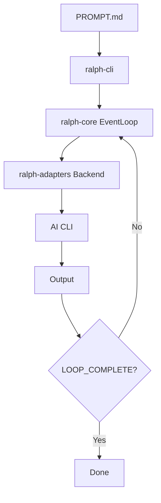
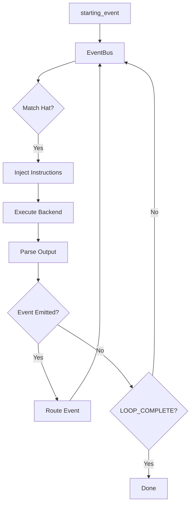

# アーキテクチャ

Ralph のシステムアーキテクチャと、各部品がどう組み合わさるかです。

## 概要

Ralph は 7 つのクレートを持つ Cargo ワークスペースであり、それぞれが特定の責務を持ちます。

```
┌─────────────────────────────────────────────────────────┐
│                      ralph-cli                          │
│                  (Binary Entry Point)                   │
├─────────────┬─────────────┬─────────────┬──────────────┤
│ ralph-core  │ralph-adapters│  ralph-tui  │ ralph-e2e   │
│  (Engine)   │ (Backends)   │    (UI)     │  (Testing)  │
├─────────────┴─────────────┴─────────────┴──────────────┤
│                     ralph-proto                         │
│                  (Protocol Types)                       │
└─────────────────────────────────────────────────────────┘
```

## クレートの責務

### ralph-proto

すべてのクレートで共有されるプロトコル型。

**主要な型:**

| 型 | 用途 |
|------|---------|
| `Event` | トピック、ペイロード、ソース/ターゲットハットを持つメッセージ |
| `Hat` | ペルソナの定義（トリガー、公開、指示） |
| `HatId` | 一意のハット識別子 |
| `Topic` | glob パターンによるイベントルーティング |
| `EventBus` | ハットレジストリとイベントルーティング |

**場所:** `crates/ralph-proto/src/`

### ralph-core

オーケストレーションエンジン。

**主要なコンポーネント:**

| モジュール | 用途 |
|--------|---------|
| `EventLoop` | メインのオーケストレーションループ |
| `config` | YAML 設定の読み込み |
| `event_parser` | エージェント出力からイベントを解析する |
| `memory_store` | 永続的なメモリの管理 |
| `task_store` | タスクの保存とクエリ |
| `instructions` | ハット指示の組み立て |

**場所:** `crates/ralph-core/src/`

### ralph-adapters

CLI バックエンドの統合。

**主要なコンポーネント:**

| モジュール | 用途 |
|--------|---------|
| `CliBackend` | バックエンドの定義 |
| `pty_executor` | PTY ベースの実行 |
| `stream_handler` | 出力ハンドラ |
| `auto_detect` | バックエンドの可用性検出 |

**サポートされるバックエンド:**
- Claude Code
- Kiro
- Gemini CLI
- Codex
- Forge
- Amp
- Copilot CLI
- OpenCode

**場所:** `crates/ralph-adapters/src/`

### ralph-tui

ratatui を使ったターミナル UI。

**機能:**
- リアルタイムのイテレーション表示
- 経過時間の追跡
- ハットの絵文字と名前の表示
- 活動インジケータ
- イベントトピックの表示

**場所:** `crates/ralph-tui/src/`

### ralph-cli

バイナリのエントリポイントと CLI の解析。

**コマンド:**
- `ralph run` — オーケストレーションを実行する
- `ralph init` — 設定を初期化する
- `ralph plan` — PDD の計画
- `ralph task` — タスクの生成
- `ralph events` — 履歴を表示する
- `ralph tools` — メモリ/タスクの管理

**場所:** `crates/ralph-cli/src/`

### ralph-e2e

エンドツーエンドのテストフレームワーク。

**テストの階層:**

| 階層 | 焦点 |
|------|-------|
| 1 | 接続性 |
| 2 | オーケストレーションループ |
| 3 | イベント |
| 4 | 能力 |
| 5 | ハットコレクション |
| 6 | メモリシステム |
| 7 | エラー処理 |

**場所:** `crates/ralph-e2e/src/`

### ralph-bench

ベンチマークのハーネス（開発のみ）。

**場所:** `crates/ralph-bench/src/`

## データフロー

### 従来型モード



### ハットベースモード



## 状態管理

### ディスク上のファイル

すべての永続的な状態は `.agent/` にあります。

```
.agent/
├── memories.md         # 永続的な学習
├── tasks.jsonl         # ランタイムの作業追跡
├── event_history.jsonl # イベントの監査ログ
└── scratchpad.md       # イテレーションの状態（ハットごとのスクラッチパッドも存在することがある）
```

### イベントバス

実行中はメモリ内にあります。

```rust
struct EventBus {
    hats: HashMap<HatId, Hat>,
    pending_events: VecDeque<Event>,
    event_history: Vec<Event>,
}
```

### 設定

`ralph.yml` から読み込まれます。

```rust
struct Config {
    cli: CliConfig,
    event_loop: EventLoopConfig,
    core: CoreConfig,
    memories: MemoryConfig,
    tasks: TaskConfig,
    hats: HashMap<String, HatConfig>,
}
```

## プロセスモデル

### Unix プロセスグループ

Ralph はプロセスを注意深く管理します。

- プロセスグループのリーダーシップを作成する
- SIGINT、SIGTERM をグレースフルに処理する
- 孤立プロセスを防ぐ
- 終了時にターミナルの状態を復元する

### PTY の処理

リアルタイムの出力キャプチャのために:

```rust
// Async PTY execution with stream handling
pty_executor.execute(command, stream_handler).await
```

## 非同期アーキテクチャ

Ralph は全体を通じて Tokio を使います。

- 非同期トレイトのサポート
- ストリームベースの出力キャプチャ
- 並行 PTY 処理
- ノンブロッキングの TUI 更新

## エラー処理

コンテキスト付きのカスタムエラー型:

```rust
// thiserror for type definitions
#[derive(Error, Debug)]
enum RalphError {
    #[error("Configuration error: {0}")]
    Config(String),
    // ...
}

// anyhow for context
fn load_config() -> Result<Config> {
    read_file(path).context("Failed to load config")?
}
```

## 拡張ポイント

### カスタムバックエンド

`CliBackend` トレイトを実装します。

```rust
struct MyBackend;

impl CliBackend for MyBackend {
    fn command(&self) -> &str { "my-cli" }
    fn prompt_mode(&self) -> PromptMode { PromptMode::Arg }
}
```

### カスタムストリームハンドラ

`StreamHandler` トレイトを実装します。

```rust
struct MyHandler;

impl StreamHandler for MyHandler {
    fn on_output(&mut self, chunk: &str) { ... }
    fn on_complete(&mut self) { ... }
}
```

## パフォーマンスの考慮事項

### コンテキストウィンドウ

「スマートゾーン」（トークンの 40〜60%）に最適化します。

- メモリ注入には設定可能な予算がある
- 指示は効率的に組み立てられる
- 大きな出力は切り詰められる

### トークン効率

- イベントはルーティングの信号であり、データの搬送手段ではない
- 詳細な出力はメモリに行く
- イベントのペイロードは小さく保たれる

## 次のステップ

- [イベントシステムの設計](event-system.ja.md) を深く探る
- [カスタムハットの作成](custom-hats.ja.md) について学ぶ
- [テストと検証](testing.ja.md) を理解する
