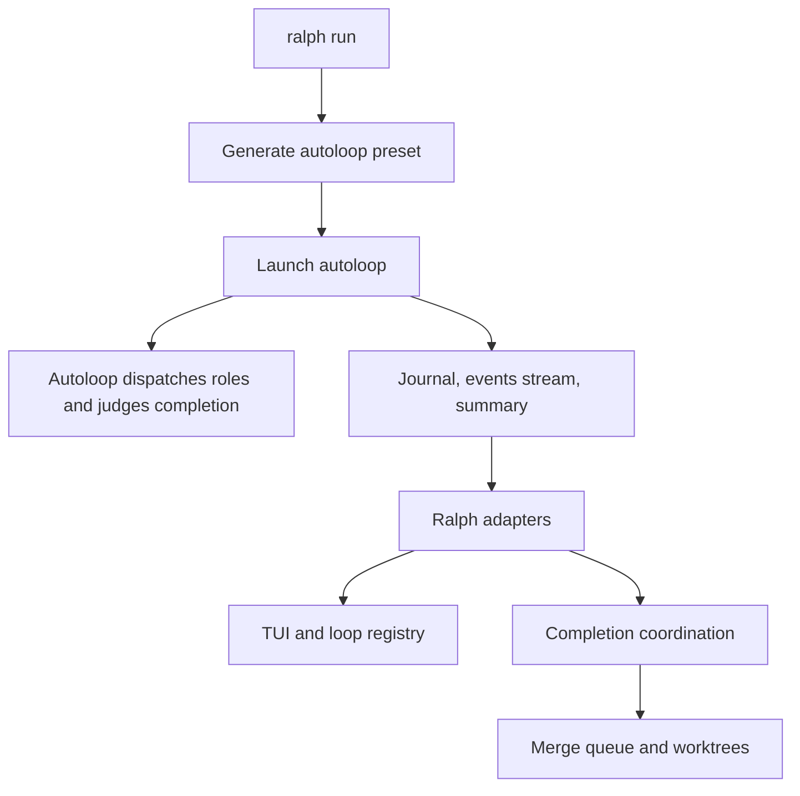

# Architecture

Ralph is the terminal frontend and observation/coordination plane for the
**autoloop** engine. Autoloop owns role dispatch, iteration state, event
routing, task completion judgment, and the final summary. Ralph does not
re-implement those decisions: it launches autoloop and observes its journal,
`--events` stream, and summary, then coordinates the TUI, loop registry,
worktrees, completion handling, and merge queue around those contracts.

## Workspace Layout

The Cargo workspace has nine crates:

| Crate | Responsibility |
|-------|----------------|
| `ralph-cli` | CLI/TUI frontend, autoloop launch, completion and merge coordination |
| `ralph-core` | Shared configuration and coordination state |
| `ralph-adapters` | Autoloop process, journal, event-stream, and summary adapters |
| `ralph-tui` | Ratatui observation UI |
| `ralph-proto` | Shared protocol definitions |
| `ralph-telegram` | Retained Telegram components; not connected to `ralph run` under v3 pending autoloop#345 |
| `ralph-e2e` | Legacy E2E scenario inventory and test framework |
| `ralph-bench` | Benchmarking support |
| `ralph-api` | Rust RPC API used by the web dashboard |

The separate `backend/` and `frontend/` workspaces contain the legacy Node web
server and the React dashboard.

## Execution Flow



The load-bearing implementation files are:

- `crates/ralph-cli/src/autoloop_engine.rs`
- `crates/ralph-cli/src/autoloop_preset_gen.rs`
- `crates/ralph-cli/src/completion_coord.rs`
- `crates/ralph-cli/src/merge_processing.rs`
- `crates/ralph-adapters/src/autoloop_runner.rs`
- `crates/ralph-adapters/src/autoloop_events.rs`
- `crates/ralph-adapters/src/autoloop_journal.rs`
- `crates/ralph-adapters/src/autoloop_event_tailer.rs`
- `crates/ralph-core/src/autoloop_health.rs`

## Configuration Translation

Ralph reads `ralph.yml` and translates supported hats, events, backend options,
budgets, and completion settings into a temporary autoloop preset. Hat
concurrency and aggregation become autoloop topology settings; autoloop then
owns dispatch and aggregation.

Some Ralph configuration remains coordination-only. In particular, Ralph's
runtime task records and autoloop's canonical task records have incompatible
formats. Ralph may inspect open Ralph tasks after a run and warn, but only
autoloop's task store participates in the engine completion gate.

## State on Disk

Primary-loop coordination state lives under `.ralph/`:

```text
.ralph/
├── agent/
│   ├── memories.md       # Ralph persistent memories
│   ├── tasks.jsonl       # Ralph runtime tracking; not autoloop's completion gate
│   └── scratchpad.md     # Retained configurable Ralph state path
├── events.jsonl          # Ralph event-history view/default emit target
├── loop.lock             # Primary-loop lock
├── loops.json            # Loop registry
├── merge-queue.jsonl     # Event-sourced merge queue
├── specs/                # Committed specifications
└── tasks/                # Committed code-task files
```

Autoloop keeps its own canonical run state and journal. Ralph consumes those
engine artifacts through the adapter contract rather than copying their
judgment into `.ralph/agent/tasks.jsonl` or the scratchpad.

Worktree loops isolate events, runtime tasks, and scratchpad under that
worktree's `.ralph/`. Memories, specifications, and committed code tasks are
symlinked to the main repository. See [Parallel Loops](parallel-loops.md).

## Observation and Completion

In TUI mode Ralph tails autoloop's event stream and journal while the engine is
running. When autoloop exits, Ralph reads the summary, maps the engine stop
reason, updates coordination state, and either completes in place or queues a
worktree for merge processing.

Telegram HITL is not currently part of this flow. The retained bot and relay
components are awaiting an autoloop engine relay contract (autoloop#345).

## Process Model

Ralph supervises the autoloop subprocess, handles terminal restoration and
signals, and keeps auxiliary event/journal readers synchronized with process
termination. Tokio tasks keep TUI observation non-blocking.

## Next Steps

- [Hats and Events](../concepts/hats-and-events.md)
- [Parallel Loops](parallel-loops.md)
- [Testing & Validation](testing.md)
- [Diagnostics](diagnostics.md)
