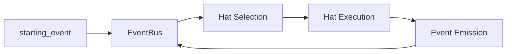

# 高度なトピック

Ralph の内部と高度な使用パターンへの深掘りです。

## このセクションの内容

| トピック | 説明 |
|-------|-------------|
| [アーキテクチャ](architecture.ja.md) | システム設計とクレート構造 |
| [カスタムハットの作成](custom-hats.ja.md) | カスタムハットを設計・実装する |
| [イベントシステムの設計](event-system.ja.md) | ハット間でイベントがどうルーティングされるか |
| [メモリシステム](memory-system.ja.md) | 永続的な学習の仕組み |
| [タスクシステム](task-system.ja.md) | ランタイムの作業追跡 |
| [テストと検証](testing.ja.md) | スモークテスト、E2E テスト、TUI 検証 |
| [診断](diagnostics.ja.md) | 完全な可視性でデバッグする |
| [並列ループ](parallel-loops.ja.md) | ワークツリーで複数のループを並行実行する |
| [エージェント波](agent-waves.ja.md) | スキャッター・ギャザーのワークフロー向けのループ内並列性 |

## いつこれを読むか

これらのガイドは、次のような場合に役立ちます。

- 複雑なマルチハットワークフローを構築している
- Ralph が内部でどう動くかを理解したい
- Ralph の開発にコントリビュートしている
- 厄介な問題をデバッグする必要がある
- カスタムバックエンドで Ralph を拡張している

## 主要概念

### クレートアーキテクチャ

Ralph は Cargo ワークスペースとして構成されています。

```
ralph-orchestrator/
├── crates/
│   ├── ralph-proto/     # プロトコル型
│   ├── ralph-core/      # オーケストレーションエンジン
│   ├── ralph-adapters/  # CLI バックエンド
│   ├── ralph-telegram/  # ヒューマンインザループ用の Telegram ボット
│   ├── ralph-tui/       # ターミナル UI
│   ├── ralph-cli/       # バイナリのエントリポイント
│   ├── ralph-e2e/       # エンドツーエンドのテスト
│   └── ralph-bench/     # ベンチマーク
```

### イベントフロー

イベントは、ハットベースの Ralph の神経系です。



### 状態管理

Ralph は、すべての永続的な状態にファイルを使います。

| ファイル | 用途 |
|------|---------|
| `.agent/memories.md` | セッションをまたいだ学習 |
| `.agent/tasks.jsonl` | ランタイムの作業追跡 |
| `.agent/event_history.jsonl` | イベントの監査ログ |
| `.agent/scratchpad.md` | イテレーションの状態（ハットごとのスクラッチパッドも存在することがある） |

## クイックリファレンス

### 診断を有効にする

```bash
RALPH_DIAGNOSTICS=1 ralph run
```

### E2E テストを実行する

```bash
cargo run -p ralph-e2e -- claude
```

### セッションを記録する

```bash
ralph run --record-session debug.jsonl -p "your prompt"
```

### TUI を検証する

```bash
# テストガイドの TUI 検証を参照
/tui-validate file:output.txt criteria:ralph-header
```

## 次のステップ

全体像は [アーキテクチャ](architecture.ja.md) から始めてください。
