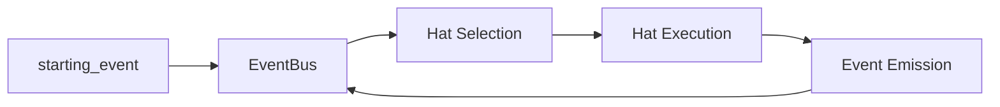

# Advanced Topics

Deep dives into Hats's internals and advanced usage patterns.

## In This Section

| Topic | Description |
|-------|-------------|
| [Architecture](architecture.md) | System design and crate structure |
| [Creating Custom Hats](custom-hats.md) | Design and implement custom hats |
| [Event System Design](event-system.md) | How events route between hats |
| [Memory System](memory-system.md) | Persistent learning mechanics |
| [Task System](task-system.md) | Runtime work tracking |
| [Testing & Validation](testing.md) | Smoke tests, E2E tests, TUI validation |
| [Diagnostics](diagnostics.md) | Debug with full visibility |
| [Parallel Loops](parallel-loops.md) | Run multiple loops concurrently with worktrees |

## When to Read This

These guides are for you if:

- You're building complex multi-hat workflows
- You want to understand how Hats works internally
- You're contributing to Hats development
- You need to debug tricky issues
- You're extending Hats with custom backends

## Key Concepts

### Crate Architecture

Hats is organized as a Cargo workspace:

```
hats/
├── crates/
│   ├── hats-proto/     # Protocol types
│   ├── hats-core/      # Orchestration engine
│   ├── hats-adapters/  # CLI backends
│   ├── hats-telegram/  # Telegram bot for human-in-the-loop
│   ├── hats-tui/       # Terminal UI
│   ├── hats-cli/       # Binary entry point
│   ├── hats-e2e/       # End-to-end testing
│   └── hats-bench/     # Benchmarking
```

### Event Flow

Events are the nervous system of hat-based Hats:



### State Management

Hats uses files for all persistent state:

| File | Purpose |
|------|---------|
| `.agent/memories.md` | Cross-session learning |
| `.agent/tasks.jsonl` | Runtime work tracking |
| `.agent/event_history.jsonl` | Event audit log |
| `.agent/scratchpad.md` | Legacy state (deprecated) |

## Quick Reference

### Enable Diagnostics

```bash
HATS_DIAGNOSTICS=1 hats run
```

### Run E2E Tests

```bash
cargo run -p hats-e2e -- claude
```

### Record a Session

```bash
hats run --record-session debug.jsonl -p "your prompt"
```

### Validate TUI

```bash
# See TUI Validation in Testing guide
/tui-validate file:output.txt criteria:hats-header
```

## Next Steps

Start with [Architecture](architecture.md) for the big picture.
