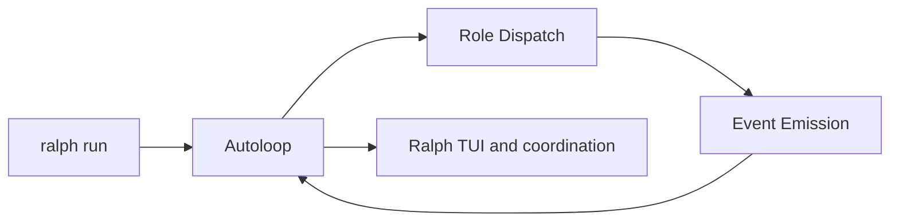

# Advanced Topics

Deep dives into Ralph's internals and advanced usage patterns.

## In This Section

| Topic | Description |
|-------|-------------|
| [Architecture](architecture.md) | System design and crate structure |
| [Creating Custom Hats](custom-hats.md) | Design and implement custom hats |
| [Event System Design](event-system.md) | How events route between hats |
| [Memory System](memory-system.md) | Persistent learning mechanics |
| [Task System](task-system.md) | Runtime work tracking |
| [Testing & Validation](testing.md) | Current Rust gates, legacy E2E inventory, TUI validation |
| [Diagnostics](diagnostics.md) | Debug with full visibility |
| [Parallel Loops](parallel-loops.md) | Run multiple loops concurrently with worktrees |

## When to Read This

These guides are for you if:

- You're building complex multi-hat workflows
- You want to understand how Ralph works internally
- You're contributing to Ralph development
- You need to debug tricky issues
- You're extending Ralph with custom backends

## Key Concepts

### Crate Architecture

Ralph is organized as a Cargo workspace:

```
ralph-orchestrator/
├── crates/
│   ├── ralph-proto/     # Protocol types
│   ├── ralph-core/      # Shared config and coordination state
│   ├── ralph-adapters/  # Autoloop process/contract adapters
│   ├── ralph-telegram/  # Telegram HITL relay for Autoloop
│   ├── ralph-tui/       # Terminal UI
│   ├── ralph-cli/       # Binary entry point
│   ├── ralph-e2e/       # End-to-end testing
│   └── ralph-bench/     # Benchmarking
```

### Event Flow

Autoloop owns role dispatch and event routing. Ralph translates configured
hats into an autoloop topology and observes the engine's event stream:


```mermaid
flowchart LR
    A[ralph run] --> B[Autoloop]
    B --> C[Role Dispatch]
    C --> D[Event Emission]
    D --> B
    B --> E[Ralph TUI and coordination]
```

### State Management

Ralph uses files for all persistent state:

| File | Purpose |
|------|---------|
| `.ralph/agent/memories.md` | Ralph cross-session learning |
| `.ralph/agent/tasks.jsonl` | Ralph runtime tracking; separate from autoloop completion |
| `.ralph/events.jsonl` | Default Ralph event-history/emit path |
| `.ralph/agent/scratchpad.md` | Retained configurable Ralph coordination path |

## Quick Reference

### Enable Diagnostics

```bash
RALPH_DIAGNOSTICS=1 ralph run
```

### Run E2E Tests

```bash
cargo run -p ralph-e2e -- claude
```

### Inspect Diagnostics

TUI runs write logs under `.ralph/diagnostics/logs/`. Set
`RALPH_DIAGNOSTICS=1` for the full diagnostic artifact set.

### Validate TUI

```bash
# See TUI Validation in Testing guide
/tui-validate file:output.txt criteria:ralph-header
```

## Next Steps

Start with [Architecture](architecture.md) for the big picture.
