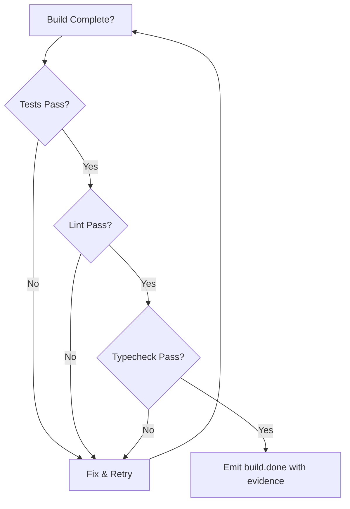

# バックプレッシャー

バックプレッシャーは、Ralph が品質ゲートを強制する仕組みです。何かのやり方を規定する
代わりに、不完全な作業を拒否するゲートを定義します。

## 概念

> 「どうやるかを規定しない。悪い作業を拒否するゲートを作る。」 — 信条 #2

従来のアプローチ（規定）:

```
1. まず関数を書く
2. 次にテストを書く
3. 次にテストを実行する
4. 次に失敗を修正する
5. 次に linter を実行する
```

バックプレッシャーのアプローチ:

```
機能を実装する。
必要な証拠: tests: pass, lint: pass, typecheck: pass, audit: pass, coverage: pass
任意（警告のみ）: mutants: pass (>=70%)
任意（失敗でブロック）: specs: pass
```

AI が「どうやるか」を考えます。十分に賢いのです。あなたの仕事は「成功の姿」を定義する
ことです。

## 仕組み

### ハットの指示の中で

```yaml
hats:
  builder:
    instructions: |
      Implement the assigned task.

      ## Backpressure Requirements

      Before emitting build.done, you MUST have:
      - tests: pass (run `cargo test`)
      - lint: pass (run `cargo clippy`)
      - typecheck: pass (run `cargo check`)
      - audit: pass (run `cargo audit`)
      - coverage: pass (run `cargo tarpaulin` or equivalent)
      - mutants: pass (run `just mutants-baseline`) # warning-only

      Include evidence in your event:
      ```
      ralph emit "build.done" "tests: pass, lint: pass, typecheck: pass, audit: pass, coverage: pass, mutants: pass (82%)"
      ```
```

### イベントのペイロードの中で

イベントは、バックプレッシャーを満たした証拠を運びます。

```bash
# 良い: 証拠を含む
ralph emit "build.done" "tests: pass, lint: pass, typecheck: pass, audit: pass, coverage: pass, mutants: pass (82%)"

# 悪い: 証拠がない
ralph emit "build.done" "I think it works"
```

### 他のハットによる検証

reviewer ハットはバックプレッシャーを検証できます。

```yaml
hats:
  reviewer:
    triggers: ["build.done"]
    instructions: |
      Verify the builder's claims:
      1. Check the event payload for evidence
      2. Re-run tests if evidence seems insufficient
      3. Reject if backpressure not satisfied

      If verified:
        ralph emit "review.approved" "evidence verified"
      If not:
        ralph emit "review.rejected" "tests actually failing"
```

## バックプレッシャーの種類

### 技術的なゲート

| ゲート | コマンド | 何を捕捉するか |
|------|---------|-----------------|
| テスト | `cargo test`, `npm test` | リグレッション、バグ |
| Lint | `cargo clippy`, `eslint` | コード品質の問題 |
| 型チェック | `cargo check`, `tsc` | 型エラー |
| 監査 | `cargo audit`, `npm audit` | 既知の脆弱性 |
| 整形 | `cargo fmt --check` | スタイル違反 |
| ビルド | `cargo build` | コンパイルエラー |
| ミューテーション | `just mutants-baseline`（ベースライン）, `just mutants-hooks-gate`（CI ゲート） | テストされていないロジックの穴。フックのロールアウトゲートはしきい値と重要な no-`MISS` 不変条件を強制する |
| スペック | 受け入れ基準を検証する | テストがスペック基準を満たしていない（任意、失敗でブロック） |

### リポジトリのミューテーションベースライン

このリポジトリでは、ミューテーションツールのベースラインは **cargo-mutants** であり、
次で呼び出します。

```bash
just mutants-baseline
```

このコマンドはフックに重要なモジュールに限定され、次に展開されます。

```bash
cargo mutants --file crates/ralph-core/src/hooks/executor.rs --file crates/ralph-core/src/hooks/engine.rs --file crates/ralph-core/src/preflight.rs --file crates/ralph-cli/src/loop_runner.rs
```

ミューテーション対象の範囲:
- `crates/ralph-core/src/hooks/executor.rs`
- `crates/ralph-core/src/hooks/engine.rs`
- `crates/ralph-core/src/preflight.rs`
- `crates/ralph-cli/src/loop_runner.rs`（フックの処理 + サスペンド制御の経路）

グローバルなミューテーション品質の解析は、`crates/ralph-core/src/event_parser.rs` の
`QualityReport::MUTATION_THRESHOLD` を通じて **>=70%** に固定されたままです。

限定されたフックのロールアウトについては、ベースラインの較正が
`docs/06-analysis/hooks-mutation-baseline-2026-03-01.md` に文書化されており、初期の
運用ゲートを **>=55%**（`caught / (caught + missed)`）に設定します。タイムアウトと
重要経路の no-survivor チェックは別途強制されます。

強制されるフックのミューテーション CI ゲートは次のとおりです。

```bash
just mutants-hooks-gate
```

`mutants-hooks-gate` は `scripts/hooks-mutation-gate.sh` を実行し、次を行います。

- `>= HOOKS_MUTATION_THRESHOLD` の運用スコアを強制する
- `crates/ralph-cli/src/loop_runner.rs:3467-3560,3623-3635` のいずれかの `MISS` で
  ハードに失敗する
- `TIMEOUT` と `unviable` のクラスを別々に報告する
- CI アップロード用に、実用的な成果物を `.artifacts/hooks-mutation/` に書き出す

### 挙動のゲート

主観的な基準には、LLM-as-judge を使います。

```yaml
hats:
  quality_judge:
    triggers: ["code.written"]
    instructions: |
      Evaluate the code quality:
      - Is it readable?
      - Are names meaningful?
      - Is complexity justified?

      Pass or fail with explanation.
```

### ドキュメントのゲート

```yaml
hats:
  doc_reviewer:
    triggers: ["feature.done"]
    instructions: |
      Check documentation:
      - [ ] README updated
      - [ ] API docs complete
      - [ ] Examples work

      Reject if documentation is missing.
```

## バックプレッシャーの実装

### ガードレールの中で

すべてのプロンプトに注入されるグローバルなルール:

```yaml
core:
  guardrails:
    - "Tests must pass before declaring done"
    - "Never skip linting"
    - "All public functions need doc comments"
```

### ハットの指示の中で

ハットごとの要件:

```yaml
hats:
  builder:
    instructions: |
      After implementing:
      1. Run `cargo test`
      2. Run `cargo clippy`
      3. Only emit build.done if both pass
```

### イベントの設計の中で

証拠を要求するイベント:

```yaml
# 単なる "done" イベントの代わりに
publishes: ["build.done"]

# 「証拠付きの done」パターンを検討する
# ペイロードの構造が証拠を強制する
```

## バックプレッシャーのフロー



## よくあるパターン

### オールオアナッシング

すべてが通らなければならない:

```bash
cargo test && cargo clippy && cargo fmt --check && \
  ralph emit "build.done" "all checks pass"
```

### 段階的なゲート

厳しさの異なるレベル:

```yaml
# 最初のイテレーション: テストのみ
evidence: "tests: pass"

# 後のイテレーション: 完全なチェック
evidence: "tests: pass, lint: pass, typecheck: pass, audit: pass, coverage: pass (>=80%)"
```

### 脱出ハッチ

例外的なケースのために:

```yaml
instructions: |
  Normally, all tests must pass.

  Exception: If a test is flaky (fails intermittently),
  document it and proceed. Add a memory:
  ralph tools memory add "Flaky test: test_network_timeout" -t fix
```

## アンチパターン

### バックプレッシャーがない

```yaml
# 悪い: 品質要件がない
instructions: |
  Implement the feature and emit build.done.
```

### 偽の証拠

```yaml
# 悪い: 証拠が検証されていない
ralph emit "build.done" "tests: pass, lint: pass, typecheck: pass, audit: pass, coverage: pass"  # 実際にはテストを実行していない
```

### ゲートが多すぎる

```yaml
# 悪い: 圧倒的な要件
instructions: |
  Must pass: unit tests, integration tests, e2e tests,
  lint, typecheck, format, security scan, performance
  benchmark, accessibility audit, i18n check...
```

バックプレッシャーは、重要なことに焦点を絞って保ちます。

## ベストプラクティス

1. **テストから始める** — 最も基本的なゲート
2. **品質のために lint を加える** — よくある問題を捕捉する
3. **証拠を含める** — 主張するだけでなく、証明する
4. **主張を検証する** — reviewer ハットを使う
5. **達成可能に保つ** — 厳しすぎると進行がブロックされる

## 次のステップ

- ハットの設計については [カスタムハットの作成](../advanced/custom-hats.ja.md) を見る
- 組み込みのバックプレッシャーを持つ [プリセット](../guide/presets.ja.md) を探す
- [テストと検証](../advanced/testing.ja.md) について学ぶ
