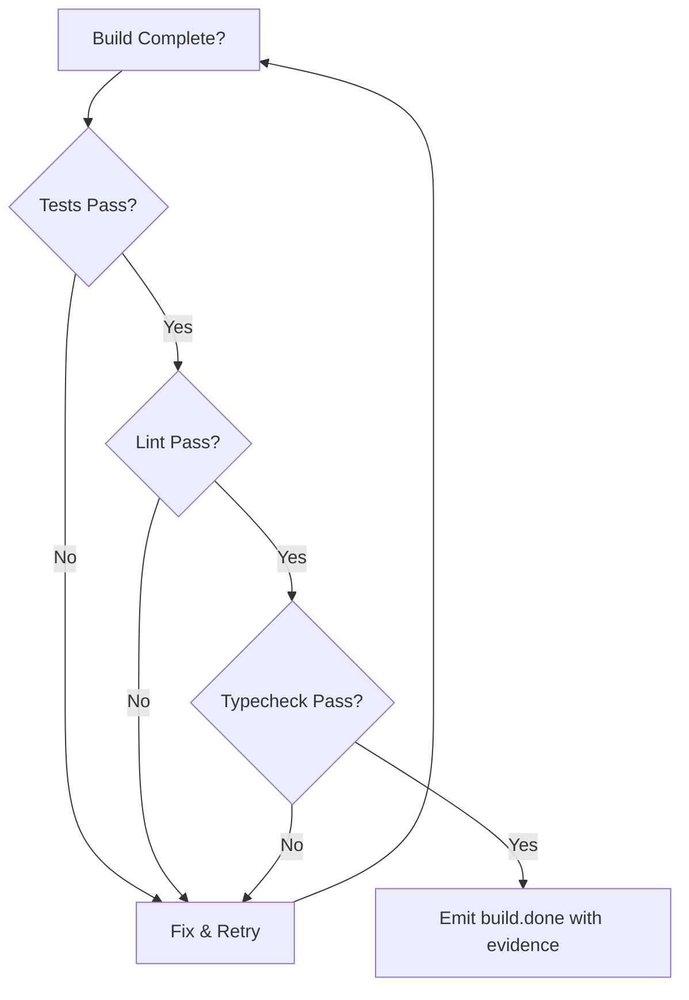

# Backpressure

Backpressure is Ralph's mechanism for enforcing quality gates. Instead of prescribing how to do something, you define gates that reject incomplete work.

## The Concept

> "Don't prescribe how; create gates that reject bad work." — Tenet #2

Traditional approach (prescription):

```
1. First, write the function
2. Then, write the tests
3. Then, run the tests
4. Then, fix any failures
5. Then, run the linter
```

Backpressure approach:

```
Implement the feature.
Evidence required: tests: pass, lint: pass, typecheck: pass, audit: pass, coverage: pass
Optional (warning-only): mutants: pass (>=70%)
Optional (fail blocks): specs: pass
```

The AI figures out the "how" — it's smart enough. Your job is defining "what success looks like."

## How It Works

### In Hat Instructions

```yaml
hats:
  builder:
    instructions: |
      Implement the assigned task.

      ## Backpressure Requirements

      Before emitting build.done, you MUST have:
      - tests: pass (run `cargo test`)
      - lint: pass (run `cargo clippy`)
      - typecheck: pass (run `cargo check`)
      - audit: pass (run `cargo audit`)
      - coverage: pass (run `cargo tarpaulin` or equivalent)
      - mutants: pass (run `git diff > /tmp/changes.diff && cargo mutants --in-diff /tmp/changes.diff`) # warning-only

      Include evidence in your event:
      ```
      ralph emit "build.done" "tests: pass, lint: pass, typecheck: pass, audit: pass, coverage: pass, mutants: pass (82%)"
      ```
```

### In Event Payloads

Events carry evidence of backpressure satisfaction:

```bash
# Good: Evidence included
ralph emit "build.done" "tests: pass, lint: pass, typecheck: pass, audit: pass, coverage: pass, mutants: pass (82%)"

# Bad: No evidence
ralph emit "build.done" "I think it works"
```

### Verification by Other Hats

A reviewer hat can verify backpressure:

```yaml
hats:
  reviewer:
    triggers: ["build.done"]
    instructions: |
      Verify the builder's claims:
      1. Check the event payload for evidence
      2. Re-run tests if evidence seems insufficient
      3. Reject if backpressure not satisfied

      If verified:
        ralph emit "review.approved" "evidence verified"
      If not:
        ralph emit "review.rejected" "tests actually failing"
```

## Types of Backpressure

### Technical Gates

| Gate | Command | What It Catches |
|------|---------|-----------------|
| Tests | `cargo test`, `npm test` | Regressions, bugs |
| Lint | `cargo clippy`, `eslint` | Code quality issues |
| Typecheck | `cargo check`, `tsc` | Type errors |
| Audit | `cargo audit`, `npm audit` | Known vulnerabilities |
| Format | `cargo fmt --check` | Style violations |
| Build | `cargo build` | Compilation errors |
| Mutation | `cargo mutants --in-diff <diff>` | Untested logic gaps (warning-only) |
| Specs | Verify acceptance criteria | Spec criteria not met by tests (optional, fail blocks) |

### Behavioral Gates

For subjective criteria, use LLM-as-judge:

```yaml
hats:
  quality_judge:
    triggers: ["code.written"]
    instructions: |
      Evaluate the code quality:
      - Is it readable?
      - Are names meaningful?
      - Is complexity justified?

      Pass or fail with explanation.
```

### Documentation Gates

```yaml
hats:
  doc_reviewer:
    triggers: ["feature.done"]
    instructions: |
      Check documentation:
      - [ ] README updated
      - [ ] API docs complete
      - [ ] Examples work

      Reject if documentation is missing.
```

## Implementing Backpressure

### In Guardrails

Global rules injected into every prompt:

```yaml
core:
  guardrails:
    - "Tests must pass before declaring done"
    - "Never skip linting"
    - "All public functions need doc comments"
```

### In Hat Instructions

Per-hat requirements:

```yaml
hats:
  builder:
    instructions: |
      After implementing:
      1. Run `cargo test`
      2. Run `cargo clippy`
      3. Only emit build.done if both pass
```

### In Event Design

Events that require evidence:

```yaml
# Instead of just "done" events
publishes: ["build.done"]

# Consider "done with evidence" patterns
# The payload structure enforces evidence
```

## Backpressure Flow



## Common Patterns

### All-or-Nothing

Everything must pass:

```bash
cargo test && cargo clippy && cargo fmt --check && \
  ralph emit "build.done" "all checks pass"
```

### Gradual Gates

Different levels of strictness:

```yaml
# First iteration: just tests
evidence: "tests: pass"

# Later iteration: full checks
evidence: "tests: pass, lint: pass, typecheck: pass, audit: pass, coverage: pass (>=80%)"
```

### Escape Hatches

For exceptional cases:

```yaml
instructions: |
  Normally, all tests must pass.

  Exception: If a test is flaky (fails intermittently),
  document it and proceed. Add a memory:
  ralph tools memory add "Flaky test: test_network_timeout" -t fix
```

## Anti-Patterns

### No Backpressure

```yaml
# Bad: No quality requirements
instructions: |
  Implement the feature and emit build.done.
```

### Fake Evidence

```yaml
# Bad: Evidence not verified
ralph emit "build.done" "tests: pass, lint: pass, typecheck: pass, audit: pass, coverage: pass"  # Didn't actually run tests
```

### Too Many Gates

```yaml
# Bad: Overwhelming requirements
instructions: |
  Must pass: unit tests, integration tests, e2e tests,
  lint, typecheck, format, security scan, performance
  benchmark, accessibility audit, i18n check...
```

Keep backpressure focused on what matters.

## Best Practices

1. **Start with tests** — The most fundamental gate
2. **Add lint for quality** — Catches common issues
3. **Include evidence** — Don't just claim, prove
4. **Verify claims** — Use reviewer hats
5. **Keep it achievable** — Too strict blocks progress

## Next Steps

- See [Creating Custom Hats](../advanced/custom-hats.md) for hat design
- Explore [Presets](../guide/presets.md) with built-in backpressure
- Learn about [Testing & Validation](../advanced/testing.md)
