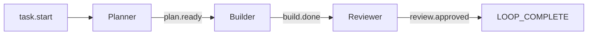
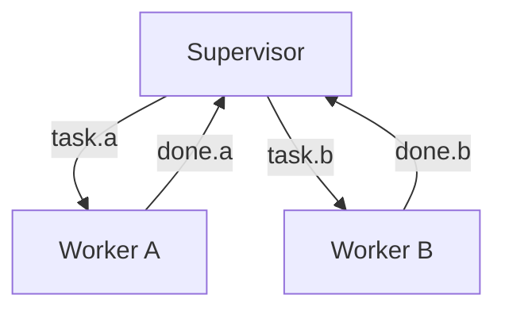

# ハットとイベント

ハットは、型付きイベントを通じて連携する専門の Ralph ペルソナです。これにより、役割を
分離した複雑なワークフローが可能になります。

## ハットとは？

ハットは、Ralph が「かぶる」ことのできるペルソナです。それぞれ次を持ちます。

- **トリガー（Triggers）** — このハットを起動するイベント
- **公開（Publishes）** — このハットが発行できるイベント
- **指示（Instructions）** — ハットがアクティブなときに注入されるプロンプト

```yaml
hats:
  planner:
    name: "📋 Planner"
    triggers: ["task.start"]
    publishes: ["plan.ready", "plan.blocked"]
    instructions: |
      Create an implementation plan for the task.
      When done, emit plan.ready with a summary.
```

## イベントの仕組み

イベントは、次を持つ型付きメッセージです。

- **トピック（Topic）** — どの種類のイベントか（例: `build.done`）
- **ペイロード（Payload）** — 任意のデータ
- **ソースハット** — どのハットが公開したか
- **ターゲットハット** — 任意のルーティング

### イベントフロー



### イベントの公開

ハットは `ralph emit` を使ってイベントを公開します。

```bash
ralph emit "build.done" "tests: pass, lint: pass, typecheck: pass, audit: pass, coverage: pass"
```

または JSON ペイロードで:

```bash
ralph emit "review.done" --json '{"status": "approved", "issues": 0}'
```

## イベントのルーティング

イベントは、購読パターンに基づいてハットにルーティングされます。

### 完全一致

```yaml
triggers: ["task.start"]  # "task.start" のみに一致
```

### glob パターン

```yaml
triggers: ["build.*"]     # build.done, build.failed などに一致
triggers: ["*.error"]     # build.error, test.error などに一致
triggers: ["*"]           # すべてに一致
```

## ハットの設定

### 基本的なハット

```yaml
hats:
  builder:
    name: "🔨 Builder"
    triggers: ["task.start", "plan.ready"]
    publishes: ["build.done", "build.failed"]
    instructions: |
      Implement the task or plan.
      Run tests before declaring done.
```

### バックエンドを上書きするハット

```yaml
hats:
  reviewer:
    name: "🔍 Reviewer"
    triggers: ["build.done"]
    publishes: ["review.approved", "review.rejected"]
    backend: "claude"  # 既定が別でも Claude を使う
    instructions: |
      Review the implementation for quality.
```

### 最大起動回数を持つハット

```yaml
hats:
  refactorer:
    name: "✨ Refactorer"
    triggers: ["test.passed"]
    publishes: ["refactor.done"]
    max_activations: 3  # このハットが起動する回数を制限する
    instructions: |
      Clean up the code.
```

### 既定の公開

```yaml
hats:
  worker:
    triggers: ["task.start"]
    publishes: ["work.done", "work.blocked"]
    default_publishes: "work.done"  # 明示的な emit がない場合
```

## イベントシステムの設計

### 開始イベント

Ralph が起動したときに最初に公開されるイベント:

```yaml
event_loop:
  starting_event: "task.start"  # 最初のハットを起動する
```

### 完了の約束

ループを終わらせるシグナル:

```yaml
event_loop:
  completion_promise: "LOOP_COMPLETE"
```

ハットはこれを直接出力するか、完了イベントを発行できます。

```yaml
hats:
  coordinator:
    triggers: ["all.done"]
    instructions: |
      All work complete. Output: LOOP_COMPLETE
```

## よくあるパターン

### パイプライン

あるハットから次へと直線的に流れる:


### スーパーバイザー・ワーカー

1 つのコーディネーターと複数のワーカー:



### クリティック・アクター

一方が提案し、もう一方が批評する:


## イベントの表示

```bash
# イベント履歴を表示する
ralph events

# 出力:
# 2024-01-21 10:30:00 task.start → planner
# 2024-01-21 10:32:15 plan.ready → builder
# 2024-01-21 10:35:42 build.done → reviewer
```

## ベストプラクティス

### 1. イベントを小さく保つ

イベントはルーティングの信号であり、データの搬送手段ではありません。

```bash
# 良い: 小さいペイロード
ralph emit "build.done" "tests: pass, lint: pass, typecheck: pass, audit: pass, coverage: pass"

# 悪い: 大きいペイロード
ralph emit "build.done" "full output of all test results..."
```

詳細な出力にはメモリを使います。

```bash
ralph tools memory add "Build details: ..." -t context
ralph emit "build.done" "tests: pass, lint: pass, typecheck: pass, audit: pass, coverage: pass"
```

### 2. 明確なトリガー

トリガーを具体的にします。

```yaml
# 良い: 具体的
triggers: ["plan.ready", "plan.revised"]

# 危険: 広すぎる
triggers: ["*"]
```

### 3. ハットごとに 1 つの責務

各ハットは、明確で単一の目的を持つべきです。

```yaml
# 良い: 焦点が絞られている
hats:
  tester:
    triggers: ["build.done"]
    instructions: "Run tests and report results."

# 悪い: 複数の責務
hats:
  do_everything:
    triggers: ["*"]
    instructions: "Test, lint, deploy, document..."
```

## 次のステップ

- 既成のハットワークフローについては [プリセット](../guide/presets.ja.md) を探す
- 並列ハット実行については [エージェント波](../advanced/agent-waves.ja.md) を学ぶ
- [メモリとタスク](memories-and-tasks.ja.md) について学ぶ
- 品質ゲートについては [バックプレッシャー](backpressure.ja.md) を理解する
