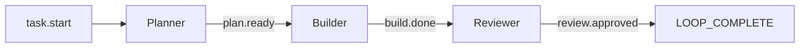
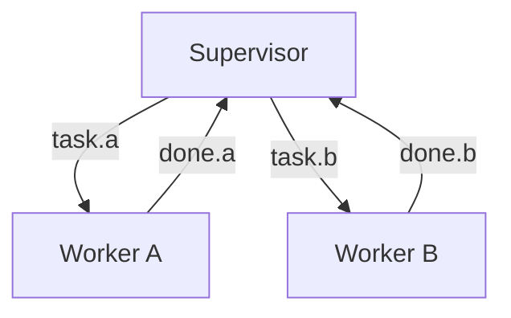

# Hats & Events

Hats are specialized Ralph personas that coordinate through typed events. This enables complex workflows with role separation.

## What Are Hats?

A hat is a persona that Ralph can "wear" — each with:

- **Triggers** — Events that activate this hat
- **Publishes** — Events this hat can emit
- **Instructions** — Prompt injected when hat is active

```yaml
hats:
  planner:
    name: "📋 Planner"
    triggers: ["task.start"]
    publishes: ["plan.ready", "plan.blocked"]
    instructions: |
      Create an implementation plan for the task.
      When done, emit plan.ready with a summary.
```

## How Events Work

Events are typed messages with:

- **Topic** — What kind of event (e.g., `build.done`)
- **Payload** — Optional data
- **Source hat** — Which hat published it
- **Target hat** — Optional routing

### Event Flow



### Publishing Events

Hats publish events using `ralph emit`:

```bash
ralph emit "build.done" "tests: pass, lint: pass, typecheck: pass, audit: pass, coverage: pass"
```

Or with JSON payloads:

```bash
ralph emit "review.done" --json '{"status": "approved", "issues": 0}'
```

## Event Routing

Events are routed to hats based on subscription patterns:

### Exact Match

```yaml
triggers: ["task.start"]  # Only matches "task.start"
```

### Glob Patterns

```yaml
triggers: ["build.*"]     # Matches build.done, build.failed, etc.
triggers: ["*.error"]     # Matches build.error, test.error, etc.
triggers: ["*"]           # Matches everything
```

## Hat Configuration

### Basic Hat

```yaml
hats:
  builder:
    name: "🔨 Builder"
    triggers: ["task.start", "plan.ready"]
    publishes: ["build.done", "build.failed"]
    instructions: |
      Implement the task or plan.
      Run tests before declaring done.
```

### Hat with Backend Override

```yaml
hats:
  reviewer:
    name: "🔍 Reviewer"
    triggers: ["build.done"]
    publishes: ["review.approved", "review.rejected"]
    backend: "claude"  # Use Claude even if default is different
    instructions: |
      Review the implementation for quality.
```

### Hat with Max Activations

```yaml
hats:
  refactorer:
    name: "✨ Refactorer"
    triggers: ["test.passed"]
    publishes: ["refactor.done"]
    max_activations: 3  # Limit how many times this hat activates
    instructions: |
      Clean up the code.
```

### Default Publishes

```yaml
hats:
  worker:
    triggers: ["task.start"]
    publishes: ["work.done", "work.blocked"]
    default_publishes: "work.done"  # If no explicit emit
```

## Event System Design

### Starting Event

The first event published when Ralph starts:

```yaml
event_loop:
  starting_event: "task.start"  # Triggers initial hat
```

### Completion Promise

The signal that ends the loop:

```yaml
event_loop:
  completion_promise: "LOOP_COMPLETE"
```

A hat can output this directly, or emit a completion event:

```yaml
hats:
  coordinator:
    triggers: ["all.done"]
    instructions: |
      All work complete. Output: LOOP_COMPLETE
```

## Common Patterns

### Pipeline

Linear flow from one hat to the next:


### Supervisor-Worker

One coordinator, multiple workers:



### Critic-Actor

One proposes, another critiques:


## Viewing Events

```bash
# View event history
ralph events

# Output:
# 2024-01-21 10:30:00 task.start → planner
# 2024-01-21 10:32:15 plan.ready → builder
# 2024-01-21 10:35:42 build.done → reviewer
```

## Best Practices

### 1. Keep Events Small

Events are routing signals, not data transport:

```bash
# Good: Small payload
ralph emit "build.done" "tests: pass, lint: pass, typecheck: pass, audit: pass, coverage: pass"

# Bad: Large payload
ralph emit "build.done" "full output of all test results..."
```

Use memories for detailed output:

```bash
ralph tools memory add "Build details: ..." -t context
ralph emit "build.done" "tests: pass, lint: pass, typecheck: pass, audit: pass, coverage: pass"
```

### 2. Clear Triggers

Make triggers specific:

```yaml
# Good: Specific
triggers: ["plan.ready", "plan.revised"]

# Risky: Too broad
triggers: ["*"]
```

### 3. One Responsibility Per Hat

Each hat should have a clear, single purpose:

```yaml
# Good: Focused
hats:
  tester:
    triggers: ["build.done"]
    instructions: "Run tests and report results."

# Bad: Multiple responsibilities
hats:
  do_everything:
    triggers: ["*"]
    instructions: "Test, lint, deploy, document..."
```

## Next Steps

- Explore [Presets](../guide/presets.md) for ready-made hat workflows
- Learn about [Memories & Tasks](memories-and-tasks.md)
- Understand [Backpressure](backpressure.md) for quality gates
