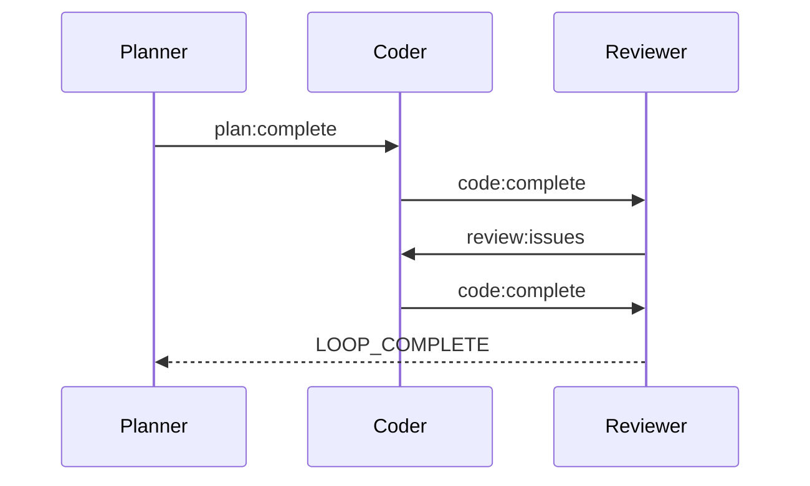

# マルチハットワークフローの例

!!! note "ドキュメント作成中"
    このページは作成中です。完全なマルチハットワークフローの例は、近日中にご確認ください。

## 概要

この例は、イベントとコンテキストに基づいて切り替わる複数のハットを使った高度な
オーケストレーションを示します。

## 設定

```yaml
preset: code-review
hats:
  planner:
    triggers: ["start", "requirements:change"]
  coder:
    triggers: ["plan:complete"]
  reviewer:
    triggers: ["code:complete"]
  fixer:
    triggers: ["review:issues"]
```

## イベントフロー



## 関連項目

- [ハットとイベント](../concepts/hats-and-events.ja.md) - 中核概念
- [カスタムハットの作成](../advanced/custom-hats.ja.md) - カスタムハットの開発
- [プリセット](../guide/presets.ja.md) - 組み込みのハットコレクション
