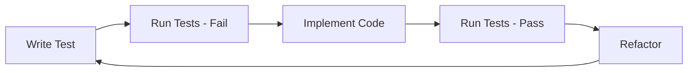

# TDD ワークフローの例

!!! note "ドキュメント作成中"
    このページは作成中です。完全な TDD ワークフローの例は、近日中にご確認ください。

## 概要

この例は、実装の前にテストを書く、テスト駆動開発のワークフローに Ralph を使う方法を
示します。

## ワークフロー



## 設定

```yaml
preset: tdd
hats:
  test-writer:
    triggers:
      - "write test"
  implementer:
    triggers:
      - "test:fail"
```

## 関連項目

- [シンプルなタスク](simple-task.ja.md) - 基本的な例
- [仕様駆動開発](spec-driven.ja.md) - 仕様優先のアプローチ
- [バックプレッシャー](../concepts/backpressure.ja.md) - テストのゲート
