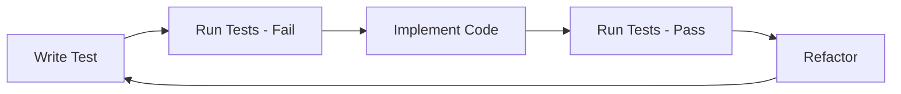

# TDD Workflow Example

!!! note "Documentation In Progress"
    This page is under development. Check back soon for a complete TDD workflow example.

## Overview

This example demonstrates using Hats for Test-Driven Development workflows, where tests are written before implementation.

## Workflow



## Configuration

```yaml
preset: tdd
hats:
  test-writer:
    triggers:
      - "write test"
  implementer:
    triggers:
      - "test:fail"
```

## See Also

- [Simple Task](simple-task.md) - Basic example
- [Spec-Driven Development](spec-driven.md) - Spec-first approach
- [Backpressure](../concepts/backpressure.md) - Test gates
