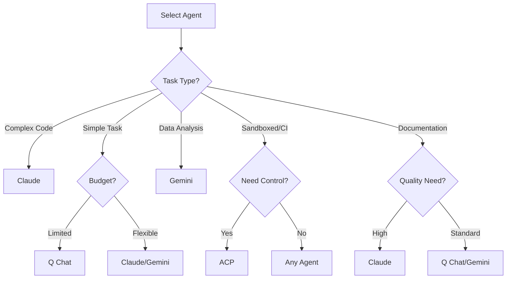

# AI エージェントガイド

Ralph Orchestrator は複数の AI エージェントをサポートしており、それぞれ固有の能力と
コスト構造を持ちます。このガイドは、タスクに合ったエージェントを選び設定するのに役立ちます。

## サポートされるエージェント

### Claude（Anthropic）

Claude は Anthropic の先進的な AI アシスタントで、繊細な理解と高品質な出力で知られます。

**強み:**
- 優れたコード生成とデバッグ
- 強力な推論と分析
- 包括的なドキュメント執筆
- 倫理的で安全な応答
- 大きなコンテキストウィンドウ（20 万トークン）

**最適な用途:**
- 複雑なソフトウェア開発
- 技術文書
- 調査と分析
- クリエイティブライティング
- 深い推論を要する問題解決

**インストール:**
```bash
npm install -g @anthropic-ai/claude-cli
```

**使い方:**
```bash
python ralph_orchestrator.py --agent claude
```

**コスト:**
- 入力: 100 万トークンあたり $3.00
- 出力: 100 万トークンあたり $15.00

### Q Chat

Q Chat は、多くの一般的なタスクに適した費用対効果の高い AI アシスタントで、堅実なアダプタ
実装を備えています。

**強み:**
- 良好な汎用能力
- ストリーミング対応の速い応答時間
- 単純なタスクに費用対効果が高い
- 単純明快な操作に信頼できる
- スレッドセーフな並行メッセージ処理
- 堅牢なエラー処理と回復
- グレースフルシャットダウンとリソースのクリーンアップ

**最適な用途:**
- 単純なコーディングタスク
- 基本的なドキュメント
- データ処理
- 手早いプロトタイプ
- 予算を意識した運用
- 高並行性のワークロード
- 長時間実行のバッチ処理

**インストール:**
```bash
pip install q-cli
```

**使い方:**
```bash
python ralph_orchestrator.py --agent q

# 短縮形
python ralph_orchestrator.py -a q
```

**運用上の機能:**
- **メッセージキュー**: スレッドセーフな非同期メッセージ処理
- **エラー回復**: 指数バックオフでの自動リトライ
- **シグナル処理**: SIGINT/SIGTERM でのグレースフルシャットダウン
- **リソース管理**: プロセスとスレッドの適切なクリーンアップ
- **タイムアウト処理**: 部分出力を保持する設定可能なタイムアウト
- **ノンブロッキング I/O**: パイプ通信のデッドロックを防ぐ
- **並行処理**: 複数のリクエストを同時に処理する

**コスト:**
- 入力: 100 万トークンあたり $0.50（推定）
- 出力: 100 万トークンあたり $1.50（推定）

### Gemini（Google）

Google の Gemini は、マルチモーダルな理解を伴う強力な能力を提供します。

**強み:**
- データ分析に優れる
- 強力な数学的能力
- 良好なコード理解
- マルチモーダル能力（Pro 版）
- 競争力のある価格

**最適な用途:**
- データサイエンスのタスク
- 数学的計算
- コード分析
- 調査タスク
- 多言語サポート

**インストール:**
```bash
pip install google-generativeai
```

**使い方:**
```bash
python ralph_orchestrator.py --agent gemini
```

**コスト:**
- 入力: 100 万トークンあたり $0.50
- 出力: 100 万トークンあたり $1.50

### ACP（Agent Client Protocol）

ACP は、[Agent Client Protocol](https://github.com/anthropics/agent-client-protocol) を
実装した任意のエージェントとの統合を可能にします。これは、基盤となる実装に関わらず AI
エージェントと通信する標準化された方法を提供します。

**強み:**
- 任意の ACP 準拠エージェントで動作する
- 標準化された JSON-RPC 2.0 プロトコル
- 柔軟な権限処理（4 モード）
- ファイルとターミナルの操作サポート
- スクラッチパッドによるセッション永続化
- ストリーミング更新のサポート

**最適な用途:**
- 複数のエージェントバックエンドを使う
- カスタムのエージェント実装
- サンドボックス化された実行環境
- 権限を制御した CI/CD パイプライン
- セキュリティ要件のあるエンタープライズ展開

**インストール:**
```bash
# ACP 対応の Gemini CLI
npm install -g @google/gemini-cli

# その他の ACP 準拠エージェント
# そのエージェントのインストール手順に従う
```

**使い方:**
```bash
# Gemini での基本的な ACP の使い方
python ralph_orchestrator.py --agent acp --acp-agent gemini

# 特定の権限モードで
python ralph_orchestrator.py --agent acp --acp-agent gemini --acp-permission-mode auto_approve

# 許可リストモードを使う
python ralph_orchestrator.py --agent acp --acp-permission-mode allowlist
```

**権限モード:**

| モード | 説明 | ユースケース |
|------|-------------|----------|
| `auto_approve` | すべてのリクエストを自動承認する | 信頼された環境、CI/CD |
| `deny_all` | すべての権限リクエストを拒否する | テスト、サンドボックス実行 |
| `allowlist` | 一致するパターンのみ承認する | 特定のツールを使う本番 |
| `interactive` | リクエストごとにユーザーに尋ねる | 開発、手動での監督 |

**設定（ralph.yml）:**
```yaml
adapters:
  acp:
    enabled: true
    timeout: 300
    tool_permissions:
      agent_command: gemini
      agent_args: []
      permission_mode: auto_approve
      permission_allowlist:
        - "fs/read_text_file:*.py"
        - "fs/write_text_file:src/*"
        - "terminal/create:pytest*"
```

**環境変数:**
```bash
export RALPH_ACP_AGENT=gemini
export RALPH_ACP_PERMISSION_MODE=auto_approve
export RALPH_ACP_TIMEOUT=300
```

**サポートされる操作:**

| 操作 | 説明 |
|-----------|-------------|
| `fs/read_text_file` | ファイルの内容を読む（パスのセキュリティ付き） |
| `fs/write_text_file` | ファイルの内容を書く（パスのセキュリティ付き） |
| `terminal/create` | コマンドでサブプロセスを作成する |
| `terminal/output` | プロセスの出力を読む |
| `terminal/wait_for_exit` | プロセスの完了を待つ |
| `terminal/kill` | プロセスを終了する |
| `terminal/release` | ターミナルのリソースを解放する |

**コスト:**
- 入力: $0.00（課金は基盤エージェントが処理する）
- 出力: $0.00（課金は基盤エージェントが処理する）

**メモ:** Claude CLI は現在、ネイティブの ACP モードをサポートしていません。Claude には、
代わりにネイティブの `ClaudeAdapter`（`--agent claude`）を使ってください。

## 自動検出

Ralph Orchestrator は、利用可能なエージェントを自動的に検出して使えます。

```bash
python ralph_orchestrator.py --agent auto
```

**検出順:**
1. Claude（インストール済みなら）
2. Q Chat（インストール済みなら）
3. Gemini（インストール済みなら）

## エージェントの比較

| 機能 | Claude | Q Chat | Gemini | ACP |
|---------|--------|--------|---------|-----|
| **コンテキストウィンドウ** | 200K | 100K | 128K | 可変 |
| **コード品質** | 優 | 良 | 非常に良 | 可変 |
| **ドキュメント** | 優 | 良 | 良 | 可変 |
| **速度** | 中 | 速い | 速い | 可変 |
| **コスト** | 高 | 低 | 低 | エージェント依存 |
| **推論** | 優 | 良 | 非常に良 | 可変 |
| **創造性** | 優 | 良 | 良 | 可変 |
| **数学/データ** | 非常に良 | 良 | 優 | 可変 |
| **権限制御** | 基本 | 基本 | 基本 | **4 モード** |
| **プロトコル** | SDK | CLI | CLI | JSON-RPC 2.0 |

## 適切なエージェントの選択

### 決定木



### タスクとエージェントの対応

| タスク種別 | 推奨エージェント | 代替 |
|-----------|------------------|-------------|
| **Web API 開発** | Claude | Gemini |
| **CLI ツールの作成** | Claude | Q Chat |
| **データ処理** | Gemini | Claude |
| **ドキュメント** | Claude | Gemini |
| **テスト** | Claude | Q Chat |
| **リファクタリング** | Claude | Gemini |
| **単純なスクリプト** | Q Chat | Gemini |
| **調査** | Claude | Gemini |
| **プロトタイピング** | Q Chat | Gemini |
| **本番コード** | Claude | - |
| **CI/CD パイプライン** | ACP | Claude |
| **サンドボックス実行** | ACP | - |
| **マルチエージェントワークフロー** | ACP | - |

## エージェントの設定

### Claude の設定

```bash
# 標準的な Claude の使い方
python ralph_orchestrator.py --agent claude

# 特定のモデルで
python ralph_orchestrator.py \
  --agent claude \
  --agent-args "--model claude-3-sonnet-20240229"

# カスタムパラメータで
python ralph_orchestrator.py \
  --agent claude \
  --agent-args "--temperature 0.7 --max-tokens 4096"
```

### Q Chat の設定

```bash
# 標準的な Q の使い方
python ralph_orchestrator.py --agent q

# カスタムパラメータで
python ralph_orchestrator.py \
  --agent q \
  --agent-args "--context-length 50000"

# 拡張設定を伴う本番構成
python ralph_orchestrator.py \
  --agent q \
  --max-iterations 100 \
  --retry-delay 2 \
  --checkpoint-interval 10 \
  --verbose

# 高並行性の構成
python ralph_orchestrator.py \
  --agent q \
  --agent-args "--async --timeout 300" \
  --max-iterations 200
```

**環境変数:**
```bash
# Q chat のタイムアウトを設定する（既定: 120 秒）
export QCHAT_TIMEOUT=300

# 詳細ログを有効にする
export QCHAT_VERBOSE=1

# リトライ回数を設定する
export QCHAT_MAX_RETRIES=5
```

### Gemini の設定

```bash
# 標準的な Gemini の使い方
python ralph_orchestrator.py --agent gemini

# 特定のモデルで
python ralph_orchestrator.py \
  --agent gemini \
  --agent-args "--model gemini-pro"
```

### ACP の設定

```bash
# Gemini での標準的な ACP の使い方
python ralph_orchestrator.py --agent acp --acp-agent gemini

# カスタムの権限モードで
python ralph_orchestrator.py \
  --agent acp \
  --acp-agent gemini \
  --acp-permission-mode allowlist

# 本番構成
python ralph_orchestrator.py \
  --agent acp \
  --acp-agent gemini \
  --acp-permission-mode auto_approve \
  --max-iterations 100 \
  --checkpoint-interval 10 \
  --verbose
```

**設定ファイル（ralph.yml）:**
```yaml
adapters:
  acp:
    enabled: true
    timeout: 300
    tool_permissions:
      agent_command: gemini
      agent_args: ["--experimental-acp"]
      permission_mode: auto_approve
      permission_allowlist: []
```

**環境変数:**
```bash
# エージェントコマンドを上書きする
export RALPH_ACP_AGENT=gemini

# 権限モードを上書きする
export RALPH_ACP_PERMISSION_MODE=auto_approve

# タイムアウトを上書きする
export RALPH_ACP_TIMEOUT=300
```

## エージェント固有の機能

### Claude の機能

- **Constitutional AI**: 組み込みの安全性と倫理
- **コード理解**: 複雑なコードベースの深い理解
- **長いコンテキスト**: 最大 20 万トークンを扱う
- **繊細な応答**: 微妙な要件を理解する

```bash
# Claude の長いコンテキストを活かす
python ralph_orchestrator.py \
  --agent claude \
  --context-window 200000 \
  --context-threshold 0.9
```

### Q Chat の機能

- **速度**: ストリーミング対応の速い応答時間
- **効率**: 最適化されたメモリ管理による低いリソース使用
- **シンプルさ**: 基本的なタスクに単純明快
- **並行性**: 並列処理のためのスレッドセーフな操作
- **信頼性**: 自動のエラー回復とリトライの仕組み
- **運用上の信頼性**: シグナル処理、グレースフルシャットダウン、リソースのクリーンアップ

**運用能力:**
```bash
# Q での手早いイテレーション
python ralph_orchestrator.py \
  --agent q \
  --max-iterations 100 \
  --retry-delay 1

# タイムアウト付きの非同期実行
python ralph_orchestrator.py \
  --agent q \
  --agent-args "--async --timeout 300" \
  --checkpoint-interval 10

# ストレステストの構成
python ralph_orchestrator.py \
  --agent q \
  --max-iterations 500 \
  --metrics-interval 10 \
  --verbose

# 長時間実行のバッチ処理
python ralph_orchestrator.py \
  --agent q \
  --checkpoint-interval 5 \
  --max-cost 50.0 \
  --retry-delay 5
```

**監視とロギング:**
- 並行操作のためのスレッドセーフなロギング
- スタックトレース付きの詳細なエラーメッセージ
- パフォーマンスメトリクスの収集
- リソース使用の追跡
- メッセージキューの状態監視

### Gemini の機能

- **データの卓越性**: データタスクに優れる
- **数学的能力**: 強力な計算能力
- **多言語**: さまざまなプログラミング言語への良好なサポート

```bash
# Gemini でのデータ処理
python ralph_orchestrator.py \
  --agent gemini \
  --prompt data_analysis.md
```

### ACP の機能

- **プロトコルの標準化**: JSON-RPC 2.0 通信
- **権限制御**: きめ細かなアクセス制御のための 4 モード
- **ファイル操作**: パス検証を伴う安全な読み書き
- **ターミナル操作**: サブプロセスの完全なライフサイクル管理
- **セッション永続化**: イテレーションをまたいだコンテキストのためのスクラッチパッド
- **ストリーミング更新**: リアルタイムのエージェント出力と思考

**権限モードの例:**
```bash
# すべてのリクエストを自動承認する（CI/CD）
python ralph_orchestrator.py \
  --agent acp \
  --acp-agent gemini \
  --acp-permission-mode auto_approve

# すべてのリクエストを拒否する（テスト）
python ralph_orchestrator.py \
  --agent acp \
  --acp-agent gemini \
  --acp-permission-mode deny_all

# 対話的な承認（開発）
python ralph_orchestrator.py \
  --agent acp \
  --acp-agent gemini \
  --acp-permission-mode interactive
```

**許可リストのパターン例:**
```yaml
# ralph.yml
adapters:
  acp:
    tool_permissions:
      permission_mode: allowlist
      permission_allowlist:
        # 完全一致
        - "fs/read_text_file"
        # glob パターン
        - "fs/*"
        - "terminal/create:pytest*"
        # 正規表現パターン（スラッシュで囲む）
        - "/^fs\\/.*$/"
```

**エージェントのスクラッチパッド:**
すべてのエージェントは、スクラッチパッドファイル（既定で `.agent/scratchpad.md`）を通じて
イテレーションをまたいでコンテキストを維持します。
- 以前のイテレーションからの進捗を永続化する
- 決定とコンテキストを記録する
- 現在のブロッカーや問題を追跡する
- 残りの作業項目を列挙する

ハットベースの設定では、各ハットは `scratchpad` 設定オプションを通じて独自のスクラッチ
パッドを持てます。カスタムパスを設定する、完全に無効にする、または `core.scratchpad` を
継承します。詳細は [ハットごとのスクラッチパッド](configuration.ja.md#with-per-hat-scratchpads)
を参照してください。

```bash
# スクラッチパッドは自動的に管理される
cat .agent/scratchpad.md
```

## マルチエージェント戦略

### 順次処理

フェーズごとに異なるエージェントで処理します。

```bash
# フェーズ 1: Claude でリサーチ
python ralph_orchestrator.py --agent claude --prompt research.md

# フェーズ 2: Q で実装
python ralph_orchestrator.py --agent q --prompt implement.md

# フェーズ 3: Claude でドキュメント
python ralph_orchestrator.py --agent claude --prompt document.md
```

### コスト最適化

より安価なエージェントから始め、必要ならエスカレートします。

```bash
# まず Q を試す
python ralph_orchestrator.py --agent q --max-cost 2.0

# うまくいかなければ Claude を試す
python ralph_orchestrator.py --agent claude --max-cost 20.0
```

## エージェントのパフォーマンスチューニング

### Claude の最適化

```bash
# 品質に最適化
python ralph_orchestrator.py \
  --agent claude \
  --max-iterations 50 \
  --checkpoint-interval 5 \
  --context-window 200000

# 速度に最適化
python ralph_orchestrator.py \
  --agent claude \
  --max-iterations 20 \
  --retry-delay 1
```

### Q Chat の最適化

```bash
# 最大の効率
python ralph_orchestrator.py \
  --agent q \
  --max-iterations 200 \
  --checkpoint-interval 20 \
  --metrics-interval 50
```

### Gemini の最適化

```bash
# データ量の多いタスク
python ralph_orchestrator.py \
  --agent gemini \
  --context-window 128000 \
  --max-tokens 500000
```

## エージェントのトラブルシューティング

### よくある問題

1. **エージェントが見つからない**
   ```bash
   # インストールを確認する
   which claude  # または q, gemini
   
   # 自動検出を使う
   python ralph_orchestrator.py --agent auto --dry-run
   ```

2. **レート制限**
   ```bash
   # リトライ遅延を増やす
   python ralph_orchestrator.py --retry-delay 10
   ```

3. **コンテキストのオーバーフロー**
   ```bash
   # コンテキスト設定を調整する
   python ralph_orchestrator.py \
     --context-window 100000 \
     --context-threshold 0.7
   ```

4. **出力品質が悪い**
   ```bash
   # より高品質なエージェントに切り替える
   python ralph_orchestrator.py --agent claude
   ```

### エージェントの診断

```bash
# エージェントの利用可否をテストする
python ralph_orchestrator.py --agent auto --dry-run --verbose

# エージェントのパフォーマンスを確認する
python ralph_orchestrator.py \
  --agent claude \
  --max-iterations 1 \
  --verbose \
  --metrics-interval 1
```

## エージェント別のコスト管理

### 予算の配分

```bash
# 低予算: Q を使う
python ralph_orchestrator.py --agent q --max-cost 5.0

# 中予算: Gemini を使う
python ralph_orchestrator.py --agent gemini --max-cost 25.0

# 高予算: Claude を使う
python ralph_orchestrator.py --agent claude --max-cost 100.0
```

### コストの追跡

エージェントごとのコストを監視します。

```bash
# 詳細なメトリクスを有効にする
python ralph_orchestrator.py \
  --agent claude \
  --metrics-interval 1 \
  --verbose
```

## イベント形式（v2.0 以降）

Ralph v2.0 は、エージェントとオーケストレーター間のイベント通信に JSONL（JSON Lines）を
使います。

イベントは**ルーティングの信号**であり、データの搬送手段ではありません。ペイロードは簡潔に
保ちます。

### イベントの書き込み

エージェントは、実行のイベントファイル（`.ralph/events-YYYYMMDD-HHMMSS.jsonl`）にイベントを
書き込みます。

```json
{"topic":"build.done","payload":"tests: pass, lint: pass, typecheck: pass, audit: pass, coverage: pass","ts":"2026-01-14T19:30:00Z"}
{"topic":"build.blocked","payload":"Missing dependency","ts":"2026-01-14T19:31:15Z"}
```

**構造化ペイロード**（複雑なデータに推奨）:

```json
{"topic":"review.done","payload":{"status":"approved","issues":0},"ts":"2026-01-14T19:30:00Z"}
```

**イベントの構造:**

| フィールド | 型 | 必須 | 説明 |
|-------|------|----------|-------------|
| `topic` | string | はい | イベントトピック（例: "build.done"） |
| `payload` | string または object | いいえ | 簡潔なイベントデータ（文字列または JSON オブジェクト） |
| `ts` | string | はい | ISO 8601 のタイムスタンプ |

### JSONL 形式のルール

⚠️ **重要**: JSONL は各イベントが**単一行**であることを要求します。

- ✅ **する**: ペイロードを簡潔に、1 行に保つ
- ✅ **する**: 構造化データには JSON オブジェクトを使う: `{"payload": {"status": "ok"}}`
- ❌ **しない**: ペイロードで YAML 整形を使う（リテラルの改行を引き起こす）
- ❌ **しない**: 複数行のコンテンツを直接ペイロードに入れる

詳細な出力には、スクラッチパッドファイルに書き込み、簡潔なイベントを発行します。

### 例: Builder ハット

```bash
# 推奨: 安全な JSON 整形のために ralph emit を使う
ralph emit build.done "tests: pass, lint: pass, typecheck: pass, audit: pass, coverage: pass"

# 構造化オブジェクトのペイロード
ralph emit review.done --json '{"status":"approved","files":3}'
```

### イベントの読み込み

Ralph は、各エージェント実行の後に実行のイベントファイルから新しいイベントを読みます。
イベントは、設定されたトリガーに基づいてハットの遷移を起動します。

各実行は、古いイベントが新しい実行を汚染するのを防ぐため、一意のタイムスタンプ付き
イベントファイル（例: `.ralph/events-20260120-193202.jsonl`）を作成します。`ralph emit`
コマンドは自動的に正しいファイルに書き込みます。

### レガシー XML 形式（v1.x）

**非推奨**: v1.x はエージェント出力に XML イベントを使いました。
```xml
<event topic="build.done">
tests: pass, lint: pass, typecheck: pass, audit: pass, coverage: pass
</event>
```

この形式は v2.0 ではサポートされなくなりました。[移行ガイド](../migration/v2-hatless-ralph.ja.md)
を参照してください。

## ベストプラクティス

### 1. エージェントをタスクに合わせる

- **複雑なロジック**: Claude を使う
- **単純なタスク**: Q Chat を使う
- **データ作業**: Gemini を使う

### 2. 小さく始める

まず少ないイテレーションでテストします。

```bash
python ralph_orchestrator.py --agent auto --max-iterations 5
```

### 3. パフォーマンスを監視する

最適化のためにメトリクスを追跡します。

```bash
python ralph_orchestrator.py --metrics-interval 5 --verbose
```

### 4. 自動検出を使う

不確かなときはシステムに選ばせます。

```bash
python ralph_orchestrator.py --agent auto
```

### 5. コストを考慮する

品質と予算のバランスを取ります。

- 開発: Q Chat を使う
- テスト: Gemini を使う
- 本番: Claude を使う

## 次のステップ

- よりよい結果のために [プロンプトエンジニアリング](prompts.ja.md) を習得する
- [コスト管理](cost-management.ja.md) について学ぶ
- [設定](configuration.ja.md) オプションを探る
- [v2.0 移行ガイド](../migration/v2-hatless-ralph.ja.md) を読む
```
