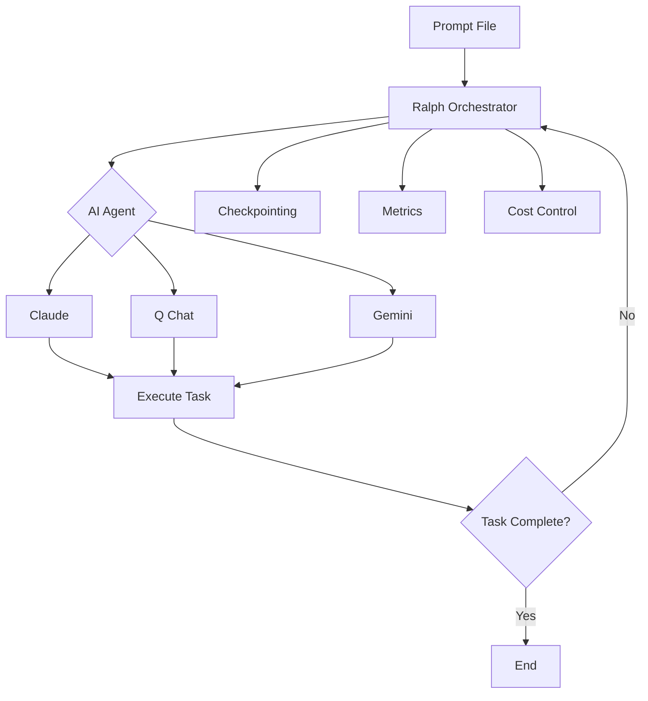
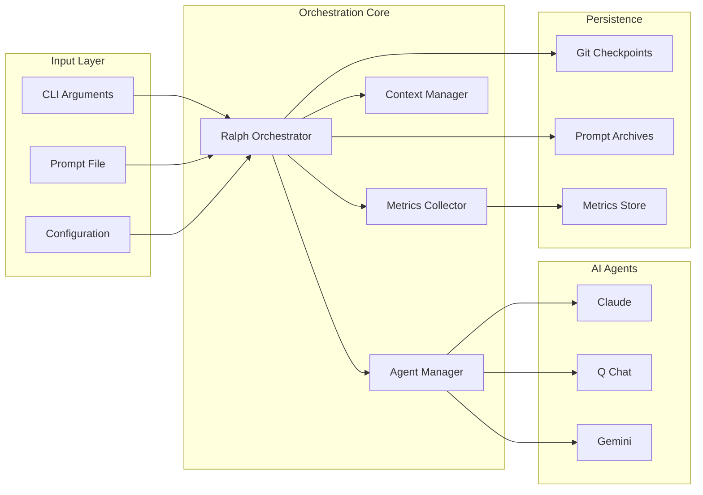

# 概要

## Ralph Orchestrator とは？

Ralph Orchestrator は、AI エージェント向けの Ralph Wiggum オーケストレーションテクニックの、
実用的で初期段階（アルファ版）の実装です。タスクが完了するまで AI エージェントを継続的な
ループで実行するための堅牢なフレームワークを、実用的な安全性・監視・コスト制御とともに
提供します。今日でも動作しますが、ときどき粗い部分があり、リリース間で API/設定に破壊的
変更があることを想定してください。

このシステムは、ザ・シンプソンズの Ralph Wiggum にちなんで名付けられ、粘り強い反復の哲学を
体現しています。「僕が英語で失敗する？そんなの不可能だい！」 - 成功するまでただ挑み続ける
のです。

## 主要概念

### Ralph Wiggum テクニック

その核心は、[Geoffrey Huntley](https://ghuntley.com/ralph/) が当初定義したとおり、
**「Ralph は Bash ループである」** というものです。

```bash
while :; do cat PROMPT.md | claude ; done
```

この AI オーケストレーションへの単純でありながら強力なアプローチは、「非決定的な世界において
決定的にダメ」です。予測可能な形で失敗しますが、その失敗は対処できる形です。このテクニックは
「結果整合性への信頼と信念」を必要とし、反復的なチューニングを通じて改善します。

ワークフローは単純明快です。

1. プロンプトファイル（PROMPT.md）を通じて **AI にタスクを与える**
2. 問題に対して継続的に **反復させる**
3. チェックポイントとメトリクスを通じて **進捗を監視する**
4. 完了したとき、または上限に達したときに **停止する**

このアプローチは、複数のイテレーションを通じて自己修正し改善する AI の能力を活かします。
逐次的に指示するのではなく成功基準を最初に定義することで、典型的な AI ワークフローを
反転させます。

### 強化された実装: Claude Code プラグイン

Claude Code 向けの公式
[ralph-wiggum プラグイン](https://github.com/anthropics/claude-code/tree/main/plugins/ralph-wiggum)
は、基本的なテクニックを次のように拡張します。

- **Stop フックの仕組み**: 終了コード 2 を横取りしてプロンプトを再注入し、反復を継続する
- **イテレーション上限**: 暴走ループを防ぐ主要な安全機構
- **完了の約束**: タスク完了を検出するための任意の文字列マッチ
- **完全なコンテキスト保持**: 各サイクルは、以前の実行からの変更済みファイルと git 履歴に
  アクセスできる

**利用可能なコマンド:**

| コマンド                  | 説明                                               |
| ------------------------ | --------------------------------------------------------- |
| `/ralph-loop "<prompt>"` | 任意の `--max-iterations` 付きで自律ループを開始する |
| `/cancel-ralph`          | アクティブな Ralph ループを停止する                                 |
| `/help`                  | プラグインのヘルプとドキュメントを表示する                     |

Claude Code との詳細な統合については、
[paddo.dev/blog/ralph-wiggum-autonomous-loops](https://paddo.dev/blog/ralph-wiggum-autonomous-loops/)
を参照してください。

### コアコンポーネント



!!! warning "コストへの注意"
自律ループは大量のトークンを消費します。**大きなコードベースでの 50 イテレーションの
サイクルは、API クレジットで 50〜100 ドル以上かかることがあり**、サブスクリプションの上限を
すぐに使い切ります。常にイテレーション上限を設定し、コストを注意深く監視してください。
戦略については [コスト管理](cost-management.ja.md) を参照してください。

## 仕組み

### 1. 初期化フェーズ

Ralph Orchestrator を起動すると、次を行います。

- セキュリティのためにプロンプトファイルを検証する
- 利用可能な AI エージェントを検出する
- 監視とメトリクス収集をセットアップする
- チェックポイント用の作業ディレクトリを作成する
- コストとトークンの追跡を初期化する

### 2. イテレーションループ

メインのオーケストレーションループ:

1. **事前確認**: トークン/コストの上限を超えていないか検証する
2. **コンテキスト管理**: コンテキストウィンドウの要約が必要か確認する
3. **エージェント実行**: 選択した AI エージェントをプロンプトとともに実行する
4. **応答処理**: エージェントの出力を取り込み分析する
5. **メトリクス収集**: トークン、コスト、パフォーマンスを追跡する
6. **進捗評価**: 目標に向けた進捗を監視する
7. **チェックポイント**: 設定された間隔で状態を保存する
8. **繰り返し**: タスクが完了するか上限に達するまで継続する

### 3. 安全機構

複数の保護レイヤーが安全な運用を保証します。

```
                                 🛡️ Five Safety Mechanisms

  ┌───────────────────┐     ┌───────────────────┐     ┌───────────────────┐
  │  Iteration Limit  │     │   Runtime Limit   │     │    Cost Limit     │
  │ (default: 100)    │     │   (default: 4h)   │     │   (default: $10)  │
  └───────────────────┘     └───────────────────┘     └───────────────────┘
            │                         │                         │
            │                         │                         │
            ∨                         ∨                         ∨
          ╔═══════════════════════════════════════════════════════╗
          ║                    SafetyGuard.check()                ║
          ╚═══════════════════════════════════════════════════════╝
            ∧                         ∧                         ∧
            │                         │                         │
            │                         │                         │
  ┌───────────────────┐     ┌───────────────────┐     ┌───────────────────┐
  │ Consecutive Fails │     │   Loop Detection  │     │ Completion Marker │
  │   (default: 5)    │     │   (90% similar)   │     │ [x] TASK_COMPLETE │
  └───────────────────┘     └───────────────────┘     └───────────────────┘
```

<details>
<summary>graph-easy のソース</summary>

```
graph { label: "🛡️ Five Safety Mechanisms"; flow: south; }
[ Iteration Limit (default: 100) ] -> [ SafetyGuard.check() ] { border: double; }
[ Runtime Limit (default: 4h) ] -> [ SafetyGuard.check() ]
[ Cost Limit (default: $10) ] -> [ SafetyGuard.check() ]
[ Consecutive Fails (default: 5) ] -> [ SafetyGuard.check() ]
[ Loop Detection (90% similar) ] -> [ SafetyGuard.check() ]
[ Completion Marker [x] TASK_COMPLETE ] -> [ SafetyGuard.check() ]
```

</details>

- **入力検証**: インジェクション攻撃を防ぐためにプロンプトをサニタイズする
- **リソース上限**: イテレーション、実行時間、コストの境界を強制する
- **完了マーカー**: プロンプトファイルで `- [x] TASK_COMPLETE` を検出すると早期終了する
- **完了の約束**: エージェントの出力に設定された文字列（既定: `LOOP_COMPLETE`）が含まれると
  早期終了する
- **ループ検出**: エージェントの出力が最近の履歴と 90% 以上類似すると停止する
- **連続失敗の上限**: 繰り返しの失敗の後に停止する（既定: 5）
- **コンテキストのオーバーフロー**: 上限に近づくと自動的に要約する
- **グレースフルシャットダウン**: 割り込みを処理し状態を保存する
- **エラー回復**: 指数バックオフでリトライする

出力の類似度検出に関する詳細なドキュメントは [ループ検出](../advanced/loop-detection.ja.md)
を参照してください。

### 4. 完了

タスクが完了するか上限に達すると、次を行います。

- 最終的なメトリクスが保存される
- 分析のために状態が永続化される
- 使用統計が報告される
- 詳細なログがエクスポートされる

## ユースケース

Ralph Orchestrator が得意とすること:

### 最適なユースケース

- **大規模なリファクタリング**: フレームワークの移行、依存関係のアップグレード
- **バッチ操作**: ドキュメント生成、コードの標準化
- **テストカバレッジの拡大**: 包括的なテストスイートの生成
- **グリーンフィールドプロジェクトの足場作り**: 新規プロジェクトのセットアップと定型コード

### 推奨されないもの

- 明確な完了基準を欠く曖昧な要件
- 人間の推論を要するアーキテクチャの判断
- セキュリティに敏感なコード（認証、決済）
- 人間の好奇心を要する探索的な作業

!!! info "実世界の成果（2024〜2025）"
このテクニックはスケールでの有効性が実証されています。

    - **Y Combinator ハッカソン**: チームが Ralph ループを使って一晩で 6 つのリポジトリを
      出荷
    - **契約 MVP**: 1 人のエンジニアが、わずか **297 ドル** の API 費用で 5 万ドルの契約を
      完了
    - **言語開発**: Geoffrey Huntley の 3 か月のループが、完全な難解プログラミング言語
      （CURSED）を生み出した — AI は、どの学習データにも存在しない、自ら発明した言語で
      うまくプログラミングした

    これらの成果は、明確なプロンプトと忍耐があれば、Ralph が新規プロジェクトのかなりの
    外注作業を置き換えられることを示しています。

### ソフトウェア開発

- 仕様から完全なアプリケーションを書く
- 大規模なコードベースをリファクタリングする
- 複雑な機能を反復的に実装する
- 難しい問題をデバッグする

### コンテンツ作成

- 包括的なドキュメントを書く
- テストスイートを生成する
- API 仕様を作成する
- 研修資料を作成する

### データ処理

- 大規模なデータセットを分析する
- レポートを生成する
- データ変換パイプライン
- ETL 操作

### 調査と分析

- 文献レビュー
- 市場調査
- 競合分析
- 技術調査

## メリット

### 🚀 生産性

- 複雑な多段階タスクを自動化する
- 人間の介入を減らす
- 複数のエージェントで作業を並列化する
- 24 時間 365 日の運用能力

### 💰 コスト管理

- リアルタイムのコスト追跡
- 設定可能な支出上限
- エージェントごとの価格モデル
- トークン使用の最適化

### 🔒 セキュリティ

- 入力のサニタイズ
- コマンドインジェクションの防止
- パストラバーサルの保護
- 監査証跡

### 📊 可観測性

- 詳細なメトリクス収集
- パフォーマンス監視
- 成功/失敗の追跡
- リソース使用率

### 🔄 信頼性

- 自動リトライ
- 状態の永続化
- チェックポイントからの回復
- グレースフルな縮退

## アーキテクチャの概要



## はじめに

Ralph Orchestrator を使い始めるには:

1. **ツール**と少なくとも 1 つの AI エージェントを**インストールする**
2. タスクを記した**プロンプトファイルを作成する**
3. 適切な上限を設定して**オーケストレーターを実行する**
4. ログとメトリクスを通じて**進捗を監視する**
5. 完了したら**結果を取得する**

詳しい手順は [クイックスタート](../quick-start.ja.md) ガイドを参照してください。

## 次のステップ

- [設定](configuration.ja.md) オプションについて学ぶ
- [エージェント](agents.ja.md) の選択と機能を理解する
- 最良の結果のために [プロンプト](prompts.ja.md) エンジニアリングを習得する
- [コスト管理](cost-management.ja.md) の戦略を探る
