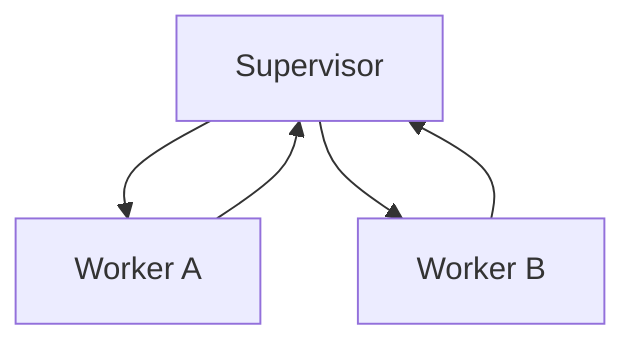

# Presets

Presets are pre-configured workflows for common development patterns. They save you from writing hat configurations from scratch.

## Using Presets

```bash
# List all presets
ralph init --list-presets

# Initialize with a preset
ralph init --preset feature

# Combine with backend
ralph init --preset spec-driven --backend kiro

# Overwrite existing config
ralph init --preset debug --force
```

## Available Presets

### Development Workflows

#### feature

Standard feature development with planning and building.

```bash
ralph init --preset feature
```

**Hats:** Builder → Reviewer
**Best for:** General feature implementation

#### code-assist

TDD implementation from specs, tasks, or rough descriptions.

```bash
ralph init --preset code-assist
```

**Hats:** Planner → Builder → Validator → Committer
**Best for:** Structured TDD development, working from specs or task definitions

#### spec-driven

Specification-first development with contract-based implementation.

```bash
ralph init --preset spec-driven
```

**Hats:** Spec Writer → Spec Critic → Implementer → Verifier
**Best for:** Complex features with clear requirements, given-when-then acceptance criteria

#### refactor

Code refactoring workflow with atomic steps.

```bash
ralph init --preset refactor
```

**Hats:** Refactorer → Verifier
**Best for:** Large refactors, technical debt cleanup

#### pdd-to-code-assist

Full autonomous idea-to-code pipeline (9-hat orchestration).

```bash
ralph init --preset pdd-to-code-assist
```

**Hats:** Inquisitor → Architect → Design Critic → Explorer → Planner → Task Writer → Builder → Validator → Committer
**Best for:** End-to-end autonomous development from a rough idea

### Bug Fixing & Debugging

#### bugfix

Systematic bug reproduction, fix, and verification.

```bash
ralph init --preset bugfix
```

**Hats:** Reproducer → Fixer → Verifier → Committer
**Best for:** Bug fixes with reproducible test cases

#### debug

Bug investigation and root cause analysis using hypothesis-driven approach.

```bash
ralph init --preset debug
```

**Hats:** Investigator → Tester → Fixer → Verifier
**Best for:** Bug hunting, issue resolution, unknown root causes

### Review & Quality

#### review

Code review workflow producing structured feedback.

```bash
ralph init --preset review
```

**Hats:** Reviewer → Analyzer
**Best for:** Code quality checks, structured feedback

#### pr-review

Multi-perspective PR review with specialized reviewers.

```bash
ralph init --preset pr-review
```

**Hats:** Correctness Reviewer → Security Reviewer → Architecture Reviewer → Synthesizer
**Best for:** Comprehensive PR reviews from multiple angles

#### gap-analysis

Compare specifications against implementation to find discrepancies.

```bash
ralph init --preset gap-analysis
```

**Hats:** Analyzer → Verifier → Reporter
**Best for:** Audit, compliance, spec-vs-implementation comparison

### Documentation & Research

#### docs

Documentation writing with writer/editor review cycle.

```bash
ralph init --preset docs
```

**Hats:** Writer → Reviewer
**Best for:** Creating and updating documentation

#### research

Deep exploration and analysis (no code changes).

```bash
ralph init --preset research
```

**Hats:** Researcher → Synthesizer
**Best for:** Codebase exploration, technical investigation, market research

### Operations

#### deploy

Deployment and release workflow with validation and monitoring.

```bash
ralph init --preset deploy
```

**Hats:** Builder → Deployer → Verifier
**Best for:** Deployment pipelines, release management

## Preset Patterns

### Pipeline

Linear A → B → C flow:


**Examples:** feature, bugfix, docs

### Supervisor-Worker

Coordinator with specialists:



**Examples:** pr-review, pdd-to-code-assist

### Critic-Actor

One proposes, another critiques:


**Examples:** spec-driven, review

## Customizing Presets

After initializing with a preset, modify `ralph.yml`:

```yaml
# Start with preset
ralph init --preset feature

# Edit ralph.yml to customize
hats:
  builder:
    instructions: |
      Custom instructions for your project...
```

## Creating Your Own Presets

Presets are stored in `/presets/`. Create a new one:

```yaml
# presets/my-workflow.yml
name: "My Workflow"
description: "Custom workflow for my team"

event_loop:
  starting_event: "task.start"
  completion_promise: "LOOP_COMPLETE"

hats:
  first_hat:
    triggers: ["task.start"]
    publishes: ["step.done"]
    instructions: "..."

  second_hat:
    triggers: ["step.done"]
    publishes: ["LOOP_COMPLETE"]
    instructions: "..."
```

Then use it:

```bash
ralph init --preset my-workflow
```

## Next Steps

- Learn about [Configuration](configuration.md) for full options
- Explore [Writing Prompts](prompts.md) for better results
- See [Creating Custom Hats](../advanced/custom-hats.md) for advanced workflows
