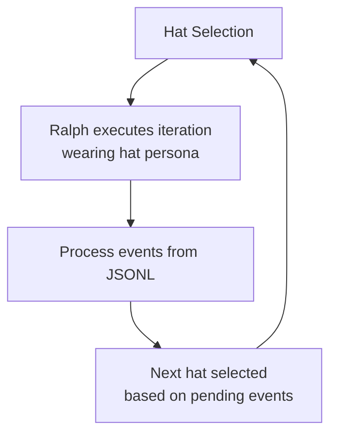
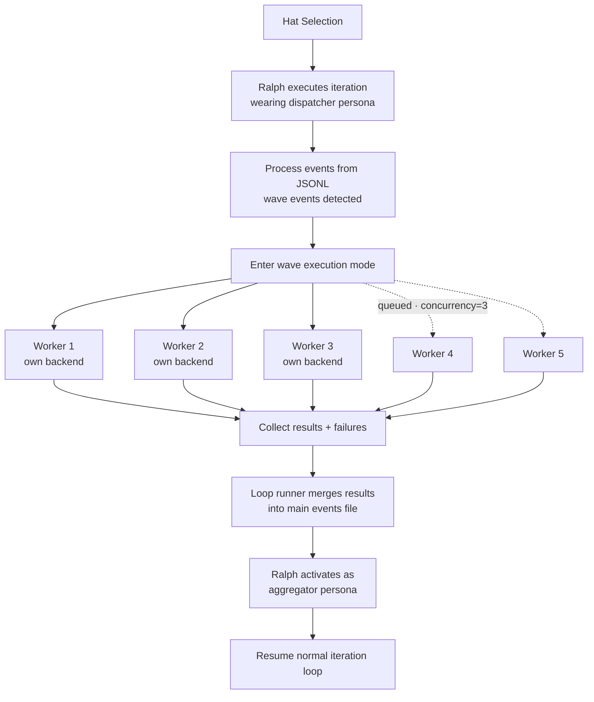
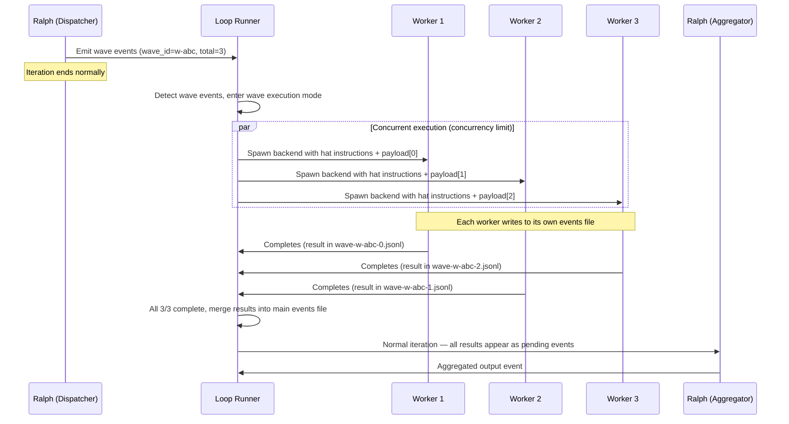
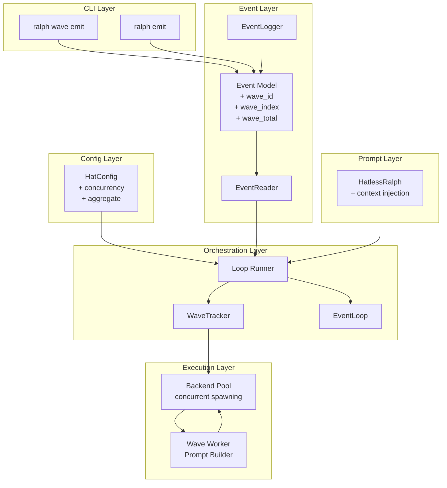

# Agent Waves: Design Document

## Overview

Agent Waves introduce intra-loop parallelism to Ralph's orchestration loop. Today, Ralph executes one hat per iteration, sequentially. Waves allow a dispatcher hat to fan out work to multiple concurrent backend instances, collect results, and aggregate them — all within a single orchestration run.

This is a general-purpose parallel execution primitive. Use cases include deep research (parallel topic exploration), multi-perspective analysis, parallel code review, scatter-gather for any domain, and multi-agent debate patterns.

Waves are built on three primitives inspired by Enterprise Integration Patterns:
1. **Wave-aware event emission** — events tagged with correlation metadata
2. **Concurrent hat execution** — the loop runner spawns multiple backends in parallel
3. **Aggregator gate** — a hat that buffers results and activates only when all correlated results arrive

Source: https://github.com/mikeyobrien/ralph-orchestrator/issues/210

### Why not just spawn subagents?

An agent could spawn N backends in a single step and collect results — no new infrastructure needed. Waves add value in two specific ways:

1. **Wall-clock time.** This is the primary motivation. 5 file reviews at 2 minutes each: sequential is 10 minutes, concurrent is 2. For multi-hat presets, sequential execution is the dominant bottleneck. Waves eliminate it.

2. **Fresh context for synthesis.** When N workers each produce substantial output, an in-context approach forces the dispatching agent to hold all results in one context window. Waves route results to a dedicated aggregator hat that activates in a fresh iteration — purpose-built instructions, no context pressure from the dispatch phase.

The concurrent execution is the real value. The event plumbing (per-worker files, env vars, correlation metadata) is what makes it work correctly within Ralph's existing architecture.

---

## Architectural Impact

Today, `next_hat()` always returns "ralph" in multi-hat mode. Custom hats never get their own backend process — they are personas that Ralph wears during coordination. Wave workers are the **first case where hats execute directly** with their own backend process, outside Ralph's coordination context.

This is a deliberate, bounded exception to the Hatless Ralph model:

- **Why it's safe**: Wave workers have no coordination role. They receive a single task payload, execute with their hat's instructions, emit a result event, and exit. They cannot emit waves (hard-blocked via env var), have no access to Ralph's HATS table, scratchpad, or objective, and cannot influence hat selection.
- **What's preserved**: Ralph still owns all coordination — hat selection, event routing, aggregation, and loop control. The loop runner manages the wave lifecycle entirely; the event loop remains wave-agnostic.
- **Bounded scope**: Workers are structurally isolated. Each gets a per-worker events file, a fresh backend process, and env vars that identify it as a wave worker. The loop runner collects results and merges them back into the main event stream only after the wave completes.

---

## Detailed Requirements

### Core Architecture (from requirements clarification)

| Decision | Choice | Rationale |
|----------|--------|-----------|
| Execution model | Ralph dispatches, loop runner executes (Q1:B) | Preserves Hatless Ralph — Ralph decides WHAT to parallelize, loop runner handles HOW |
| Instance capability | Full hat execution, no nested waves (Q2:A) | Agents are smart; let them do the work. Guardrails are structural, not capability-based |
| Aggregation | Ralph as aggregator with `wait_for_all` gate (Q3:A) | Aggregator is just another hat. Only new thing is the gate |
| Dispatch mechanism | CLI tools + context injection for NL dispatch (Q4:C) | Same mechanism — CLI tools are the plumbing, context injection enables adaptive dispatch |
| Isolation | Shared workspace only (Q5:A) | Zero overhead, sufficient for read-heavy/write-disjoint workloads |
| Failure handling | Best-effort, hardcoded (Q6:B) | Wave continues on failure. Aggregator gets partial results + failure metadata |
| Cost accounting | Each instance = one activation (Q7:A) | Transparent. Existing limits (`max_activations`, `max_cost`) constrain wave size naturally |
| Aggregation timeout | 300s default, overridable (Q8:B) | Prevents hung waves. Aggregator fires with partial results on timeout |

### v1 Scope

**Included:**
- Wave CLI tool (`ralph wave emit` — atomic batch emission)
- Event correlation metadata (`wave_id`, `wave_index`, `wave_total`)
- Concurrent backend spawning in loop runner (respecting `concurrency` limit)
- `aggregate.mode: wait_for_all` with configurable timeout (default 300s)
- Context injection (downstream hat descriptions in prompt for NL dispatch)
- Best-effort failure handling with structured failure metadata
- Per-instance activation and cost accounting
- Per-worker events files (merged by loop runner after collection)
- Worker env var injection (`RALPH_WAVE_WORKER`, `RALPH_WAVE_ID`, `RALPH_WAVE_INDEX`, `RALPH_EVENTS_FILE`)
- Shared workspace (no filesystem isolation)
- No nested waves

**Deferred to v2+:**
- `ralph wave start`/`ralph wave end` (incremental wave emission)
- Nested waves
- Additional aggregation modes (`first_n`, `quorum`, `external_event`)
- Configurable failure modes (`on_failure: fail_fast`)
- Wave-level cost limits
- Dedicated aggregator backends
- Multi-round debate optimizations

---

## Architecture Overview

### Normal Iteration



### Wave Iteration



### Wave Lifecycle



### Component Interaction



---

## Components and Interfaces

### 1. Event Model Extensions

**File:** `crates/ralph-proto/src/event.rs`

Add optional wave metadata to the `Event` struct:

```rust
pub struct Event {
    pub topic: Topic,
    pub payload: String,
    pub source: Option<HatId>,
    pub target: Option<HatId>,
    // New wave fields
    pub wave_id: Option<String>,
    pub wave_index: Option<u32>,
    pub wave_total: Option<u32>,
}
```

Builder methods:
```rust
impl Event {
    pub fn with_wave(mut self, wave_id: String, index: u32, total: u32) -> Self {
        self.wave_id = Some(wave_id);
        self.wave_index = Some(index);
        self.wave_total = Some(total);
        self
    }

    pub fn is_wave_event(&self) -> bool {
        self.wave_id.is_some()
    }
}
```

**File:** `crates/ralph-core/src/event_logger.rs`

Extend `EventRecord` with optional wave fields:

```rust
pub struct EventRecord {
    // ... existing fields ...
    #[serde(skip_serializing_if = "Option::is_none")]
    pub wave_id: Option<String>,
    #[serde(skip_serializing_if = "Option::is_none")]
    pub wave_index: Option<u32>,
    #[serde(skip_serializing_if = "Option::is_none")]
    pub wave_total: Option<u32>,
}
```

**File:** `crates/ralph-core/src/event_reader.rs`

Update the JSONL deserializer to parse wave fields. Use `#[serde(default)]` so existing events without wave fields parse correctly. The existing `deserialize_flexible_payload` function handles string/object/null payloads — no changes needed there, but the `Event` struct in `event_reader.rs` (distinct from `ralph-proto`'s `Event`) must gain the optional wave fields.

### 2. HatConfig Extensions

**File:** `crates/ralph-core/src/config.rs`

```rust
pub struct HatConfig {
    // ... existing fields ...
    /// Maximum concurrent instances when processing wave events.
    /// Default: 1 (sequential, current behavior).
    #[serde(default = "default_concurrency")]
    pub concurrency: u32,
    /// Aggregation configuration. When set, this hat buffers incoming
    /// wave-correlated events and only activates once all results arrive.
    #[serde(default)]
    pub aggregate: Option<AggregateConfig>,
}

fn default_concurrency() -> u32 { 1 }

#[derive(Debug, Clone, Serialize, Deserialize)]
pub struct AggregateConfig {
    /// Aggregation mode. v1 only supports `wait_for_all`.
    pub mode: AggregateMode,
    /// Timeout in seconds. Aggregator activates with partial results
    /// if not all wave results arrive within this duration.
    /// Default: 300 seconds.
    #[serde(default = "default_aggregate_timeout")]
    pub timeout: u32,
}

fn default_aggregate_timeout() -> u32 { 300 }

#[derive(Debug, Clone, Serialize, Deserialize)]
#[serde(rename_all = "snake_case")]
pub enum AggregateMode {
    WaitForAll,
}
```

**Validation** (in `RalphConfig::validate()`):
- `concurrency` must be >= 1
- If `aggregate` is set, `mode` must be `wait_for_all`
- Warn if `concurrency` > 1 but no downstream hat has `aggregate` configured (likely misconfiguration)
- Error if `aggregate` is set on a hat that also has `concurrency` > 1 (an aggregator shouldn't be a concurrent worker)

### 3. WaveTracker

**New file:** `crates/ralph-core/src/wave_tracker.rs`

Central state machine for tracking active waves.

```rust
pub struct WaveTracker {
    active_waves: HashMap<String, WaveState>,
}

pub struct WaveState {
    pub wave_id: String,
    pub expected_total: u32,
    pub source_hat: HatId,           // dispatcher hat
    pub worker_hat: HatId,           // hat that processes wave events
    pub result_topic: Option<Topic>, // topic workers publish to
    pub dispatched: Vec<WaveInstance>,
    pub results: Vec<WaveResult>,
    pub failures: Vec<WaveFailure>,
    pub started_at: Instant,
    pub timeout: Duration,
}

pub struct WaveInstance {
    pub index: u32,
    pub event: Event,              // the original wave event
    pub status: InstanceStatus,
}

pub enum InstanceStatus {
    Queued,
    Running,
    Completed,
    Failed(String),                // error message
    TimedOut,
}

pub struct WaveResult {
    pub index: u32,
    pub event: Event,              // the result event from worker
}

pub struct WaveFailure {
    pub index: u32,
    pub error: String,
    pub duration: Duration,
}

impl WaveTracker {
    pub fn new() -> Self;

    /// Register a new wave from detected wave events.
    pub fn register_wave(&mut self, wave_id: String, events: Vec<Event>,
                         worker_hat: HatId, timeout: Duration) -> &WaveState;

    /// Record a result event for a wave.
    pub fn record_result(&mut self, wave_id: &str, event: Event) -> WaveProgress;

    /// Record a failure for a wave instance.
    pub fn record_failure(&mut self, wave_id: &str, index: u32,
                          error: String, duration: Duration);

    /// Check if a wave is complete (all results or timeout).
    pub fn is_complete(&self, wave_id: &str) -> bool;

    /// Check for timed-out waves. Returns wave IDs that have timed out.
    pub fn check_timeouts(&mut self) -> Vec<String>;

    /// Get all results and failures for a completed wave.
    pub fn take_wave_results(&mut self, wave_id: &str) -> Option<CompletedWave>;

    /// Check if any wave is currently active.
    pub fn has_active_waves(&self) -> bool;
}

pub struct CompletedWave {
    pub wave_id: String,
    pub results: Vec<WaveResult>,
    pub failures: Vec<WaveFailure>,
    pub timed_out: bool,
    pub duration: Duration,
}

pub enum WaveProgress {
    /// More results expected.
    InProgress { received: u32, expected: u32 },
    /// All results received, wave complete.
    Complete,
}
```

### 4. Wave CLI Tool

**New file:** `crates/ralph-cli/src/wave.rs`

Top-level command (like `ralph emit`):

```rust
#[derive(Parser, Debug)]
pub struct WaveArgs {
    #[command(subcommand)]
    pub command: WaveCommands,
}

#[derive(Subcommand, Debug)]
pub enum WaveCommands {
    /// Batch emit: generate wave ID, emit N events atomically.
    Emit(WaveBatchEmitArgs),
}

#[derive(Parser, Debug)]
pub struct WaveBatchEmitArgs {
    /// Event topic for all wave events.
    pub topic: String,
    /// Payloads for each wave event.
    #[arg(long, num_args = 1..)]
    pub payloads: Vec<String>,
}
```

**`ralph wave emit <topic> --payloads "a" "b" "c"`:**
Atomic batch emission — no state file needed:
1. Check `RALPH_WAVE_WORKER` env var — if set, exit with error (nested wave prevention)
2. Generate wave ID (timestamp-based hex: `w-{:08x}` from nanos mod `0xFFFF_FFFF`)
3. Resolve events file from `.ralph/current-events` marker (falling back to `.ralph/events.jsonl`)
4. Write N events to JSONL, each with `wave_id`, `wave_index: 0..N-1`, `wave_total: N`
5. Print wave ID to stdout

v1 only supports batch emission. Incremental emission (`ralph wave start`/`ralph wave end`) is deferred to v2 — the batch command covers the common case and avoids state file complexity.

**`ralph emit` (unchanged):**
No modifications to `ralph emit` in v1. When a wave worker needs to emit result events, the worker's env vars (`RALPH_WAVE_ID`, `RALPH_WAVE_INDEX`) are read by `ralph emit` to auto-tag the event with wave correlation metadata. The worker's `RALPH_EVENTS_FILE` env var directs output to its per-worker events file.

```rust
// In emit_command():
fn resolve_wave_metadata() -> Option<(String, u32)> {
    let wave_id = std::env::var("RALPH_WAVE_ID").ok()?;
    let wave_index = std::env::var("RALPH_WAVE_INDEX").ok()?.parse().ok()?;
    Some((wave_id, wave_index))
}

fn resolve_events_file(args: &EmitArgs) -> PathBuf {
    // 1. RALPH_EVENTS_FILE env var (set for wave workers)
    // 2. .ralph/current-events marker (existing behavior)
    // 3. args.file fallback (existing behavior)
    if let Ok(path) = std::env::var("RALPH_EVENTS_FILE") {
        return PathBuf::from(path);
    }
    // ... existing resolution logic ...
}
```

When wave metadata is present, the emitted event includes `wave_id` and `wave_index` fields. `wave_total` is omitted on worker result events (the loop runner already knows the expected total from the dispatch events).

### 5. Loop Runner Changes

**File:** `crates/ralph-cli/src/loop_runner.rs`

The main loop gains a new execution phase after processing events from a normal iteration. The loop runner **owns the entire wave lifecycle** — the event loop remains wave-agnostic.

```
Main loop iteration:
  1. Hat selection → Ralph (dispatcher persona)
  2. Build prompt → include HATS table with downstream descriptions
  3. Execute backend → Ralph runs, emits wave events via CLI
  4. Process output
  5. Read events from JSONL
  6. *** NEW: Detect wave events ***
  7. If wave events detected:
     a. Separate wave events from non-wave events
     b. Resolve target hat from wave event topics (via hat registry)
     c. Create per-worker events files (.ralph/wave-{wave_id}-{index}.jsonl)
     d. Spawn concurrent backends (up to concurrency limit)
     e. Collect results with aggregate timeout
     f. Read result events from each per-worker events file
     g. Merge all results into the main events file
     h. Clean up per-worker files
     i. Increment worker hat's activation count by number of instances
  8. Continue normal loop (aggregator hat sees all results as pending events)
```

**Wave detection** (after `process_events_from_jsonl()`):
```rust
pub struct DetectedWave {
    pub wave_id: String,
    pub target_hat: HatId,           // resolved from topic → hat mapping
    pub hat_config: HatConfig,       // the worker hat's config
    pub events: Vec<Event>,          // the individual wave events
    pub total: u32,                  // expected total (from wave_total field)
}

fn detect_wave_events(
    events: &[Event],
    registry: &HatRegistry,
) -> Option<DetectedWave> {
    // Group events by wave_id
    // Validate: all events in a wave_id have consistent wave_total
    // Resolve target hat from event topic via registry
    // Return wave metadata + events
}
```

**Concurrent backend spawning:**
```rust
async fn execute_wave(
    &mut self,
    wave: DetectedWave,
    backend: &CliBackend,
) -> Result<CompletedWave> {
    let semaphore = Arc::new(Semaphore::new(wave.hat_config.concurrency as usize));
    let mut handles = Vec::new();

    for (index, event) in wave.events.iter().enumerate() {
        // Create per-worker events file
        let worker_events_file = self.ralph_dir
            .join(format!("wave-{}-{}.jsonl", wave.wave_id, index));

        let permit = semaphore.clone().acquire_owned().await?;
        let handle = tokio::spawn(async move {
            let result = execute_wave_instance(
                event, &wave.hat_config, backend,
                &worker_events_file, &wave.wave_id, index as u32,
            ).await;
            drop(permit); // release concurrency slot
            result
        });
        handles.push(handle);
    }

    // Collect all results (with aggregate timeout from downstream aggregator config)
    let timeout = self.resolve_aggregate_timeout(&wave);
    let results = tokio::time::timeout(timeout,
        futures::future::join_all(handles)
    ).await;

    // On timeout: cancel running instances (SIGTERM, then SIGKILL after 250ms)
    // Merge results from per-worker files into main events file
    // Clean up per-worker files
    // Return CompletedWave with results, failures, cost data
}
```

**Wave instance execution:**
Each wave instance gets:
- A fresh backend process (ACP or PTY, matching the worker hat's backend config)
- The worker hat's instructions as system context
- The specific wave event payload as the prompt/task
- Full tool access (same as normal hat execution)
- No Ralph coordination context (no HATS table, no scratchpad, no objective)
- Environment variables for wave context and isolation:

```rust
fn build_wave_instance_env(
    wave_id: &str,
    index: u32,
    worker_events_file: &Path,
) -> Vec<(String, String)> {
    vec![
        ("RALPH_WAVE_WORKER".into(), "1".into()),
        ("RALPH_WAVE_ID".into(), wave_id.into()),
        ("RALPH_WAVE_INDEX".into(), index.to_string()),
        ("RALPH_EVENTS_FILE".into(), worker_events_file.display().to_string()),
    ]
}
```

These env vars are set on the spawned backend process and serve three purposes:
1. `RALPH_WAVE_WORKER` — hard-blocks nested `ralph wave emit` calls
2. `RALPH_WAVE_ID` + `RALPH_WAVE_INDEX` — auto-tags events emitted by `ralph emit` with wave correlation metadata
3. `RALPH_EVENTS_FILE` — directs `ralph emit` output to the per-worker events file, avoiding concurrent writes to the main events file

**Cost tracking:**
Each `WaveInstanceResult` includes cost and token data extracted from the backend output:

```rust
pub struct WaveInstanceResult {
    pub index: u32,
    pub status: InstanceStatus,
    pub events: Vec<Event>,          // parsed from per-worker events file
    pub cost: f64,                   // API cost for this instance
    pub tokens: u64,                 // token usage for this instance
    pub duration: Duration,
}
```

The loop runner accumulates costs across all instances and feeds them into the global `max_cost` check. Each instance counts as one activation against the worker hat's `max_activations`.

### 6. Wave Worker Prompt Builder

**New file:** `crates/ralph-core/src/wave_prompt.rs`

Builds the prompt for a wave worker instance. Simpler than Ralph's full prompt:

```rust
pub fn build_wave_worker_prompt(
    hat_config: &HatConfig,
    event: &Event,
    wave_context: &WaveWorkerContext,
) -> String {
    // Sections:
    // 1. Hat instructions (from hat config)
    // 2. Wave context metadata (wave_id, index, total)
    // 3. Event payload (the specific work item)
    // 4. Event writing guide (how to emit result events)
    // 5. Nested wave guard ("Do NOT use `ralph wave` commands")
}
```

```rust
pub struct WaveWorkerContext {
    pub wave_id: String,
    pub wave_index: u32,
    pub wave_total: u32,
    pub result_topics: Vec<String>,   // from hat's `publishes`
}
```

The worker's events file path and wave metadata are communicated via env vars (see Section 5), not embedded in the prompt. The prompt only includes what the agent needs to understand its task — the env vars handle the plumbing transparently.

### 7. Context Injection for NL Dispatch

**File:** `crates/ralph-core/src/hatless_ralph.rs`

Enhance the existing HATS table generation to include richer downstream context. When building the prompt for a hat that has `publishes` topics:

**Current behavior** (partially exists):
```
| Hat | Triggers On | Publishes | Description |
```

**Enhanced for waves:**
```
## Available Downstream Hats

When you emit events, they activate downstream hats. Use `ralph wave`
tools to fan out work in parallel.

| Topic | Activates | Description | Concurrent |
|-------|-----------|-------------|------------|
| review.security | Security Reviewer | Reviews for vulnerabilities, injection, auth bypass | up to 3 |
| review.perf | Perf Reviewer | Reviews hot paths, allocations, N+1 queries | up to 3 |
| review.maintain | Maintainability Reviewer | Reviews clarity, naming, duplication, coverage | up to 3 |

Emit multiple events as a wave to process them in parallel:
  ralph wave emit <topic> --payloads "<payload1>" "<payload2>" ...
```

This context is injected only when:
- The active hat has `publishes` that target wave-capable hats (`concurrency > 1`)
- OR the active hat has `publishes` that target multiple different hats (scatter-gather pattern)

### 8. Aggregator Gate

**Owned by:** the loop runner (`crates/ralph-cli/src/loop_runner.rs`)

The aggregator gate is implicit in the loop runner's wave lifecycle. The loop runner collects **all** wave results (or times out), then writes them to the main events file in a single batch. The event loop never sees partial wave results — by the time it processes events on the next iteration, all results are present.

This means:
- No changes to `event_loop/mod.rs` for gating
- No `should_activate_hat()` needed — the event loop's existing `determine_active_hats()` naturally picks up the aggregator hat because all its pending events appear at once
- The `aggregate` config on the hat is used only by the **loop runner** to determine timeout duration
- The `aggregate.mode: wait_for_all` is the loop runner's collection strategy, not an event loop filter

When all results are merged, Ralph activates as the aggregator persona and sees them as pending events in a single prompt:

```
## PENDING EVENTS

Wave results (wave_id: w-abc123, 5/5 complete):

[0] review.result from Security Reviewer:
  Found SQL injection risk in src/db.rs:42...

[1] review.result from Perf Reviewer:
  N+1 query detected in src/api/users.rs:18...

[2] review.result from Maintainability Reviewer:
  Function `process_all` exceeds 200 lines...

[3] review.result (FAILED - instance timeout after 300s)

[4] review.result from API Reviewer:
  Breaking change: removed `user_id` field from response...
```

### 9. Nested Wave Prevention

Wave worker instances must not emit further waves. Enforced at two levels:

**Soft enforcement (prompt):** Wave worker prompts include:
```
IMPORTANT: Do NOT use `ralph wave start`, `ralph wave end`, or
`ralph wave emit` commands. You are a wave worker instance —
nested waves are not supported.
```

**Hard enforcement (CLI):** `ralph wave emit` checks for the `RALPH_WAVE_WORKER` environment variable set by the loop runner on all wave worker processes:
```rust
if std::env::var("RALPH_WAVE_WORKER").is_ok() {
    eprintln!("Error: nested waves are not supported. This instance is already a wave worker.");
    std::process::exit(1);
}
```

---

## Data Models

### Wave Event (JSONL format)

Emitted by dispatcher (written to main events file):
```json
{
  "topic": "review.file",
  "payload": "src/main.rs",
  "ts": "2026-02-28T10:00:00Z",
  "wave_id": "w-a3f7b2c1",
  "wave_index": 0,
  "wave_total": 5
}
```

Emitted by worker (written to per-worker events file, e.g., `.ralph/wave-w-a3f7b2c1-0.jsonl`):
```json
{
  "topic": "review.result",
  "payload": "Found SQL injection risk in...",
  "ts": "2026-02-28T10:01:23Z",
  "wave_id": "w-a3f7b2c1",
  "wave_index": 0
}
```

The `wave_id` and `wave_index` are auto-tagged by `ralph emit` from the `RALPH_WAVE_ID` and `RALPH_WAVE_INDEX` env vars. `wave_total` is omitted on worker events — the loop runner already knows the expected total from the dispatch events.

### Hat Config (YAML)

```yaml
hats:
  dispatcher:
    name: "Research Dispatcher"
    description: "Identifies research topics and fans out parallel investigation"
    triggers: ["research.start"]
    publishes: ["research.topic"]
    instructions: |
      Analyze the research question and identify distinct topics
      to investigate in parallel. Fan out to researchers.

  researcher:
    name: "Deep Researcher"
    description: "Investigates a specific topic using web search and code analysis"
    triggers: ["research.topic"]
    publishes: ["research.finding"]
    concurrency: 5
    instructions: |
      You are researching a specific topic. Use all available tools
      to gather comprehensive information. Emit research.finding
      with your analysis.

  synthesizer:
    name: "Research Synthesizer"
    description: "Combines parallel research findings into a coherent report"
    triggers: ["research.finding"]
    publishes: ["research.complete"]
    aggregate:
      mode: wait_for_all
      timeout: 600
    instructions: |
      You have received findings from parallel research agents.
      Synthesize into a coherent report, noting areas of agreement,
      contradiction, and gaps.
```

### Completed Wave (internal)

Returned by `execute_wave()` in the loop runner. Cost and token fields are accumulated from individual `WaveInstanceResult` structs (see Section 5).

```rust
pub struct CompletedWave {
    pub wave_id: String,
    pub results: Vec<WaveResult>,      // successful results
    pub failures: Vec<WaveFailure>,    // failed/timed-out instances
    pub timed_out: bool,               // did the aggregate timeout fire?
    pub duration: Duration,            // total wall-clock time
    pub total_cost: f64,               // accumulated API cost
    pub total_tokens: u64,             // accumulated token usage
}
```

---

## Error Handling

### Instance Failures (Best-Effort)

When a wave instance fails:
1. The failure is recorded in `WaveTracker` with error message and duration
2. The wave continues — other instances are unaffected
3. When the aggregator activates, failures appear as structured metadata in the prompt
4. The aggregator's instructions determine how to handle partial results

Failure types:
- **Backend error** — API returned an error (rate limit, server error)
- **Timeout** — instance exceeded the aggregate timeout (the aggregate timeout from the downstream aggregator hat's config applies to the entire wave; there is no separate per-instance timeout in v1)
- **Crash** — backend process exited unexpectedly
- **Scope violation** — instance emitted an event outside its `publishes` whitelist

### Aggregation Timeout

When `aggregate.timeout` fires:
1. All running instances are cancelled (SIGTERM, then SIGKILL after 250ms)
2. Aggregator activates with all results received so far
3. Missing instances appear as `status: timeout` in the failure metadata
4. A `diag.wave.timeout` event is logged to diagnostics (not published to the EventBus, to avoid accidental hat triggering)

## Testing Strategy

### Unit Tests

**WaveTracker:**
- Register wave, record results, check completion
- Timeout detection
- Partial results on timeout
- Multiple concurrent waves

**Wave CLI (`ralph wave emit`):**
- Correct JSONL output format
- Nested wave prevention (RALPH_WAVE_WORKER env var)
- Wave ID generation uniqueness
- Atomic write (all events in one file operation)

**Wave prompt builder:**
- Correct section ordering
- Hat instructions included
- Wave context metadata present
- Nested wave guard included

**Event model:**
- Wave events serialize/deserialize correctly
- Existing events without wave fields parse correctly (backward compat)
- `is_wave_event()` returns correct results

### Integration Tests

**2-worker wave:**
- Dispatcher emits 2 wave events
- Loop runner spawns 2 backends
- Both complete and emit result events
- Aggregator sees both results

**Concurrency limit:**
- 5 wave events with concurrency=2
- At most 2 backends run simultaneously
- All 5 complete eventually

**Aggregate timeout:**
- One worker hangs
- Timeout fires after configured duration
- Aggregator activates with partial results
- Timed-out instance appears in failure metadata

**Best-effort failure:**
- One worker crashes
- Wave continues
- Aggregator receives failure metadata

**Nested wave prevention:**
- Worker attempts `ralph wave emit`
- CLI exits with error
- Parent wave continues unaffected

**Cost accounting:**
- Total cost accumulated across all instances
- `max_cost` limit enforced
- Each instance counted as one activation

### End-to-End Tests

Using the existing PTY backend test harness:

**Parallel file review:**
- 3 files, 3 reviewer hats, concurrency=3
- All reviews complete within wall-clock budget
- Synthesizer aggregates all 3 reviews

**Research scatter-gather:**
- Dispatcher identifies 4 topics
- 4 researchers run in parallel
- Synthesizer produces final report

---

## Migration and Compatibility

### Backward Compatibility

- Existing configs without `concurrency` or `aggregate` fields work unchanged
- `concurrency` defaults to 1 (sequential, current behavior)
- `aggregate: null` (default) means no aggregation gating
- Existing JSONL events without wave fields deserialize correctly via `#[serde(default)]`
- No changes to `ralph run`, `ralph emit`, or existing CLI surface

### Config Migration

No migration needed. Existing configs are fully compatible. Wave features are opt-in via new fields.

### Event File Migration

No migration needed. Existing `.ralph/events.jsonl` files continue to work. Wave fields are optional and default to `None`.

---

## Open Questions / Future Work

### Resolved in This Design

- **Q: Should wave workers share the main events file?** No — per-worker files prevent concurrent write corruption. Loop runner merges atomically.
- **Q: How does the aggregator know how many results to expect?** From `wave_total` on dispatch events, tracked by loop runner. The aggregator hat itself is unaware — it just sees N pending events.
- **Q: What if the dispatcher emits both wave and non-wave events?** Non-wave events are processed normally in the same iteration. Wave events trigger the wave execution phase. Both types can coexist.
- **Q: Can a hat be both a worker and a dispatcher?** No — `RALPH_WAVE_WORKER` env var hard-blocks nested `ralph wave emit`. A worker can only emit result events via `ralph emit`.

### Deferred to v2+

- **Incremental wave emission** — `ralph wave start`/`ralph wave end` for dynamic fan-out
- **Nested waves** — wave workers that can themselves dispatch waves
- **Additional aggregation modes** — `first_n`, `quorum`, `external_event`
- **Configurable failure modes** — `on_failure: fail_fast` to abort wave on first failure
- **Wave-level cost limits** — separate budget for a single wave
- **Dedicated aggregator backends** — specialized instances for synthesis tasks
- **Multi-round debate** — workers that can exchange messages before final aggregation
- **Wave introspection CLI** — `ralph wave status <wave_id>` for debugging
- **Wave replay** — re-run failed instances without re-dispatching the whole wave
